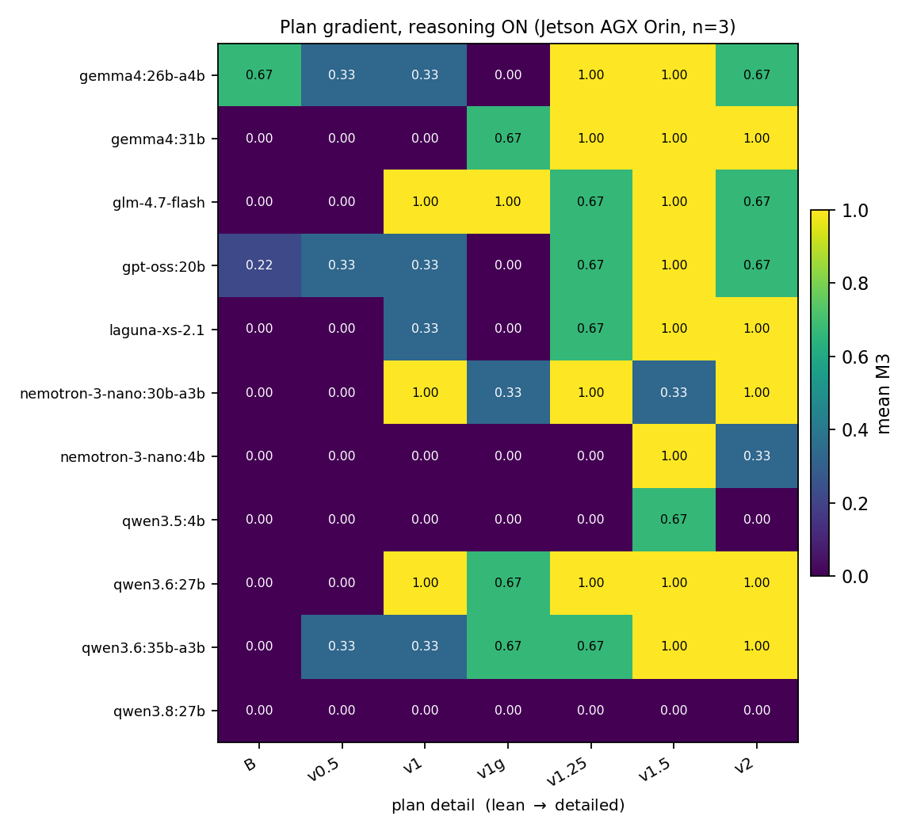
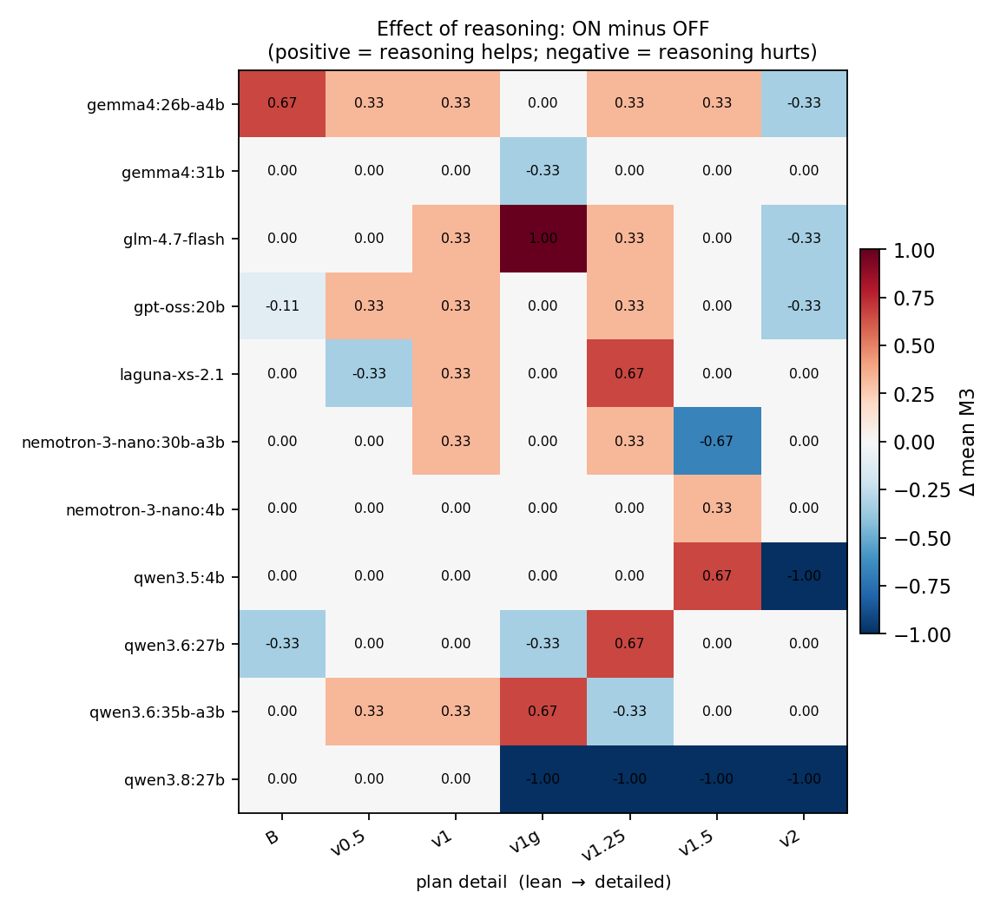
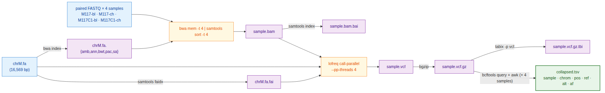
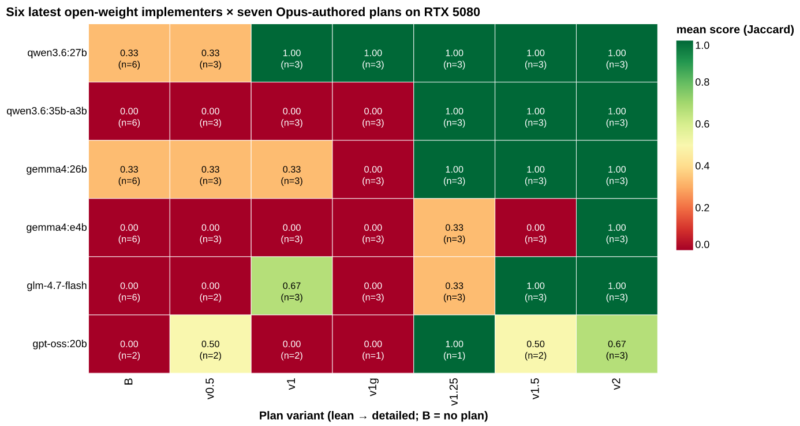

# Supplementary material

Supplement to "In a single pass, most local 4-bit executors transcribe a detailed plan; two of thirteen bind it".

Contents:

- **Supplementary Methods** (Tables S1–S9): study-design ledger; plan conditions and prompts; data-governance audit; hardware sizing and residency; inference settings; execution environment; scoring conventions; error injection; benchmark-2 protocol; the fabrication study; platforms and reproducibility metadata; the cost model.
- **Supplementary Results** (Tables S10–S17): generation outcomes; per-model repeated sampling; conventional variant-calling metrics; the emitted-script constraint audit; the reasoning arms; wall time by platform; benchmark-2 per-sample counts and the defect ledger; the seed extension at the discriminating conditions; the perturbed-plan pass.
- **Supplementary Discussion**: the workflow-class taxonomy (Table S18); production concerns for a shared deployment (Table S19); the agent-harness survey.
- **Verbatim prompts and plan files.**
- **Supplementary Figures S1–S4.**

## Supplementary Methods

### Study design: the cell ledger and the four denominators
**Table S1.** Cell-count and wall-clock ledger for benchmark 1, one row per released log file. Cells, generation hours and the non-`ok` count are all now emitted by the same pass over the released logs. The first version of this table hand-entered the non-`ok` column. That is why the reasoning-effort row read 0 where its log carries 2, and why the total read 50 where it is 52. The frontier reference block ran on the Anthropic API and consumed no local GPU time. Every other block ran on the Jetson AGX Orin.

| Block | Log file | Cells | Generation (h) | Non-`ok` generations |
|---|---|---:|---:|---:|
| Frontier reference gradient (API) | `matrix_jetson.jsonl` | 81 | 1.55 | 0 |
| Plan gradient, reasoning off | `matrix_jetson_thinkoff.jsonl` | 324 | 7.22 | 1 |
| Plan gradient, reasoning on | `matrix_jetson_thinkon.jsonl` | 270 | 28.54 | 18 |
| Repeated sampling at v2 Track A (7 added seeds) | `matrix_jetson_n10_v2.jsonl` | 84 | 1.61 | 1 |
| `qwen3.8:27b` gradient, reasoning off | `matrix_jetson_qwen38_off.jsonl` | 27 | 0.64 | 0 |
| `qwen3.8:27b` gradient, reasoning on | `matrix_jetson_qwen38_on.jsonl` | 27 | 17.40 | 27 |
| Budget ablation at 32,768 tokens | `ablation_32768.jsonl` | 3 | 4.57 | 3 |
| Budget ablation at 65,536 tokens | `ablation_65536.jsonl` | 3 | 7.87 | 0 |
| Reasoning-effort sweep, `gpt-oss:20b` | `effort_gptoss.jsonl` | 20 | 1.20 | 2 |
| Reasoning-effort sweep at 128k context | `effort_gptoss_high128k.jsonl` | 9 | 4.67 | 0 |
| **Total** | | **848** | **75.27** | **52** |

The reasoning-effort row is 20 cells, not the 27 its design implies. The high-effort arm at a 32,768-token budget terminated after 2 of its 9 cells, both `truncated_in_thinking` at plan v1. The high-effort arm was then re-run at the model's native 131,072-token context as a separate block. That substitution is stated wherever the effort result is reported. Two log files post-date this ledger and are not in it: `matrix_jetson_seedext.jsonl` (273 cells, the seed extension at v1g, v1.25 and v1.5) and `matrix_jetson_perturbed.jsonl` (39 cells, the perturbed-plan pass). They are reported in Tables S16 and S17. <!-- addresses: T4-nonok, effort-native-context, R2.24 -->
**Table S2.** Denominator reconciliation. Every count is a `find` or a filter over the released tree, not a transcription.

| Quantity | n | What it is |
|---|---:|---|
| Cells run and logged | 848 | every row of the ten log files in Table S1 |
| Cells archived under `revision/runs/` | 813 | all blocks except the budget ablation (6 cells, `revision/runs_ablation/`) and the reasoning-effort sweep (29 cells, `revision/runs_effort/`) |
| Archived cells carrying a `run.sh` | 766 | the emitted-script constraint audit corpus (Supplementary Results, *What the emitted scripts actually did*) |
| Archived cells carrying no `run.sh` | 47 | exactly the 47 non-`ok` generations in those blocks: 1 + 18 + 1 + 27 from the four gradient and sampling passes; the other 5 non-`ok` cells are in the ablation and effort blocks |
| Reasoning-off scripts | 514 | the transcription-index corpus: 433 local plus 81 API |

<!-- addresses: R1.1, R2.11, T11-corpus, R3.10 -->

### Plan conditions, the planner meta-prompts, and the executor prompt
| Condition | Size | Summary | Hypothesis tested |
|---|---:|---|---|
| Track B | 1.2 KB | Problem statement and tool inventory only | How much does a model do unaided? |
| v0.5 | 1.4 KB | Track B plus one line giving the tool order | Does sequencing alone help? |
| v1 (lean) | 3.1 KB | Numbered bullets naming tools and key flags; no code | Reference lean plan |
| v1.25 | 3.1 KB | v1 plus one literal `lofreq call-parallel` command line | Does one full command bridge v1 to v2? |
| v1.5 | 1.3 KB | v2 with all prose stripped; code fences only | Does the prose change outcomes, or only the code? |
| v1g | 4.2 KB | v1 plus a `lofreq` invocation extracted mechanically from the Galaxy IUC tool registry | Can a tool registry substitute for a plan author? |
| v2 (detailed) | 4.6 KB | Exact command line and a Gotchas block per step | Reference detailed plan |
| v2_defensive | 6.5 KB | v2 plus `try()` helper, per-step validation, retry-once, failure log | Does error-handling prose change runtime behaviour? |

Three planner meta-prompts produced these files. They are described here by category. The plan gradient is the study's independent variable, so how it was elicited is not an appendix detail. All three prompts are reproduced verbatim in this Supplement. They are released as `plan/PLANNER_PROMPT.md`, `plan/PLANNER_PROMPT_v2.md` and `plan/PLANNER_PROMPT_v2_defensive.md`. <!-- addresses: R1.4 -->

`PLANNER_PROMPT.md` produced v1. Editing v1 produced v1.25 and v1.5. The prompt frames the audience as "a junior bioinformatician" and "a competent shell programmer who knows generic bioinformatics tools but not the specific best-practice flags". It forbids bash code outright ("No code blocks"). It caps the plan at ten steps and 400 words. It requires flag values to be named but not shown as invocations. It requests no validation or retry prose. `PLANNER_PROMPT_v2.md` produced v2. It frames the implementer as someone who "has NEVER used bwa, samtools, lofreq, bcftools, or tabix". It requires "the exact command line (or pipeline)" as "a fenced one-liner of code" for every step, and "every flag, with its exact value". It also requires an explicit idempotency guard per step and a per-step gotchas block. It states the audience constraint that "the implementer will copy-paste your invocations into a shell script". It sets no limit on step count. `PLANNER_PROMPT_v2_defensive.md` is `PLANNER_PROMPT_v2.md` plus a defensive-execution block. That block requires output validation after every per-sample step, retry-once on transient failure, per-sample isolation, a structured `results/failures.log`, a final stderr summary line, and an explicit exit-code policy. <!-- addresses: R1.4 -->

Two pieces of content that shape the results originated in the human meta-prompt, not with the planner model. Both sit in conditions the Results treat as model-authored. The read-group string `@RG\tID:{sample}\tSM:{sample}\tLB:{sample}\tPL:ILLUMINA` appears verbatim in `PLANNER_PROMPT.md`. That prompt instructs the planner to reproduce it "EXACT[ly], character-for-character" and to warn the implementer that the separators are colons rather than equals signs. This literal string and its accompanying gotcha are therefore present in the *lean* v1 condition, not only in v2. The same meta-prompt names `lofreq call-parallel` as the required subcommand. It requires `bgzip` plus `tabix` rather than `bcftools view -O z`, fixes `THREADS=4`, forbids duplicate marking, and requires `bcftools query` for the collapse step. The planner model contributed the ordering, the phrasing and the per-step flag selection to v1. To v2 it additionally contributed the assembly of each step into a complete, literal invocation. The gradient is therefore, at least in part, a gradient in how much literal syntax was demanded of the planner. It is not purely a gradient in model-authored detail. <!-- addresses: R1.4 -->

The single exception to model authorship is v1g. Its `lofreq` block was extracted mechanically from the Galaxy IUC tool registry (`tools/lofreq/lofreq_call.xml` at tools-iuc commit `39e7456`) by `scripts/galaxy_to_snippet.py`. It is therefore a plan at v1-level density with a non-model author. It serves as a check on the gradient, not as an arm of a planner comparison. The first version of this manuscript called it the latter. That description is withdrawn, for reasons given with the result (main text, *The prose is close to inert*). <!-- addresses: R3.6, Q5 -->

Two conditions are Track B, in which the prompt template substitutes no plan at all. **Every Track-B run is a no-plan run, no matter which plan file was nominally passed on the command line**. Grouping runs by plan file without honouring this folds no-plan runs into the v1 and v2 columns. That yields the convincing but false conclusion that the most detailed plan performs worst. The released analysis code (`revision/scripts/gradient.py`) implements the correct mapping and asserts it. The frontier reference gradient was affected by exactly this error in the first version of this manuscript. It is recomputed here. `gradient.py --arm frontier` now generates that row, so it is derived rather than transcribed. <!-- addresses: Q1 -->

The executor prompt had a fixed structure, released verbatim in this Supplement. It contains: a role statement; hard constraints on the emitted script; a task specification; a dataset manifest; the tool inventory with pinned versions; the plan slot; and an output-format instruction. The hard constraints are as follows.

- The shebang, then `set -euo pipefail`.
- All output under `results/`.
- Idempotent re-execution.
- No absolute paths outside the working directory.
- Only tools from the supplied inventory; no package managers.
- A 600-s wall-clock limit at four threads. Only v2_defensive carries safety and validation prose; the other seven conditions do not. That difference is a measured condition rather than an oversight. <!-- addresses: R1.4, R3.15 -->

The split also defines a data-governance boundary. Once the cost model is taken into account, this boundary is the main non-cost justification for the architecture. The claim must be scoped carefully. **The boundary was respected by the planner role only.** The planner was prompted with a workflow description, a tool inventory, generic relative paths and de-identified sample labels. No absolute filesystem path, host name, credential or read data was included in a planner prompt. The frontier *executor* arms necessarily transmitted the executor prompt. These arms are 81 API cells in the reference gradient and 234 in the Jetson error matrix (`error_matrix_anthropic.jsonl`; the first version of this manuscript wrote 117, which is the per-plan count). The executor prompt contains the dataset manifest with this study's own subject labels (`M117-bl`, `M117-ch`, `M117C1-bl`, `M117C1-ch`, a mother–child pair). It also contains the tool inventory generated locally by `setup/verify_env.sh`. The boundary therefore holds for the deployed architecture and not for the comparator arms. That was not disclosed in the first version of this manuscript. The audit below shows the boundary holds less completely for the planner role than this paragraph originally claimed. <!-- addresses: R1.4 -->

The first version of this manuscript said the audit of what was actually sent was possible and had not been run. **It has now been run, and it changes the claim.** One correction first. `provider_envelope.json`, archived for each of the 81 frontier cells, is the *response* envelope — usage, cost, stop reason — and carries no request body. The earlier statement that the harness archives every request envelope is therefore wrong. The request body is instead deterministically reconstructable. `harness/run_one.py` builds every outbound payload as `prompts/system.txt` plus one template whose only substitutions are a plan file and the stdout of `setup/verify_env.sh`. `revision/scripts/payload_audit.py` rebuilds every payload that was sent and scans it against a deny-list of local-identity tokens. Table S3 reports the result. Benchmark 2's MCP traffic is neither archived nor reconstructable and is therefore outside the audit. That is a gap, not a clean result. <!-- addresses: R1.4 -->

### What was actually sent to the commercial API
**Table S3.** Deny-list scan of the outbound payloads sent to the commercial API, by arm. Cells count payloads containing at least one hit for that token class. Payloads are reconstructed rather than captured, for the reason given above.

| Arm | Payloads scanned | Host name | `$HOME` | Conda prefix | Absolute path | Credential | Subject label |
|---|---:|---:|---:|---:|---:|---:|---:|
| Planner meta-prompts | 3 | 0 | 0 | 0 | 0 | 0 | **3** |
| Frontier executor gradient | 81 | 0 | **81** | 0 | **81** | 0 | **81** |
| Frontier error matrix (Jetson) | 234 | 0 | **234** | 0 | **234** | 0 | **234** |
| Benchmark 2 MCP traffic | not archived, not reconstructable | — | — | — | — | — | — |

Two of the three findings were predicted and one was not. As expected, every frontier *executor* payload carries the study's own subject labels, because the dataset manifest names them. Less expectedly, all three *planner* meta-prompts carry the same labels: `plan/PLANNER_PROMPT.md` and its two variants state the sample list verbatim. The labels are de-identified, so this does not contradict the paragraph above. But it does mean the planner boundary blocks paths, host metadata and read data, and does **not** block sample identifiers. Sample identifiers are the class a data use agreement is most likely to restrict. The only absolute path on the wire is the operator's home directory, `/home/anton`. It appears in every executor payload — not from the manifest, but from the constraint line of `prompts/system.txt`, which reads "No /home/anton, no /tmp, no absolute paths to data". A prohibition that names the path it prohibits exports it. No host name, conda prefix or credential appeared in any payload. The harness could enforce the boundary with a pre-flight scrub of the rendered prompt against the same deny-list, refusing to send on a hit. It does not currently do so. On this evidence, the boundary held for the planner role only for paths and system metadata, not for identifiers. <!-- addresses: R1.4 -->

### Hardware sizing and measured residency

This subsection is placed in Methods rather than the Introduction because it reports measurements rather than motivation. Residency figures are the `SIZE` column of `ollama ps` with the model fully resident on GPU. That is weights, plus the KV cache allocated for the pinned context, plus graph buffers. The figures are collected in `revision/hardware/resident_sizes.md`.

On the Jetson AGX Orin, a dense `gemma4:12b` occupying 7.6 GB generated at 14.4 tokens/s. The MoE `qwen3.6:35b-a3b`, occupying 23.9 GB with 3 B active parameters, generated at 30.7 tokens/s — three times the residency, 2.1 times the throughput. These are two models from two families. They differ in tokenizer, layer count and architecture as well as in density. They come from this study's own mixed workload, not from a standardised throughput benchmark. The comparison supports one narrow statement: in this workload, one 3B-active MoE model outran one 12B dense model despite three times the residency. It does not support a general claim about the hardware class. The first version of this manuscript overstated it. <!-- addresses: R2.3b, R3.11 -->

KV-cache growth was measured on `qwen3.8:27b` at the three budgets of the reasoning-budget ablation, with `OLLAMA_FLASH_ATTENTION=false` and `OLLAMA_KV_CACHE_TYPE=f16`. We projected 25, 31 and 43 GB at 16k, 32k and 64k context. The projection assumed 19 GB of weights plus a 6 GB KV cache at 16k, scaling linearly. Measured residency was 25, 27 and 31 GB, so quadrupling the context added 6 GB rather than 18. Grouped-query attention, which shares key and value projections across attention heads, accounts for most of the difference. Two figures in this study are not reconcilable. A reader may size a purchase from them, so the consequence is stated first: **this manuscript reports no residency figure a reader should provision against**. The ablation series puts `qwen3.8:27b` at 25 GB with a 16k context. The benchmark-2 configuration records the same model at 19.6 GB with a 65,536-token context (`revision/galaxy_demo/METHODS.md`). That is a 60% discrepancy in the direction that under-provisions: the larger context gives the smaller number. The two were measured months apart under different service configurations. Nothing in the archived records explains the difference. Re-measuring all four models under one pinned configuration at 16k and 64k is roughly an hour of cold loads and would settle it. **It was not done in this revision.** The residency column has therefore been removed from main-text Table 1. Every residency measurement this study made is given in Table S4, with the discrepancy stated inline. We stand behind three statements only. A 27 B q4_K_M model occupied between 19 and 31 GB across the engine settings and contexts used here. A 64 GB board held one at 64k context. A laboratory should measure on its own hardware rather than project from these numbers or from parameter count. <!-- addresses: R2.3, Q15 -->


**Table S4.** Measured residency, and the discrepancy in it.

`revision/hardware/resident_sizes.md` records every `ollama ps` measurement made in this study, with the pinned context for each. Residency is weights, plus the key–value cache allocated for the pinned context, plus graph buffers. The engine was ollama 0.32.5 with `OLLAMA_FLASH_ATTENTION=false` and `OLLAMA_KV_CACHE_TYPE=f16`, on the Jetson AGX Orin 64 GB.

| Model | Quantisation | Pinned context | Resident | Source |
|---|---|---:|---:|---|
| `qwen3.6:27b` | q4_K_M | 16,384 | ~17 GB | this study's hardware notes |
| `qwen3.6:35b-a3b` | q4_K_M | 16,384 | 23.9 GB | `revision/galaxy_demo/METHODS.md` |
| `qwen3.6:35b-a3b` | q4_K_M | 65,536 | 31 GB | `ollama ps` |
| `qwen3.8:27b` | q4_K_M | 16,384 | 25 GB | budget-ablation series |
| `qwen3.8:27b` | q4_K_M | 32,768 | 27 GB | budget-ablation series |
| `qwen3.8:27b` | q4_K_M | 65,536 | 31 GB | budget-ablation series |
| `qwen3.8:27b` | q4_K_M | 65,536 | **19.6 GB** | `revision/galaxy_demo/METHODS.md` — **does not reconcile with the row above** |
| `gemma4:12b` | q4_K_M | 16,384 | 7.6 GB | this study's hardware notes |

The two `qwen3.8:27b` rows at a 65,536-token context differ by 11 GB. Nothing in the archived records explains the difference. The measurements were made months apart under different service configurations. **No residency figure in this paper should be used to size a purchase.** Re-measuring the four models under one pinned configuration at 16k and 64k is roughly an hour of cold loads. It was not done. **Ten of the twelve benchmark-1 models were never measured at all**, and no figure is estimated for them. The first version of this manuscript said eight, which is wrong. The source file has been corrected to match. <!-- addresses: R2.3, residency-8-vs-10 -->


### Inference settings, sampling parameters, and the token budget

All local generations were served by ollama 0.32.5 at `temperature = 0.2` with `num_ctx = num_predict = 16384`. For local models an integer seed was passed to the sampler. At fixed decoding parameters, the seed therefore selects a trajectory through the distribution those parameters define. For the Anthropic API runs the harness constructs no seed argument at all. The integer recorded in those rows is a bare run identifier and is reported as such. Neither case gives bitwise determinism, because batched GPU inference does not guarantee identical results even at a fixed seed. All claims of reproducible sampling have been removed. <!-- addresses: C4, R2.6, R3.9 -->

A confound found during revision is disclosed here rather than in a supplement. The harness overrode only `temperature`. It left `top_k` and `top_p` at each model's own defaults, and those defaults are **not uniform** across families. `top_k` is 20 for the Qwen 3.5 and 3.6 models, 64 for Gemma 4, and unset elsewhere. `top_p` is 0.95 for those Qwen models, Gemma 4 and GLM, 1 for Nemotron, and unset elsewhere. The family label is not a safe shorthand. `qwen3.8:27b`, the benchmark-2 dense arm, declares neither, so it ran at the engine defaults; its predecessor `qwen3.6:27b` ran at top_k 20 / top_p 0.95. Models were therefore compared under different sampling configurations. Per-model values are in Supplementary Table S8. **This is a confound and not merely a disclosure.** Every cross-model comparison in this paper — the gradient, the repeated-sampling table, the abstract's contrast between arms — compares models decoded from different distributions. The model that fails at the headline condition (`nemotron-3-nano:4b`, 1/10) and the models that pass are not decoded alike. Repair does not require re-running the whole matrix. Re-running the headline cell (12 models × 10 seeds) and the discriminating cell (12 models × 3 seeds) with `top_p` and `top_k` pinned is 156 cells. That is roughly 4 GPU-hours against the 75.27 h already spent. It would put the pinned numbers in the headline, with the current run as a sensitivity check. **That was not done in this revision.** Until it is, the ordering of models under a pinned decoder is unknown. Any cross-model ordering claimed here must be read as provisional. The gradient itself is a within-model comparison across plan conditions and is not affected, because each model's decoder is constant across its own columns. <!-- addresses: C4, R2.6, R3.16 -->

The 16,384-token budget was never justified in the original code or manuscript. It is uniform across all local models, which makes the comparison internally fair. It is generous for the target artefact, a bash script of roughly 100 lines. It is between one eighth and one sixty-fourth of the native context these models declare. Declared native context ranges from 131,072 tokens for `gpt-oss:20b` and both Granite models to 1,048,576 for `nemotron-3-nano:30b-a3b` (Supplementary Table S8). The first version of this manuscript stated a single 262,144-token native context. That is correct only for the Qwen, Gemma and laguna subset. The ~2.4k-token prompt is charged against the budget, leaving about 14k tokens of usable generation. The budget decided at least one result, so the ablation reported in the Results was run as a sensitivity check. <!-- addresses: Q14 -->

A fixed budget can convert a verbose reasoner into an apparent failure. The harness therefore records a generation-outcome class for every cell alongside its score: `ok`, `truncated_in_thinking`, `truncated`, `empty_content`, `provider_error`, or `refusal`. Reasoning traces are persisted separately, because ollama ≥ 0.32 returns them in a distinct field. A scorer reading only message content records a model that spent its budget reasoning as a total failure. Reasoning-enabled generations were additionally bounded by a 2,700-s wall-clock timeout, recorded as `provider_error` when it fired. <!-- addresses: R3.16 -->


### Execution environment and safety guardrails

In benchmark 1, generated scripts were executed on the same machine that hosted the model. Each script ran in a per-cell working directory, under a conda environment with a pinned tool inventory, and was killed at 600 s of wall clock. Generated code was **not** reviewed by a human before execution. There was no container, virtual machine, seccomp profile, user namespace, cgroup quota, or network-egress restriction. Scripts ran as an unprivileged user. No privilege-escalation attempt was observed. No audit of available escalation paths on the JetPack image — sudoers entries, docker group membership, writable setuid binaries on `PATH` — was performed. The first version's claim of "no route to elevation" is therefore withdrawn. <!-- addresses: R1.1 -->

Enforced and requested constraints must be distinguished. The 600-s kill, the PATH-restricted tool inventory and the working directory are enforced by the harness. "No absolute paths outside the working directory", "no package managers", and "no `curl` or `wget`" are prompt instructions a model is free to violate. The first version of this manuscript said only that no destructive or escape behaviour was observed. The violation rate is now measured over every archived script and reported below (*What the emitted scripts actually did*). That measurement is the empirical content the earlier claim was standing in for. <!-- addresses: R1.1 -->

Benchmark 2 supplies the contrasting production case. Execution took place on usegalaxy.org, where jobs run in per-tool containers under the server's own scheduler and quotas. The isolation claim in the first version of this manuscript — "the blast radius of any error is one history" — was wrong. The correction matters because this is the manuscript's answer to what a production sandbox looks like. The executor held an ordinary Galaxy API key, which is **account-scoped, not history-scoped**. A holder of such a key can list, modify, purge and share every history, dataset and workflow belonging to that account. It can also create new histories and consume the account's quota. The blast radius was therefore the account, not the history. What narrowed it in practice was the MCP server. The MCP server exposed a bounded set of verbs — import a workflow by TRS identifier, build a collection, invoke, poll, read a dataset — rather than the full set of Galaxy API operations. A real deployment should narrow the blast radius deliberately rather than incidentally: a per-run service account, a dedicated history with a scoped key, and an MCP server exposing only the invoke/poll/read verbs. <!-- addresses: R1.1 -->

Sandboxing is a prerequisite for production use of this pattern. That means a container or VM boundary, an explicit filesystem scope, no network egress by default, no `sudo`, and cgroup resource limits. It also means either human review or a policy layer between generated commands and the shell. The local arm of this study does not meet that bar and is not a deployment template. <!-- addresses: R1.1 -->

A bounded tool set must bound inputs as well as verbs. This study exercised the input channel without controlling it. Attacker- or accident-controlled text reached the executor through at least five channels.

- Dataset and history names on a shared multi-user public server.
- Job stderr.
- Tool output read back through MCP.
- The descriptions of the MCP tools themselves.
- In benchmark 1, 200 lines of adversarially shaped stderr injected deliberately through a PATH shim. The one fabrication incident documented in this study is an instance of the same class, from an unexpected direction. The model harvested a plausible tool name out of the harness's own injected system context and used it in a report. None of these channels was sanitised, filtered, or marked as untrusted. No indirect-prompt-injection test was run. A deployment needs to treat tool output as data rather than instruction. It must not let observed text authorise a state-changing call without read-back verification. That is one of the three recommendations this paper derives from its own failure modes. <!-- addresses: R1.1 -->


### Scoring, and how it departs from published practice
**Table S5.** Scoring choices in benchmark 1, the closest published convention for each, and the departure. This replaces the promise of an enumeration that the first version of this manuscript made and did not keep.

| Scoring choice here | Closest published convention | Departure, and why |
|---|---|---|
| M1/M2/M3 ladder (executed / schema-valid / matched, matching the released scorer's field names) | BixBench final-answer scoring; Biomni task rubrics | The ladder separates plumbing failure from wrong answer, which a single pass/fail cannot. Departure: no partial credit for reasoning quality, only for output. |
| Per-run pass as the unit: tolerant Jaccard averaged over four samples, scored 0 on non-zero exit status | GA4GH germline benchmarking, which scores per variant across a stratified truth set (Krusche et al. 2019) | The unit here is the run, not the variant, because the object under test is whether a pipeline was constructed, not how well a caller performs. |
| No per-variant tolerance beyond ±0.02 on allele frequency, and no confident-region stratification | `hap.py` with GA4GH stratifications | The caller is deterministic and the reference is 16,569 bp: a correctly wired pipeline reproduces the answer key exactly, so stratification would have nothing to separate. 0 of 324 runs produced any allele frequency outside the window. |
| Truth set is the canonical output of the same caller, not an orthogonal call set | Genome in a Bottle-style external truth (Krusche et al. 2019) | No held-out truth set exists for these downsampled samples. The consequence is that precision is 1.000 by construction and the metric measures orchestration, not variant-calling accuracy. |
| Success proportions carry Clopper–Pearson exact intervals; nothing is pooled across models | Agent benchmarks generally report a single accuracy figure | Between-model dispersion here is gross (nine models at 10/10, one at 1/10), so a pooled proportion describes no quantity of interest. |

### Error injection

Tool failures were injected with PATH shims. Before each error-matrix cell the harness wrote short wrappers for `bwa` and `lofreq` into a per-run directory. It prepended that directory to `PATH` after conda activation, so the shell resolved the wrapper first. Each shim read `EVAL_INJECT_PATTERN` and `EVAL_INJECT_TARGET`. It passed untargeted invocations straight through to the real tool and applied the pattern only to the targeted one. The generated script observed nothing but ordinary exit codes, stderr and output files. Three handling metrics were assigned from those observations. The first is a **handle category** with four values: `crash`, an error-propagation value, `partial`, and `recover`. The second is a binary **recover** flag, scored against the best outcome each pattern permits. The third is a binary **diagnose** flag, recording whether the script announced the failure at all.

Two of the seven patterns do not inject an error at all. Table S6 recategorises them on that axis.

**Table S6.** Injected patterns, by target and by whether the tool actually fails. Shims were written for two targets, `bwa` and `lofreq`. Five true-error patterns × two targets would be ten combinations. Two are absent **by design and not by post-hoc exclusion**: `silent_truncation` and `wrong_format_output` both act on the VCF, and `bwa` emits no VCF, so neither pattern is expressible against it. That is why the true-error denominator is 8 and not 10. The first version of this manuscript did not state this.

| Pattern | Targets run | Shim behaviour | Class |
|---|---|---|---|
| `flake_first_call` | `bwa`, `lofreq` | Exits 1 once, then passes through | true error |
| `one_sample_fails` | `bwa`, `lofreq` | Exits 1 for one named sample only | true error |
| `missing_lib_error` | `bwa`, `lofreq` | Exits 127 without running the tool | true error |
| `silent_truncation` | `lofreq` only (no VCF from `bwa`) | Runs the tool, then truncates the VCF to zero bytes | true error |
| `wrong_format_output` | `lofreq` only (no VCF from `bwa`) | Runs the tool, then strips all variant lines | true error |
| `slow_tool` | `bwa`, `lofreq` | Sleeps 30 s, **then succeeds** | latency tolerance, not an error |
| `stderr_warning_storm` | `bwa`, `lofreq` | Emits 200 warnings, **then succeeds** | log-noise tolerance, not an error |

### Benchmark 2: protocol and enabling conditions

The second benchmark re-quantified *Candidozyma auris* RNA-seq from Santana et al. (2023), BioProject PRJNA904261, six paired-end runs SRR22376027–SRR22376032. The comparison target is a published benchmark with known expected values (~5,594 genes, ~92% assigned). Benchmark 2 varies four things at once relative to benchmark 1.

- A second workflow class.
- A second infrastructure: a shared multi-user production server rather than a private board.
- A 30-step workflow rather than a 7-step script.
- The existence of an external cost comparator (Nekrutenko 2026). It is a case study: one invocation per arm, two executors, no replicates, no frontier control, and no interval on anything. <!-- addresses: R2.14, R2.15 -->

The executor-selection rule is invoked three times in this manuscript and was never given. It is stated in full here. *Take every local model that scored 3/3 at plan v2 Track A with reasoning off in the benchmark-1 gradient. From that set, take the largest dense model and the largest mixture-of-experts model by total parameter count. The two benchmark-2 arms then differ in architecture and not only in size.* Applied to the twelve-model set frozen before benchmark 2, the rule returns `qwen3.6:27b` (dense) and `qwen3.6:35b-a3b` (MoE). The dense arm actually run was `qwen3.8:27b`. That model was released on 14 August 2026, after the rule was fixed and after benchmark 1 was complete. It was substituted for its predecessor at matched parameter count and quantisation. **That substitution is a deviation from the frozen rule, so the dense arm is exploratory rather than confirmatory.** The first version of this manuscript described four elements as frozen. Three survive as confirmatory: the selection rule itself, the reasoning-off setting, and the hardware. The model selection does not. Plan sufficiency was never confirmatory on either benchmark. The Galaxy plan was corrected repeatedly while benchmark 2 ran — eleven times by the author's contemporaneous record in `revision/galaxy_demo/FACTS.md`, a count the released artifacts cannot confirm. <!-- addresses: R3.5, R1.4 -->

Both executors ran on one Jetson AGX Orin 64 GB. The dense arm was `qwen3.8:27b` (19.6 GB resident). The MoE arm was `qwen3.6:35b-a3b` (23.9 GB resident, ~3 B active). Reasoning was suppressed in both. Three arms were run: a human validation arm, in which a person drove the same workflow manually, plus one arm per executor. All three history and invocation identifiers are listed in the Supplement.

The harness was `galaxyproject/loom`, with Galaxy reached over MCP and `notebook.md` as durable inter-session state. The plan was a router: a 50-line index plus seven step files, so the executor loads only the step it is on. The loop had seven stages. Import the IWC `rnaseq-pe` v1.5 workflow (fastp → STAR → featureCounts) by TRS identifier. Locate and verify inputs. Build or verify the paired collection. Resolve the annotation. Construct and submit a 30-step invocation. Poll invocation and job state. Report. Unlike benchmark 1, every turn produced an observation the model read before deciding what to do next.

Several enabling conditions are reported because they are part of the result. Context was pinned to 65,536 tokens via a Modelfile; at the model default, ollama reserves the full native context and allocates 53 of 61 GB. Requests were routed through a LiteLLM proxy using the `ollama_chat/` provider. The reason: ollama's OpenAI-compatible `/v1` shim silently drops the `think: false` flag, while the native `/api/chat` endpoint honours it. A fresh-session flag and a hard `TERM` timeout were needed because the Galaxy poller keeps headless runs alive.

**No number reported for this benchmark comes from an agent's own report.** Every state, parameter and count was read back from the Galaxy API or from dataset contents. The reason: one executor produced a fully formed failure report for an event that never occurred, and the only thing distinguishing it from a true report was the API. That read-back was performed live. Its outputs were transcribed into `revision/galaxy_demo/FACTS.md` and `featurecounts_summary.csv`; the raw jobs-summary JSON was **not** archived. Job-level outcome counts appeared in the first version of this manuscript and are removed here, because no released file supports them. <!-- addresses: Q2, R3.3 -->

Scoring had four components. (a) Invocation correctness, checked field by field against the validated invocation. (b) Biological outcome: gene count and per-sample assigned fragments against the published benchmark, read from dataset contents. (c) End-to-end reporting: whether the executor itself delivered the required per-sample table with a dataset identifier beside every number. (d) A defect ledger attributing every human intervention to the planner side or the executor side.

One methodological change belongs in Methods because it changed the design. The original step-7 verification file stated the expected values. That lets an executor that never opens a dataset produce a flawless verification by reciting the task. The file was rewritten to state no expected values, to require a dataset identifier beside every reported number, and to sanction `UNAVAILABLE` as an answer. The general point: any agent evaluation that places the expected answer in the task description cannot distinguish execution from recitation. <!-- addresses: C1, C2, R2.10, R3.1, R3.3, R3.5, R1.3, T3.1, T3.3, T3.4 -->


### The fabrication-rate study

The fabrication incident was a single observation, so a controlled follow-up was run to bound the rate. The design: 3 conditions × 2 models × 5 seeds, one fresh workspace per cell, a fixed prompt, and known ground truth. The task was to fetch six featureCounts summary datasets from a real Galaxy history and report each `Assigned` value with the dataset identifier it was read from. The design is therefore **30 launches**. Twenty-four produced a scorable answer file — 13 for the dense model and 11 for the MoE model. That gives 78 and 66 sample-level judgements respectively, 144 in total. **Six of the 30 launches, 20%, produced no answer to score.** The first version of this manuscript said the count of excluded launches could not be quantified. It is recoverable from the design statement and is given here. The per-model and per-condition split of those six is not recoverable, because the released records do not identify which launches they were.

Each condition varied one thing. **Blind** stated nothing about expected values. **Leaky** stated the expected range, exactly as the original step-7 file did. **Blocked** replaced two of the six dataset identifiers with same-shaped identifiers that do not exist (verified to return HTTP 400). Those values cannot be obtained, so `UNAVAILABLE` is the only correct answer for them. Answers were scored into four categories chosen to separate silence from a claim. `CORRECT` is the true value. `WRONG` is any other number; this is the fabrication category. `ABSTAINED` is an explicit `UNAVAILABLE`. `ABSENT` is no statement at all. In the blocked condition, an abstention on an unreadable identifier is scored correct. A number reported there is scored as a fabrication.

Three limitations govern how the rate may be read. First, the six judgements within a session are not independent. A session that opens the right datasets gets all six right; one that does not gets none right. The session, not the judgement, is therefore the unit of analysis, and both denominators are reported. Second, launches producing no answer file are not scored at all. The observed mode was a session that made zero tool calls, ran about a minute, emitted a single malformed pseudo-citation and stopped. The rate therefore measures fabrication **conditional on an answer having been produced**, at a 20% no-answer rate. The excluded class is structurally the one the original incident belongs to. Third, the incident arose in a resumed session carrying roughly 27,000 tokens of prior work with no reachable tool path. Every cell here is a single-shot task with a working path. The study therefore does not reproduce the regime in which fabrication occurred. <!-- addresses: R2.18, R3.7, R1.1 -->


### Platforms, engines, and reproducibility metadata

Five platforms were used (Table S7). Identical weights do not give identical outputs across them, in part because they are not the same build of the same weights. The CUDA platforms ran GGUF `q4_K_M` weights under ollama; the Apple-silicon machines ran MLX 4-bit builds.


Engine configuration on the Jetson affects the results directly. Flash attention was disabled. ollama warns that it cannot verify its compiled CUDA architectures for sm_87. With flash attention enabled, we recorded 22 illegal-memory-access faults in six hours across 5 of 12 models. After disabling it, we recorded zero faults in roughly 41 h. The key–value cache was set to `f16` rather than `q8_0`, and one model was loaded at a time.

Supplementary Table S8 is generated by script. It records, per model, the exact tag, blob digest, architecture, parameter count, quantisation format, context length, declared capabilities and default decoding parameters. It also records the engine version (ollama 0.32.5), the platform (JetPack 5.1.2, CUDA 11.4, compute capability 8.7) and the pinned analysis tools (bwa 0.7.18, samtools 1.21, bcftools 1.21, htslib/tabix 1.21, lofreq 2.1.5). One hazard is recorded for anyone regenerating timings. An archived error-matrix log for the M4 Pro has a reduced schema in which the wall-clock field means something else and reads ~2 s. The correct file for that platform is the `_r2` variant. <!-- addresses: R3.11, R3.16 -->

Per-cell provenance is partial. This is a reproducibility limitation of the released artifacts rather than of the study. Each cell's `meta.json` records the plan file path and plan name it was rendered from, but **not** a git revision for that file. The released data therefore supports attributing a generated command to a plan *file* and not to a plan *revision*. Plans are versioned in git, and the defect ledger attributes corrections to specific revisions, so the link is recoverable by hand. It is not machine-checkable from the per-cell records. Adding a plan blob SHA to `meta.json` would close this gap. That was not done. <!-- addresses: R1.3 -->

**Table S7.** Platforms, with the inference engine and quantisation actually used on each.

| Platform | Maker | Year | Memory | OS | GPU | Engine / quantisation |
|---|---|---|---|---|---|---|
| Jetson AGX Orin Developer Kit | NVIDIA | 2022 | 64 GB LPDDR5 unified | Ubuntu 20.04.6, JetPack 5.1.2 (L4T 35.4.1) | Integrated Ampere, 2,048 CUDA cores | ollama 0.32.5, GGUF q4_K_M |
| RTX 5080 desktop | Dell | 2025 (GPU) | 16 GB GDDR7 | Ubuntu | RTX 5080, 10,752 CUDA cores | ollama, GGUF q4_K_M |
| MacBook Pro M4 Pro | Apple | 2024 | 48 GB LPDDR5X unified | macOS 15.6 | M4 Pro integrated | MLX, 4-bit |
| MacBook Air M4 | Apple | 2025 | 24 GB LPDDR5X unified | macOS 15.6 | M4 integrated | MLX, 4-bit |
| 2× RTX A5000 desktop | Dell | 2021 (GPUs) | 2 × 24 GB GDDR6 | Ubuntu 25.10 | 2 × RTX A5000 | ollama, GGUF q4_K_M |

**Table S8.** Reproducibility metadata.

Collected by `revision/scripts/collect_repro_metadata.py` into `revision/repro_metadata.json` and rendered with its `--markdown` flag, so the table is regenerated rather than transcribed. Digests are the ollama manifest blob digests as resolved on the Jetson at collection time.

**This table contains all fourteen local models the study uses.** The first version of it contained twelve. It omitted `gemma4:12b`, used for a throughput measurement only. It also omitted `qwen3.8:27b`, the benchmark-2 dense arm, the out-of-sample row in Figure 2 and the subject of the entire reasoning-budget ablation. The second omission mattered. This manuscript's own disclosure is that `top_k` and `top_p` were left at publisher defaults, which differ across families. Omitting that row therefore left the sampling configuration of the case-study executor unknown to a reader. The collection script has been re-run against both models, which were still resident on the board. The two rows are now present, and the last twelve rows reproduce the earlier collection digest for digest. Two corrections came out of the re-run. First, `qwen3.8:27b-q4_K_M` **declares no default `top_k` or `top_p` at all**. The case-study executor was therefore decoded at the engine defaults rather than at a publisher setting. That is the one configuration this manuscript could not previously state. Second, the collector had a parsing fault that this model exposed. A multimodal tag carries a `Projector` block whose own `architecture` and `parameters` keys were being filed as the model's, so `qwen3.8:27b` first collected as `clip` at 460.73 M. The fault is fixed in `collect_repro_metadata.py`, and it changed none of the twelve original rows. It is recorded here because a script-generated table is only as trustworthy as its parser. The model's measured residency (19.6 GB at a 65,536-token context) is in `revision/galaxy_demo/METHODS.md` and Table S4. It does not reconcile with the ablation series.

| Model tag | Digest | Architecture | Parameters | Quantisation | Context length | Capabilities | Publisher default decoding parameters |
|---|---|---|---|---|---|---|---|
| `laguna-xs-2.1:q4_K_M` | `0175be1e57f4` | laguna | 33.4B | Q4_K_M | 262144 | completion, tools, thinking | none declared |
| `qwen3.6:35b-a3b-q4_K_M` | `07d35212591f` | qwen35moe | 36.0B | Q4_K_M | 262144 | completion, vision, tools, thinking | temp 1; top_k 20; top_p 0.95; min_p 0; repeat 1; presence 1.5 |
| `gemma4:26b-a4b-it-q4_K_M` | `5571076f3d70` | gemma4 | 25.8B | Q4_K_M | 262144 | completion, vision, tools, thinking | temp 1; top_k 64; top_p 0.95 |
| `nemotron-3-nano:30b-a3b-q4_K_M` | `b725f1117407` | nemotron_h_moe | 31.6B | Q4_K_M | 1048576 | completion, tools, thinking | temp 1; top_p 1 |
| `gpt-oss:20b` | `17052f91a42e` | gptoss | 20.9B | MXFP4 | 131072 | completion, tools, thinking | temp 1 |
| `glm-4.7-flash:q4_K_M` | `4475827791a2` | glm4moelite | 29.9B | Q4_K_M | 202752 | completion, tools, thinking | temp 1; top_p 0.95; min_p 0.01; repeat 1 |
| `qwen3.6:27b-q4_K_M` | `a50eda8ed977` | qwen35 | 27.8B | Q4_K_M | 262144 | completion, vision, tools, thinking | temp 1; top_k 20; top_p 0.95; min_p 0; repeat 1; presence 1.5 |
| `gemma4:31b-it-q4_K_M` | `6316f0629137` | gemma4 | 31.3B | Q4_K_M | 262144 | completion, vision, tools, thinking | temp 1; top_k 64; top_p 0.95 |
| `granite4.1:30b-q4_K_M` | `3f3e5df8a021` | granite | 28.9B | Q4_K_M | 131072 | completion, tools | none declared |
| `granite4.1:8b-q4_K_M` | `444af1c4b2fe` | granite | 8.8B | Q4_K_M | 131072 | completion, tools | none declared |
| `qwen3.5:4b-q4_K_M` | `2a654d98e6fb` | qwen35 | 4.7B | Q4_K_M | 262144 | completion, vision, tools, thinking | temp 1; top_k 20; top_p 0.95; presence 1.5 |
| `nemotron-3-nano:4b` | `6cc467f05439` | nemotron_h | 4.0B | Q4_K_M | 262144 | completion, tools, thinking | temp 1; top_p 1 |
| `qwen3.8:27b-q4_K_M` | `75312a6ba435` | qwen35 | 26.9B | Q4_K_M | 262144 | completion, vision, tools, thinking | **none declared** |
| `gemma4:12b` | `4eb23ef187e2` | gemma4 | 11.9B | Q4_K_M | 262144 | completion, vision, audio, tools, thinking | temp 1; top_k 64; top_p 0.95 |

Two facts in this table matter for interpretation. First, quantisation is not uniform. `gpt-oss:20b` is MXFP4 and every other local model is Q4_K_M. That is why main-text Table 1's caption states the exception rather than claiming uniformity. Second, the publisher defaults for `top_k` and `top_p` differ across families. top_k is 20 for the Qwen 3.5 and 3.6 models, 64 for the Gemma 4 family, and unset elsewhere. top_p is 0.95 for those Qwen models, Gemma 4 and GLM, 1 for Nemotron, and unset elsewhere. `qwen3.8:27b` declares neither, so the family name does not predict the setting. The harness overrides only temperature. Models were therefore compared under non-identical sampling configurations. This is disclosed rather than corrected, because correcting it costs a full re-run of the matrix. Declared context lengths range from 131,072 to 1,048,576 tokens. That range is the basis for the statement in Methods that the 16,384-token budget is between one eighth and one sixty-fourth of native context. <!-- addresses: Q13, Q14, R3.16, R2.6, R3.11 -->

**Harness overrides.** `temperature` 0.2; `num_ctx` = `num_predict` = 16,384 for the plan-gradient matrix; `top_k` and `top_p` not overridden. For benchmark 2 the context was pinned to 65,536 through a Modelfile, because at the model default ollama reserves 53 of the board's 61 GB.

**Engine and platform.** ollama 0.32.5; JetPack L4T R35 revision 4.1 (JetPack 5.1.2, CUDA 11.4); NVIDIA Jetson AGX Orin 64 GB, compute capability 8.7. Service environment: `OLLAMA_FLASH_ATTENTION=false` (the flash-attention kernels are miscompiled for sm_87 on this build and produced 22 illegal-memory-access faults in six hours across 5 of 12 models; none in the ~41 h after disabling), `OLLAMA_KV_CACHE_TYPE=f16` (q8_0 is lossy and alters output), `OLLAMA_MAX_LOADED_MODELS=1`, `OLLAMA_NUM_PARALLEL=1`.

**Pinned analysis tools** (conda environment `bench`, linux-aarch64), asserted before every run by `setup/verify_env.sh`, whose stdout is the tool inventory injected verbatim into the prompt: bwa 0.7.18, samtools 1.21, bcftools 1.21, tabix/htslib 1.21, lofreq 2.1.5, SnpSift 5.2, snpEff 5.2, fastqc 0.12.1, seqkit 2.8, snakemake 8.20, shellcheck 0.10, java 21.

**Reproducibility hazard.** One archived error-matrix log, `error_matrix_ollama_m4.jsonl`, has a reduced schema in which the `wall_s` field means something else and reads about 2 s. Timings for that platform come from the `_r2` variant of the file. Regenerating from the obvious filename yields nonsense.


### Cost model

Two of the model's eight inputs are measured. The first is frontier-API cost of $0.0662 per run, the mean over 81 API cells. The second is Jetson time per run of 86.7 s. The first version of this manuscript labelled that figure *generation* time; it is not. `cost_model.py` computes it as 7.8 h over 324 cells. 7.8 h is the **wall-clock** figure for that block, which includes model loading, script execution and scoring. Table S1 reports 7.22 h of generation for the same block, giving 80.2 s per run of generation. The label is corrected here and in Table S9. The value is left at the wall-clock figure, because wall clock is the right basis for an electricity term. The choice is immaterial to the result: by the model's own sensitivity analysis, electricity is a rounding error. The remaining six inputs are assumptions and are labelled as such. Board draw is assumed at 40 W under load and 10 W idle, from the documented AGX Orin envelope rather than a rail measurement. Reading the INA3221 rails requires privileges unavailable on the test unit. The electricity tariff is $0.17/kWh. The hardware price is $2,000. Staff time is 16 h for setup plus 8 h per year, at a loaded $75/h.

The first version of this manuscript reported break-even against a three-year cost of ownership. That comparison is internally inconsistent: the horizon is three years and the break-even arrives after fifteen. Under the model's own assumptions, that requires buying the hardware five times. The model now also reports a like-for-like **annualised** comparison. In it, both columns are a cost per year at a stated run rate, and the local column charges a hardware and setup refresh every depreciation period. The model further exposes an API-side labour term: harness setup, key and quota management, prompt maintenance. The first version charged that term entirely to the local arm and set it implicitly to zero for the API arm. Both are options on the released script (`revision/scripts/cost_model.py --api-staff-hours-year`). The sensitivity of break-even to that term is reported with the result. <!-- addresses: R2.17 -->

Supervision labour is not in the model. Benchmark 2 consumed supervised human time in three forms the cost model does not price. These are: repeated plan correction; the manual pre-building of the input collection and the annotation; and the manual read-out of six per-sample values that neither executor reported. The wall-clock cost of the human validation arm, from first API call to counts in hand, was not recorded. It cannot be recovered from the released artifacts. The one comparison that would settle the motivating question is therefore set up and not made. The cost model should be read as the zero-touch case, which benchmark 2 did not achieve. <!-- addresses: R3.2 -->

**Table S9.** Cost model. Measured inputs are marked as such; the remainder are assumptions exposed as parameters in `revision/scripts/cost_model.py`.

| Quantity | Value | Source |
|---|---|---|
| **Inputs measured / assumed** | **2 of 8 measured** | measured: API cost per run, local wall-clock time per run. Assumed: board draw under load, board draw idle, electricity tariff, hardware price, setup hours, maintenance hours per year (at a loaded $75/h, itself an assumption) |
| API cost per run | $0.0662 | measured, 81 runs |
| Local wall-clock time per run | 86.7 s | measured, 324 cells in 7.8 h wall; includes model load, script execution and scoring. Generation alone is 80.2 s (Table S1) |
| Local marginal cost per run | $0.00016 | electricity only |
| Local fixed cost, annualised | $1,682 / year | hardware + setup over 3 yr, plus maintenance and idle power |
| **Annualised crossover, no API-side labour** | **25,475 runs / year** | like-for-like; the figure to quote |
| Annualised crossover, 4 h/yr API-side labour | 17,900 runs / year | sensitivity |
| Annualised crossover, 8 h/yr API-side labour | 10,325 runs / year | sensitivity |
| Three-year cost of ownership | $5,045 | $3,000 of it local-side labour |
| Runs to recover that total | 76,424 | 15.3 years at 5,000 runs/yr; horizon-inconsistent, not a break-even |
| Runs to recover the 3-yr total at $0.25 per API run | 20,192 | sensitivity sweep |
| Runs to recover the 3-yr total at $1.00 per API run | 5,046 | sensitivity sweep |
| Runs to recover the 3-yr total at $5.00 per API run | 1,009 | sensitivity sweep |


## Supplementary Results

### Generation outcomes by pass
**Table S10.** Generation outcomes by pass.

Counts of cells whose generation did not complete normally, by released log file. Under the single exclusion rule (Methods, *Scoring, error injection, and interval estimates*) all of these are scored 0 and retained. The first version of this table listed six of the ten blocks. It therefore totalled 813 cells and 47 non-`ok` against Table S1's 848 and 52. All ten blocks are now present and the totals reconcile.

| Pass | Cells | `ok` | Non-`ok` | Which cells |
|---|---:|---:|---:|---|
| Frontier reference gradient | 81 | 81 | 0 | — |
| Plan gradient, reasoning off | 324 | 323 | 1 | `gpt-oss:20b` v1g seed 42, `truncated_in_thinking` |
| Plan gradient, reasoning on | 270 | 252 | 18 | `qwen3.5:4b` ×13, `glm-4.7-flash` ×3, `nemotron-3-nano:4b` ×1, `qwen3.6:35b-a3b` ×1 |
| Repeated sampling at v2 Track A | 84 | 83 | 1 | `gpt-oss:20b` v2 seed 45, `truncated_in_thinking` |
| `qwen3.8:27b`, reasoning off | 27 | 27 | 0 | — |
| `qwen3.8:27b`, reasoning on at 16k | 27 | 0 | 27 | all truncated in reasoning; excluded from the eleven-model difference for that reason |
| Budget ablation at 32,768 tokens | 3 | 0 | 3 | `qwen3.8:27b` v1g, all `truncated_in_thinking` |
| Budget ablation at 65,536 tokens | 3 | 3 | 0 | — |
| Reasoning-effort sweep, `gpt-oss:20b` | 20 | 18 | 2 | v1 at high effort, seeds 42 and 43, `truncated_in_thinking`; the high-effort arm ran 2 of its 9 design cells and was re-run at 131k |
| Reasoning-effort sweep at 128k context | 9 | 9 | 0 | — |
| **Total** | **848** | **796** | **52** | reconciles with Table S1 |

<!-- addresses: R3.8, R3.10, Q10, Q11, Q12, Q7, T4-nonok -->


### Repeated sampling at the headline condition, per model
**Table S11.** Repeated sampling at plan v2, Track A, reasoning off, pooled over ten seeds (42–51). Intervals are Clopper–Pearson exact 95% confidence intervals on the per-run proportion. Generation outcome is given because one non-perfect run is a plumbing failure rather than a capability failure.

| Executor | Perfect runs / n | 95% CI | Non-`ok` generations |
|---|---:|---|---|
| `gemma4:26b-a4b-it` | 10/10 | [0.69, 1.00] | 0 |
| `gemma4:31b-it` | 10/10 | [0.69, 1.00] | 0 |
| `glm-4.7-flash` | 10/10 | [0.69, 1.00] | 0 |
| `granite4.1:30b` | 10/10 | [0.69, 1.00] | 0 |
| `granite4.1:8b` | 10/10 | [0.69, 1.00] | 0 |
| `laguna-xs-2.1` | 10/10 | [0.69, 1.00] | 0 |
| `nemotron-3-nano:30b-a3b` | 10/10 | [0.69, 1.00] | 0 |
| `qwen3.6:27b` | 10/10 | [0.69, 1.00] | 0 |
| `qwen3.6:35b-a3b` | 10/10 | [0.69, 1.00] | 0 |
| `gpt-oss:20b` | 9/10 | [0.55, 1.00] | 1 (`truncated_in_thinking`, seed 45) |
| `qwen3.5:4b` | 7/10 | [0.35, 0.93] | 0 |
| `nemotron-3-nano:4b` | 1/10 | [0.00, 0.45] | 0 |

`gpt-oss:20b`'s single miss is the retained generation failure described in the Methods. At seed 45 the model returned an empty script after 54,295 characters of reasoning with `done_reason=length`, despite `think: false`. Scored 0 by the retention rule, it gives 9/10. On completed generations `gpt-oss:20b` is 9/9 ([0.66, 1.00]). The corresponding failure in the gradient pass is at v1g seed 42. <!-- addresses: Q12 -->

### Conventional variant-calling metrics by plan condition
**Table S12.** Conventional variant-calling metrics by plan condition.

Computed over all 324 reasoning-off runs by `revision/scripts/variant_metrics.py` into `revision/variant_metrics_thinkoff.json`. Precision is 1.000 in every condition by construction, because the truth set is the canonical output of the same deterministic caller. **Recall does not equal the run-level success rate.** The statement that it does has been withdrawn from this manuscript. The two are compared column by column in the table below and differ in every condition except v2. The gap is real biology that the run-level metric discards through its exit-status rule. It comes from 26 runs that produced 2 of 9 truth variants and 8 runs that produced all four VCFs and then exited non-zero (main text, Results). This gap is the most informative thing in this table. The first version reported the table for completeness only. No figure here should be quoted without the conditions it pools over. That is why the pooled row is given last rather than first.

| Condition | Runs | TP | FP | FN | Precision | Recall | Run-level success rate | Gap |
|---|---:|---:|---:|---:|---:|---:|---:|---:|
| Track B (no plan) | 108 | 84 | 0 | 888 | 1.000 | 0.086 | 0.056 (6/108) | +0.030 |
| v0.5 | 36 | 15 | 0 | 309 | 1.000 | 0.046 | 0.028 (1/36) | +0.018 |
| v1 | 36 | 99 | 0 | 225 | 1.000 | 0.306 | 0.250 (9/36) | +0.056 |
| v1g | 36 | 94 | 0 | 230 | 1.000 | 0.290 | 0.250 (9/36) | +0.040 |
| v1.25 | 36 | 157 | 0 | 167 | 1.000 | 0.485 | 0.417 (15/36) | +0.068 |
| v1.5 | 36 | 287 | 0 | 37 | 1.000 | 0.886 | 0.833 (30/36) | +0.053 |
| v2 | 36 | 306 | 0 | 18 | 1.000 | 0.944 | 0.944 (34/36) | 0.000 |
| **Pooled over all conditions** | **324** | **1,042** | **0** | **1,874** | **1.000** | **0.357** | **0.321 (104/324)** | **+0.036** |

The pooled F1, 0.527 in the first version of this manuscript, is deleted: it averages over conditions that share no denominator of interest and re-expresses a binary.

The detection accounting closes exactly: truth is 9 variants per run, and 324 × 9 = 2,916 = TP + FN. The *run-level* accounting does not close. The first version's claim that it closed exactly concealed the discrepancy. 110 runs recovered all nine truth variants, while 104 scored a perfect run. The 6 missing runs wrote every VCF and then exited non-zero, so the exit-status rule set their score to 0 (*Scoring*, above). Separately, 26 runs recovered exactly 2 of 9 variants: 15 at Track B, 3 at v0.5, 2 at v1g, 2 at v1.25 and 4 at v1.5. Allele-frequency error on true positives is 0.0000. 0 of 324 runs produced any allele frequency outside the ±0.02 window. <!-- addresses: R2.11, R3.4, C3, Q7, recall-equals-success, no-output-at-all -->


### What the emitted scripts actually did against the requested constraints

The prompt asks for constraints the harness does not enforce. The rate at which they were violated is a grep over released artifacts, not an impression (`revision/scripts/script_audit.py`). The corpus is every `run.sh` archived under `revision/runs/` — **766 scripts**. That is all archived cells of the frontier reference gradient, both plan-gradient arms, the repeated-sampling pass and both `qwen3.8:27b` passes, less the 47 cells whose generation produced no script. The budget-ablation and reasoning-effort blocks are archived elsewhere and are outside it (Table S2). The audit is **lexical over script text**: it reads what the script says, not what it would do. It therefore cannot see a command assembled at run time. That is why a count of dynamic dispatch is reported beside the others rather than left out.

- **0 of 766** invoke `curl`, `wget`, `pip`, `conda`, `mamba`, `apt`, `yum` or `npm`.
- **0 of 766** invoke `sudo`, `su` or set a setuid bit.
- **17 of 766 (2.2%)** write to a path under `/tmp/`, which is outside the per-cell working directory.
- **0 of 766** direct output to an absolute path outside `/dev/` and `/tmp/`, by a scan targeted at redirection targets and output-flag arguments. This is the second requested constraint the audit can count exactly, and it was not violated.
- **13 of 766** contain a recursive `rm`, and **3 of 766** contain a recursive or forced `rm` whose target is neither under `results/` nor a script-created temporary directory. All three are quoted below.
- **1 of 766** uses dynamic dispatch — `eval`, `bash -c`, `sh -c`, `python -c`, or a substitution feeding an executed command. It is `revision/runs/jetson_v1p25/qwen3.5_4b-q4_K_M_think-off_track-A_seed-44_246fa5/run.sh`, which builds `bwa mem` and `bcftools query` invocations as strings and dispatches them with `eval`. Its constructed commands were read and stay within the pinned inventory. Every other line in this list is therefore a count over scripts that say what they do.
- The only binaries invoked that are not in the pinned inventory are the case-variant misspellings `snpSift` and `snpsift` (the inventory provides `SnpSift`), in 10 script lines; they fail rather than execute.

Two counters in the released auditor are noisy. The first version of this manuscript reported neither, on the tool's own grounds — a filter chosen after seeing the number. They are reported here with their adjudication. `abs_path` fires on 181 of 766 scripts, 479 occurrences. Hand-classifying all 479 gives: 418 that are the tail of a `${VAR}/…` expansion resolving inside the working directory; 50 under `/tmp/`; 3 `/dev/stdin`; and 8 that are awk regular-expression fragments or `results=$(pwd)/results`. None is an absolute path outside the sandbox, which is what the targeted scan above reports as 0 of 766. `write_outside_results` fires on 578 of 766. It is dominated by redirections into shell variables that hold `results/` paths. The targeted scan supersedes it, and it is not quotable as a violation rate.

**"No destructive or escape behaviour was observed" is replaced by an adjudicated count.** Three scripts issue a delete whose target is outside `results/` and outside a script-created temporary directory:

```
find "$TMP" -mindepth 1 -maxdepth 1 -exec rm -rf {} +          # $TMP is script-created
rm -f /tmp/*.txt /tmp/temp_*.vcf.gz 2>/dev/null || true        # unbounded wildcard in a shared directory
rm -f /tmp/${sample}.unsorted.bam
```

The first is bounded by construction. The third names a single file. **The second is a genuinely out-of-sandbox action.** It is an unbounded wildcard delete against `/tmp/`, a shared multi-user directory. On a machine with other users' scratch files, it would delete them. It is the one such action in 766 scripts, and it came from a no-plan run. The word "recursive" in the first version's phrasing rescued the sentence on a technicality no reader would apply.

The `/tmp/` rate is informative about plans rather than about safety. The writes concentrate in the no-plan condition: 11 of 303 no-plan scripts (3.6%) against 6 of 463 scripts written with a plan (1.3%). A model given no plan invents its own scratch-space convention, and that convention leaves the sandbox. A plan that names `results/` as the output root suppresses this. <!-- addresses: R1.1, R2.1 -->


### The reasoning arms in full

A plan and a chain of thought both supply intermediate steps, so it is reasonable to expect them to substitute. We ran both arms of the gradient: 324 reasoning-disabled cells (1 non-`ok` generation, 0.3%) and 270 reasoning-enabled cells (18, 6.7%), with zero CUDA faults across 37 h (Figure 4). The comparison is restricted to the 10 models runnable in both arms. Both Granite models are excluded, because Ollama rejects the `think` parameter outright (HTTP 400). <!-- addresses: R3.16 -->



**Figure S2.** Plan gradient with reasoning enabled, same axes, hardware and scoring as main-text Figure 2. Both Granite models are absent because ollama rejects the `think` parameter for them outright (HTTP 400). Truncated generations are scored 0 and retained, per the single exclusion rule in Methods.

Reasoning helps where the plan is thin and costs accuracy where it is sufficient (Figure 5). The manuscript's stated convention scores truncated generations 0 and retains them. Under that convention, the per-plan differences (enabled minus disabled) over the ten both-arm models follow. Track B **+0.02**; v0.5 **+0.07**; v1 **+0.17**; v1g **+0.03**; v1.25 **+0.23**; v1.5 **+0.07**; v2 **−0.20**. The first version of this manuscript printed +0.18 at v1 and +0.05 at v1g. Neither reproduces under either convention; the corrected values are given here. Under the alternative convention — dropping cells with no M3 — the same vector is +0.03, +0.08, +0.23, +0.07, +0.26, +0.07, −0.20. Both vectors are emitted by `revision/scripts/gradient.py` in its per-plan difference mode (`--truncation {zero,drop}`), not computed by hand. The two conventions agree exactly at v1.5 and v2 and diverge everywhere else. The divergence is largest at v1 (+0.17 against +0.23), then v1g (+0.03 against +0.07) and v1.25 (+0.23 against +0.26). The first version of this manuscript said they agreed except at v1 and v1.25. That understates the divergence at v1g, the condition where the reasoning-on arm loses a cell under the drop rule. That sensitivity is itself the reason to state the convention. At v2 Track A, 4 of 10 models regress, none improve and 6 are unchanged. <!-- addresses: Q9, Q10, R2.6, R3.16 -->

Including `qwen3.8:27b` deepens the v2 term to −0.27. That figure is **not comparable and should not be quoted**. All 27 of `qwen3.8:27b`'s reasoning-on cells at the 16k budget truncated without returning a script, so they enter the eleven-model average as zeros. The ten-model figure of −0.20 rests on cells that completed and were scored. The eleven-model figure is a budget artifact. The first version of this manuscript attached the "not a budget artifact" disclaimer to the eleven-model number, where it is false. <!-- addresses: Q11 -->



**Figure S3.** Effect of enabling reasoning, by model and plan condition: mean M3 with reasoning on minus mean M3 with reasoning off, over the ten models runnable in both arms. Positive (red) means reasoning helped; negative (blue) means it hurt. The negative band at the right-hand edge is the v2 regression.

One caveat travels with the result. The reasoning-enabled arm carries a 6.7% harness-bounded failure rate against 0.3% for the disabled arm. It therefore measures model-plus-budget rather than model capability alone.

We took the model that failed hardest through a budget curve. The condition was `qwen3.8:27b` on plan v1g, Track A, reasoning enabled, 3 seeds per budget. At 16k tokens: 3/3 truncated, 0/3 correct, ~2,200 s per cell. At 32k: 3/3 truncated, 0/3 correct, ~5,480 s. At 64k: 0/3 truncated, 1/3 correct, 7,395–12,974 s. The same condition with reasoning disabled at 16k is 3/3 correct in ~130 s. At 64k the model self-terminates after 35,000–55,000 tokens of reasoning, two to three times the budget the whole study uses. The 16k and 32k rows are therefore pure budget artifacts and carry no capability information. The defensible statement is narrow. Enabling reasoning on this model requires a token budget two to three times larger merely to produce output. Even when that budget is supplied, accuracy falls from 3/3 to 1/3 and wall-clock cost rises 57- to 100-fold. <!-- addresses: R3.16, R3.8 -->

Two interpretations offered earlier in this work are superseded. The first was that reasoning-enabled scripts are systematically more elaborate, and that the elaboration is what breaks them. In fact the median enabled/disabled script-size ratio at v2 across the other ten models is 1.00×. The most elaborate script in the ablation (2,984 bytes, 8 staleness helpers) is the one that scored 1.00. The reasoning-enabled failures at v2 are ordinary bad bash: unterminated blocks, malformed pipes, a hallucinated `bwa` subcommand. The second interpretation was that the budget explanation was dead. Moving from 16k to 64k moved the condition from 0/3 to 1/3, so the budget was genuinely part of the problem. <!-- addresses: R3.8, R2.21 -->

An independent probe points the same way, with one disclosure the first version of this manuscript omitted. `gpt-oss:20b` exposes a reasoning-effort control. Low and medium effort were run at a 32,768-token budget. The high-effort arm at that budget terminated after 2 of its 9 cells, both `truncated_in_thinking` at plan v1. It was **re-run at the model's native 131,072-token context**. Mean reasoning length is therefore 480, 10,053 and 139,705 characters across low, medium and high. But the span is computed across two different token budgets. That is exactly the confound this manuscript polices in the `qwen3.8:27b` reasoning result. The span should not be quoted as a 290-fold manipulation at fixed budget. With that substitution stated, the results at the two budgets used are these. A sufficient plan (v2) is 3/3 at low, medium and high effort. An insufficient plan (v1) is 0/3 at low, medium and high. Only the intermediate band moves, non-monotonically, with medium (2/3 at v1.25) beating both ends. Every "at every effort level" statement here rests on the 131k re-run for its high arm. The same experiment limits our own generalisation. At a generous budget, `gpt-oss:20b` is 3/3 at v2 at every effort. The v2 reasoning penalty is therefore not general, and the claim narrows to `qwen3.8:27b` specifically. A roughly 12-cell re-run at generous budget would settle whether any v2 penalty survives for the others; it was not run. Finally, `think: false` is a request rather than a guarantee. Most models honour it. Both Granite models reject it outright. `gpt-oss:20b` ignores it, and emitted 47,606 and 60,523 characters of reasoning with the flag off. <!-- addresses: R3.16, R2.6 -->


### Wall time by platform
**Table S13.** Median wall time per generation on the sufficient plan (v2), by platform, **fully generated** by `revision/scripts/table6.py --markdown`. The figure is **generation** time — the model producing the script — and does not include script execution. The 600-s harness limit applies to execution only and does not bound generation; that is why the MacBook Air range exceeds it. Both dispersion columns are now emitted by the generator, which asserts min ≤ Q1 ≤ median ≤ Q3 ≤ max before printing. This matters because the previous version of this table repeated the exact failure its own caption claimed had been eliminated. The generator emitted no min–max column, so the "full range" was hand-entered. Four of its five rows were wrong in the direction that understates the maximum — the M4 Pro row by a factor of eight. The RTX 5080 row printed that platform's IQR in the full-range column while declaring the IQR unreportable. At n = 6 and n = 3 a quartile estimate is weak and should be read as such. But withholding it while reporting a hand-typed range was the worse choice.

| Platform | n | Median generation (s) | IQR | Full range |
|---|---:|---:|---|---|
| 2× RTX A5000 | 36 | 29 | [24–31] | [24–150] |
| MacBook Pro M4 Pro | 36 | 92 | [91–108] | [87–1,177] |
| Jetson AGX Orin | 36 | 105 | [98–107] | [97–227] |
| RTX 5080 | 6 | 302 | [219–405] | [208–514] |
| MacBook Air M4 | 3 | 518 | [397–2,431] | [276–4,345] |

The corrected maxima change the reading of this table. The tails are much longer than the first version implied. An M4 Pro generation that usually takes 92 s took 1,177 s once; a Jetson generation that usually takes 105 s took 227 s. The two-order-of-magnitude spread across platforms in the median therefore understates the spread a user will actually meet. <!-- addresses: T15-fullrange -->

<!-- addresses: R3.12, R2.22 -->

### Benchmark 2: per-sample counts and the defect ledger
**Table S14.** Per-sample featureCounts outcome, read back from the Galaxy API and from dataset contents rather than from any executor's report (`revision/galaxy_demo/featurecounts_summary.csv`). The dense and mixture-of-experts arms produced byte-identical values in all four featureCounts categories from twelve distinct dataset identifiers, so one set of values is given. The published benchmark of ~92% assigned corresponds to the uniquely-mapped denominator.

| Run | Assigned fragments | % of uniquely mapped | % of all fragments | Multi-mapped (%) |
|---|---:|---:|---:|---:|
| SRR22376027 | 25,270,576 | 93.3 | 84.0 | 10.0 |
| SRR22376028 | 18,286,752 | 93.4 | 83.8 | 10.2 |
| SRR22376029 | 15,721,261 | 93.2 | 76.6 | 17.9 |
| SRR22376030 | 21,231,776 | 93.1 | 77.4 | 16.9 |
| SRR22376031 | 20,130,414 | 93.6 | 85.2 | 9.0 |
| SRR22376032 | 22,162,227 | 93.5 | 83.1 | 11.1 |


Repeated human correction of the plan, and not any change of model, is what produced a clean run. The count and its attribution come from `revision/galaxy_demo/FACTS.md`. That file records eleven plan defects, all authored on the planner side and none originating with an executor. Against them it records two genuine executor errors and one harness error attributable to the supervisor (Table S15). **The item-by-item ledger and the diffs that fixed each entry are not released**. A reader therefore cannot check the attribution, cannot see the eleven defects separately, and must take the split on the author's contemporaneous record. Table S15 collapses eleven distinct defects into one row with one example for that reason, not by choice of presentation. The count carries the case study's central claim and cannot be audited. It is therefore used only in this section and in Methods, where its provenance is stated. It is **not** used in the Introduction, the Discussion or the Conclusion, which say "repeated human correction" instead. Each of the eleven first presented as a model failure. Each was resolved only by executing the failing step by hand against the live API. <!-- addresses: R3.5, R3.2, R1.4, R3.16, C2 -->

The most expensive defect is the clearest instance. A GFF3 annotation was staged where featureCounts requires a GTF carrying `gene_id`. Six fastp and six STAR jobs ran correctly for approximately 2 h. Then all six counting jobs aborted with `failed to find the gene identifier attribute in the 9th column`. The IWC workflow hard-codes the `exon`/`gene_id` pair and exposes neither as an input, so the GFF3 could not have worked at any parameterisation. The defect stayed invisible until the last stage of a two-hour workflow. That is what made it expensive rather than merely wrong. <!-- addresses: R3.5, R3.preamble -->

Five defect classes are worth naming for anyone writing plans for executors.

- Omitted structural keys in an API call.
- A step saying "record the output id" without saying which of three available identifiers.
- A rule forbidding one fallback but not the others, so a transport error produced 30 min of retries.
- Matching a file by name rather than by type.
- A verification step that states its own expected answer. <!-- addresses: R3.5 -->

The two executor errors are instructive by contrast. One was a transcription slip. The plan supplied a 32-character hexadecimal identifier and the model sent 30, dropping two mid-string, which Galaxy rejected. Literal commands copy reliably because they are lexically structured. Opaque identifiers do not, and a two-character elision still looks right. The other error was the fabricated report below. <!-- addresses: R3.2 -->

Plan sufficiency was established during this exercise rather than tested by it. The corrections are data about plan authoring, not a validated protocol. This case study cannot test specification sufficiency at all. It contains no plan gradient, so nothing in it discriminates a sufficient plan from an insufficient one. <!-- addresses: R3.5, R2.14, C2, T3.3 -->

**Table S15.** Defect ledger for the benchmark-2 case study, attributing each defect to the party that authored it. **Source: `revision/galaxy_demo/FACTS.md`, a hand-typed contemporaneous record, not primary data.** The full eleven-item ledger with the diff that fixed each entry is not released, so the three counts in this table cannot be independently verified (main text, *Availability*). Either releasing the ledger or dropping the counts would resolve this; releasing it is the right answer and the artifacts do not exist.

| Class | n | Attribution | Example |
|---|---|---|---|
| Plan defects | 11 | Planner (human-supervised) | GFF3 staged where featureCounts requires a GTF with `gene_id` |
| Executor errors | 2 | Model | Two characters dropped from a 32-hex identifier; one fabricated report |
| Harness error | 1 | Supervisor | Two runner processes alive in one workspace, truncating and appending to the same files |


### The seed extension at the discriminating conditions

After the second review cycle, the three plan conditions carrying the mechanism argument — v1g, v1.25 and v1.5, Track A, reasoning off — were raised from three to ten seeds per model (seeds 42–51). This ran across thirteen local executors: the twelve gradient models plus `qwen3.8:27b`. The new cells are in `revision/logs/matrix_jetson_seedext.jsonl` (273 cells) and are pooled with `matrix_jetson_thinkoff.jsonl`. `qwen3.8:27b`'s original three seeds sit in its own log (`matrix_jetson_qwen38_off.jsonl`) and are not pooled. That model therefore contributes seven runs per condition. One `gpt-oss:20b` v1g cell produced no score record and is excluded. Denominators are therefore 126 for v1g and 127 for v1.25 and v1.5. Pooled totals, with Clopper–Pearson exact 95% intervals: v1g 31/126 (0.246, [0.17, 0.33]); v1.25 63/127 (0.496, [0.41, 0.59]); v1.5 109/127 (0.858, [0.79, 0.91]). Fisher exact tests: v1.25 against v1g, p = 0.00005 (p = 0.21 at three seeds); v1.5 against v1.25, p = 7.1 × 10⁻¹⁰. <!-- addresses: R2.24, R3.8, R3.6 -->

**Table S16.** Seed extension at the discriminating conditions: perfect runs (M3 = 1.0) per model per plan, Track A, reasoning off, ten seeds per model. `qwen3.8:27b` contributes seven seeds for the reason above; `gpt-oss:20b`'s v1g denominator is 9 because one generation produced no score record.

| Model | v1g | v1.25 | v1.5 |
|---|---:|---:|---:|
| `gemma4:26b-a4b` | 0/10 | 6/10 | 7/10 |
| `gemma4:31b` | 7/10 | 10/10 | 10/10 |
| `glm-4.7-flash` | 0/10 | 4/10 | 10/10 |
| `gpt-oss:20b` | 0/9 | 7/10 | 8/10 |
| `granite4.1:30b` | 7/10 | 5/10 | 9/10 |
| `granite4.1:8b` | 0/10 | 0/10 | 8/10 |
| `laguna-xs-2.1` | 0/10 | 0/10 | 10/10 |
| `nemotron-3-nano:30b-a3b` | 2/10 | 3/10 | 10/10 |
| `nemotron-3-nano:4b` | 0/10 | 0/10 | 7/10 |
| `qwen3.5:4b` | 0/10 | 3/10 | 3/10 |
| `qwen3.6:27b` | 10/10 | 8/10 | 10/10 |
| `qwen3.6:35b-a3b` | 0/10 | 10/10 | 10/10 |
| `qwen3.8:27b` | 5/7 | 7/7 | 7/7 |
| **Total** | **31/126** | **63/127** | **109/127** |

The per-model rows show that the pooled v1g figure is not a uniform floor. Four models (`qwen3.6:27b`, `qwen3.8:27b`, `gemma4:31b`, `granite4.1:30b`) handle the registry-style block most of the time, one occasionally, and eight never do. The pooled contrast is the comparison the manuscript quotes. The per-model heterogeneity is reported, not tested. <!-- addresses: R2.24, R3.8 -->


### The perturbed-plan pass

The design is in the main text (Methods, *The perturbed-plan condition*). Plan v2 is used byte-for-byte verbatim. The sandbox holds the same four read pairs, but the reference sits at `data/ref/GRCh38_chrM/rCRS.fa`, and the plan's literal `data/ref/chrM.fa` does not exist. The prompt's DATASET section states the real path. Before any model ran, the sandbox was validated in both directions with two hand-written scripts. A copier that reproduces the plan's command lines fails at `bwa index`. A binder that substitutes the stated path produces the correct call set. Thirteen local executors × 3 seeds = 39 cells, reasoning off, Track A. The log is `revision/logs/matrix_jetson_perturbed.jsonl`; per-cell artifacts are under `revision/runs_perturbed/`. The control is the unperturbed published v2 condition, 34/36 perfect. No frontier arm was run. <!-- addresses: R2.1, R3.preamble -->

**Table S17.** Perturbed-plan pass, per model: 6/39 perfect overall, and every model is 3/3 or 0/3. The path column is read from the emitted `run.sh` scripts, not from the scores; all three seeds of each model agree on it. Every failing run exited at the first step with `[bwa_idx_build] fail to open file 'data/ref/chrM.fa'`; several failing models also derived index filenames (e.g. `chrM.fa.fa`) from the stale path.

| Model | Perfect runs | Reference path written in the emitted scripts |
|---|---:|---|
| `gemma4:31b` | 3/3 | `data/ref/GRCh38_chrM/rCRS.fa` (bound to the stated input) |
| `gpt-oss:20b` | 3/3 | `data/ref/GRCh38_chrM/rCRS.fa` (bound to the stated input) |
| `gemma4:26b-a4b` | 0/3 | `data/ref/chrM.fa` (copied from the plan) |
| `glm-4.7-flash` | 0/3 | `data/ref/chrM.fa` (copied from the plan) |
| `granite4.1:30b` | 0/3 | `data/ref/chrM.fa` (copied from the plan) |
| `granite4.1:8b` | 0/3 | `data/ref/chrM.fa` (copied from the plan) |
| `laguna-xs-2.1` | 0/3 | `data/ref/chrM.fa` (copied from the plan) |
| `nemotron-3-nano:30b-a3b` | 0/3 | `data/ref/chrM.fa` (copied from the plan) |
| `nemotron-3-nano:4b` | 0/3 | `data/ref/chrM.fa` (copied from the plan) |
| `qwen3.5:4b` | 0/3 | `data/ref/chrM.fa` (copied from the plan) |
| `qwen3.6:27b` | 0/3 | `data/ref/chrM.fa` (copied from the plan) |
| `qwen3.6:35b-a3b` | 0/3 | `data/ref/chrM.fa` (copied from the plan) |
| `qwen3.8:27b` | 0/3 | `data/ref/chrM.fa` (copied from the plan) |

Three cautions bound this table. Each per-model figure is three seeds, so a 3/3 is [0.29, 1.00] and a 0/3 is [0.00, 0.71]. The result is the sharpness of the split across 39 cells, not any per-model rate. The perturbation is a single type — one moved path. It says nothing about renamed samples, added samples, permuted steps or wrong output paths. No frontier executor was run on the perturbed plan, so whether frontier models bind under it is unknown. <!-- addresses: R2.1, R3.preamble, R3.8 -->


## Supplementary Discussion

### Candidate workflow classes for a local executor
**Table S18.** Candidate workflow classes for a local executor.

The compressed six-class table that carried this content in the main text of the first version has been removed. Four of its six rows were author opinion with no measurement behind them. A numbered main-text table gave them a standing they had not earned. The boundary they were there to draw is stated in prose in *Scope, study design, and what each benchmark can and cannot show*. The expanded version is retained here, for readers who want the reasoning per class, with every qualitative judgement marked. It adds the representative analysis and the reason each class stresses a different part of an executor. Step counts and I/O footprints are measured only for the two classes that were run. For the four classes that were not run, plan complexity and I/O footprint are qualitative estimates by the author with no measurement behind them, and they are marked as such. No numeric step count is offered for them, because no source in the released artifacts gives one.

| Workflow class | Representative analysis | Steps in the plan | Plan complexity | I/O footprint | Run here |
|---|---|---|---|---|---|
| Alignment and small-variant calling | mtDNA amplicon calling, 4 paired-end MiSeq samples against chrM (16,569 bp) | 7 (measured) | Low: a fixed linear chain of shell binaries, no data-dependent parameters | Small: 8 FASTQ files in, per-sample BAM/VCF and one collapsed table out | Yes — benchmark 1 |
| RNA-seq quantification and differential expression | *C. auris* re-quantification, 6 paired-end runs, 20.5–30.1 M fragments per sample, IWC `rnaseq-pe` v1.5 (fastp → STAR → featureCounts) | 30 (measured) | Moderate: branching workflow, a reference build and an annotation to resolve, 8 parameters to bind | Moderate: 12 FASTQ files, a genome and a GTF in; per-sample count tables out | Quantification yes — benchmark 2 case study. Differential expression not run |
| Single-cell RNA-seq | Droplet-based expression atlas, filtering through clustering | Estimate (qualitative) | High: filtering thresholds and clustering resolution are scientific judgements with no canonical value to transcribe | Large: raw matrices scale with cell number | No |
| De novo assembly | Short- or long-read genome assembly with polishing and evaluation | Estimate (qualitative) | High: assembler parameterisation depends on read length, coverage and heterozygosity | Large: memory-bound, long runtimes, large intermediates | No |
| Metagenomic profiling | Taxonomic and functional profiling against a reference database | Estimate (qualitative) | Moderate: mostly fixed wiring, but database selection and version are decisions | Large: dominated by database residency rather than by sample size | No |
| ChIP-seq / ATAC-seq peak calling | Treatment-versus-control peak calling with QC | Estimate (qualitative) | Moderate: fixed wiring, but peak-calling thresholds are data-dependent | Moderate: paired treatment and control libraries in, peak files out | No |

The table makes one pattern visible. The two classes run here are the two in which the plan can state the answer. The four classes not run include the classes in which it cannot. That statement is repeated in the main text, in *Scope* and in *Scope of the plan-sufficiency result*, because it bounds every claim in this paper. <!-- addresses: R2.4, C2 -->


### Production concerns for a shared-cluster deployment
The case study supplies part of the answer to what changes in a production setting, because usegalaxy.org is one. The executor operated under an external scheduler with real queueing, per-tool containerisation and server-side provenance recorded independently of the agent. Its credential was account-scoped, so its blast radius was the account rather than the history. What narrowed the blast radius in practice was the MCP server's bounded verb set, not the credential.

Four production concerns remain untested. For each, this study has enough behind it to say something more useful than a list (Table S19).

**Table S19.** Production concerns a shared-cluster deployment must settle, what benchmark 2 supplied, and what this study's own failures recommend. No row is a tested result.

| Concern | What benchmark 2 supplied | What remains untested | Recommended mitigation |
|---|---|---|---|
| Executor process isolation | Nothing: the local arm ran unsandboxed on the board that hosted the model, with no container, cgroup or namespace | Multi-user isolation of the executor process; whether generated code can reach another user's files | A container or per-user cgroup around the executor is a prerequisite, not a hardening step (*Execution environment*, above). The one out-of-sandbox action observed — an unbounded `rm -f /tmp/*.txt` — is exactly what a shared `/tmp` makes dangerous |
| Credential scoping | An account-scoped Galaxy API key, whose blast radius was the whole account; what narrowed it was the MCP server's bounded verb set, not the credential | Whether per-run credentials can be issued and revoked at the scale of a queue | A per-run service account, a dedicated history with a scoped key, and an MCP server exposing only the invoke, poll and read verbs. This is stated in Methods and belongs here, where a deployment is being planned |
| Queue-time behaviour | A multi-hour polling loop against a real scheduler, which required a fresh-session flag and a hard `TERM` timeout to survive | What happens when the polling loop outlives the session that started it, or when the queue delays a job past any session budget | Durable state plus an explicit session-restart contract; treat the poller as a supervised process with its own timeout rather than as a turn in a conversation |
| Unattended failure notification | The concrete failure: six counting jobs aborted approximately two hours into an unattended run, with no notification path, and were noticed by a human | Any paging or alerting path at all; none existed here | A failure channel outside the agent, since the agent that fails is the one that would have to report — which is the same lesson as the unexecuted reporting step |

### Agent harnesses and bioinformatics agents

The execution side of a planner-executor system is supplied in practice by an *agent harness*. That is software that presents tools to a model, runs the resulting tool calls, feeds the outputs back, and decides when to stop. Several open-source harnesses were in wide use by mid-2026 — Claude Code, OpenCode, Aider, OpenHands, Goose, Cline and Continue among them. No comparison among them was run here. The first version of this manuscript carried a capability table for these harnesses. It is removed: every row answered yes to every capability column, and no reader could check any cell against a pinned release. Benchmark 2 used `galaxyproject/loom` for two reasons that are properties of the deployment rather than judgements about the alternatives. It runs headless with no terminal attached. It keeps a file-backed `notebook.md` that survives session boundaries, which the multi-hour Galaxy polling loop requires. Nothing in the results is known to be harness-independent. The failure modes reported for benchmark 2 — a stale durable note, an unexecuted final step — are partly properties of that harness. <!-- addresses: R2.5, C1 -->

Benchmark 1's harness is not an agent harness at all. It issues one prompt, receives one script, and executes it externally. It has no loop, shows the model no output, and gives it no opportunity to repair. That was a deliberate choice: it isolates plan detail as the only variable. It is also precisely the limitation three reviewers of the first version of this manuscript identified. The resulting system should not be called agentic. Benchmark 2 was added to supply the missing loop. <!-- addresses: R2.5, C1 -->

Within bioinformatics, the closest work evaluates open-ended tool-using research agents against task suites. Biomni couples a large tool and database inventory to a frontier model. It scores the system across a wide range of biomedical tasks, including ones requiring literature retrieval and experimental design (Huang et al. 2025). BixBench grades agents on 53 Dockerised computational-biology capsules with 296 curated open-answer questions (Mitchener et al. 2025). BioMaster wraps a plan/task/debug/check loop around retrieval-augmented generation for RNA-seq, ChIP-seq, scRNA-seq and Hi-C (Su et al. 2025). BioAgents fine-tunes small open-weight models for local execution (Mehandru et al. 2025). We did not run any of these systems on this study's task, and **no external anchor was obtained**. None of the numbers reported here can be placed on a published scale. A reader therefore cannot tell from this paper whether 34 of 36 perfect runs at the detailed plan is good by any external standard. BixBench ships 53 public Dockerised capsules precisely so that new executors can be placed on a common scale. Running this study's executors on a subset of them is a bounded experiment on public artifacts. It would convert this declination into an anchor. It was not run. This is the sharpest reproducibility gap in the paper's positioning. The first version of this manuscript carried a table contrasting scoring conventions across benchmarks. Every row of it explained why the numbers are not comparable, which is an apology rather than an anchor. It is removed. <!-- addresses: R2.9, C5, T3.8 -->

Two external comparators were available for benchmark 2, and both are used with their protocols stated. A human executed the same Galaxy workflow manually on the same server. And the Galaxy Project published a run on 9 June 2026 in which eight frontier models acted as *both* planner and executor on the same RNA-seq data (Nekrutenko 2026). Cost was $2.82–$131.83 per run, and six of eight models reproduced the original finding. That post is not matched to this study. It is by the present author. Its models plan as well as execute, its plans and scoring rubric are not published, and it reports no replicates. It bounds the API cost of a comparable task. It is not a frontier control for anything measured here. <!-- addresses: R2.9, R2.15, C1, C5 -->


### Prompt structure for the planner and the executor

The following files are reproduced verbatim in *Verbatim prompts and plan files* below. Their structure is summarised first, by category.

- The three planner meta-prompts: `plan/PLANNER_PROMPT.md`, `plan/PLANNER_PROMPT_v2.md`, `plan/PLANNER_PROMPT_v2_defensive.md`.
- The executor system prompt: `prompts/system.txt`.
- The three executor user templates: `prompts/track_a_user.tmpl`, `prompts/track_b_user.tmpl`, and the Track-B-with-order variant `prompts/track_b_with_order_user.tmpl`, which constitutes the v0.5 condition.
- Plan files v1 and v2. <!-- addresses: R1.4 -->

The **planner meta-prompts** are categorised in Methods (*Plan conditions*) on five axes. The axes are: role and audience framing; whether bash code is permitted in the plan; whether literal flag values are required; the step-count limit; and whether validation and retry prose is requested. `PLANNER_PROMPT.md` forbids code, caps the plan at ten steps and 400 words, requires flags to be named but not shown, and requests no validation prose. `PLANNER_PROMPT_v2.md` requires a fenced literal one-liner per step with every flag and value, an idempotency guard, and a gotchas block. It sets no step limit and tells the planner that the implementer will copy-paste its invocations. `PLANNER_PROMPT_v2_defensive.md` adds the defensive block. Readers checking the transcription argument should note one fact. `PLANNER_PROMPT.md` — the meta-prompt behind the *lean* condition — itself contains the literal read-group string and the `lofreq call-parallel` subcommand name.

The **system prompt** fixes the role ("an expert bioinformatician") and the output contract (one self-contained bash script, no prose, no markdown fences). It then imposes seven hard constraints on the emitted script.

- The shebang line, then `set -euo pipefail`.
- An assumed working directory containing `data/raw/` and `data/ref/`.
- All output under `results/`.
- Idempotency on re-run.
- No absolute paths outside the working directory.
- Only the tools in the injected inventory, with no package managers.
- A 600 s wall-clock limit at four threads.

Three of these are enforced by the harness: the wall-clock kill, the tool inventory on `PATH`, and the working directory. The rest are requests the model can violate. The rate at which it did is measured in the Results (*What the emitted scripts actually did*).

The **user template** has five slots in a fixed order: the task specification; the dataset manifest; the tool inventory; the plan slot; and the output-format reminder. The task specification covers per-sample variant calling on four paired-end samples. It gives the exact list of required output paths and the exact column header of the collapsed table. The dataset manifest names every input file. The tool inventory is injected at run time from `setup/verify_env.sh`, so the prompt cannot drift from the environment. Track A and Track B differ only in the plan slot. Track A substitutes the plan file. Track B substitutes the sentence "None provided. Design and implement the workflow yourself, using only the tools above." The Track B template contains no plan placeholder. Every Track B run is therefore a no-plan run regardless of which plan file was nominally passed to the harness. That rule must be honoured in any re-analysis of the released data. The dataset manifest carries this study's own subject labels. That is why the frontier executor arms are noted in Methods as crossing the governance boundary the planner role respects.

Safety and validation checks are carried by exactly one plan condition. `v2_defensive` adds a `try()` helper, per-step validation, retry-once semantics, a `failures.log`, and an exit-code policy. The other seven plan conditions carry none of these. That difference is a measured experimental condition, not an oversight. It is the comparison behind the claim that a defensive plan changes error handling. The Results narrow that claim, because the size and sign of the change are model-dependent. <!-- addresses: R1.4, R1.1, R2.7 -->

The **Galaxy plan** was structured differently, because the executor there is a loop rather than a single generation. It is a 50-line `PLAN.md` index plus seven step files, so the model loads only the step it is currently executing. The seventh file is the verification step. It was rewritten mid-study to state no expected values, to require a dataset identifier beside every reported number, and to sanction `UNAVAILABLE` as an answer. The original stated its own expected values ("~5,594 genes, ~92% assigned"). It would therefore let an executor that never opened a dataset produce a flawless verification by recitation. **Neither version of that plan is in the released repository**, so neither can be reproduced here. The general point stands independently of the artifact: any agent evaluation placing the expected answer in the task description cannot distinguish execution from recitation. <!-- addresses: Q4, R1.4 -->

### Verbatim prompts and plan files

The first version of this manuscript stated that these files were reproduced below the tables and did not reproduce them. They are reproduced here. Reviewers asked specifically that pointing at a repository is not sufficient and that the material be lifted into the paper. The three planner meta-prompts and the executor system prompt are therefore given in full. So are the three executor user templates and the two plan files every gradient argument turns on. Plan files v1.25, v1.5, v1g and v2_defensive are omitted for length and are in `plan/` in the released repository. <!-- addresses: R1.4 -->

#### `plan/PLANNER_PROMPT.md`

Planner meta-prompt that produced plan v1 (and by editing v1, v1.25 and v1.5).

````
You are designing a per-step implementation plan for a junior bioinformatician. The implementer will read your plan and produce a single bash script. Your plan must be unambiguous about ordering, tool choices, and flag values, but it should not include the bash code itself — that is the implementer's job.

Audience: a competent shell programmer who knows generic bioinformatics tools but not the specific best-practice flags for amplicon mitochondrial variant calling.

# Workflow goal
Per-sample variant calling on 4 paired-end MiSeq amplicon samples mapped to the human mitochondrial reference (chrM, 16,569 bp). The final outputs are:

  results/{sample}.bam
  results/{sample}.bam.bai
  results/{sample}.vcf.gz
  results/{sample}.vcf.gz.tbi
  results/collapsed.tsv          # columns: sample, chrom, pos, ref, alt, af

# Inputs already on disk
- data/raw/{sample}_1.fq.gz, {sample}_2.fq.gz for sample in {M117-bl, M117-ch, M117C1-bl, M117C1-ch}
- data/ref/chrM.fa (decompressed but not indexed)

# Tools available (only these; pinned in a conda env)
{TOOL_INVENTORY}

# Your task
Write a numbered, ≤10-step plan covering:
1. Reference preparation (which indexes are needed, which tools, and in what order).
2. Per-sample alignment (specify the aligner and threading). The read-group string passed to `bwa mem -R` must follow this EXACT format, character-for-character: `@RG\tID:{sample}\tSM:{sample}\tLB:{sample}\tPL:ILLUMINA`. Tell the implementer:
   - The separators between key and value are colons (`:`), not equals signs (`=`).
   - The separators between fields are the two literal characters `\` and `t` (a backslash followed by t). Do NOT use `printf`, `echo -e`, `$'\t'`, or any other mechanism that converts those escapes into real tab characters; `bwa` rejects real tabs with "the read group line contained literal <tab> characters". The simplest correct form is to put the whole string inside a double-quoted shell argument with literal `\t` text inside, e.g. `-R "@RG\tID:..."`.
3. BAM post-processing (sort, index; whether duplicate marking is needed for amplicon data — note that amplicon data should NOT be duplicate-marked because PCR duplicates are expected).
4. Variant calling (specify caller, threading, parallelization choice, and the output format).
5. VCF post-processing (compression and indexing; what extension and indexer).
6. Collapse step (specify exactly how to derive the collapsed.tsv: which fields, which separator, header on/off, how to attach the sample name).
7. Idempotency expectations (re-running on a populated results/ dir must exit 0 without redoing finished work).

Constraints to mention to the implementer:
- THREADS=4 throughout.
- Use the "lofreq call-parallel" subcommand for variant calling.
- Use bgzip + tabix for VCF compression and indexing (not "bcftools view -O z" — be explicit).
- Do not perform duplicate marking; this is amplicon data.
- Use bcftools query for the collapse step; the AF tag is in INFO.

Output format: a single Markdown document with a numbered list and short descriptive bullets. No code blocks. No file paths outside data/, results/, and the cwd. ≤400 words.
````

#### `plan/PLANNER_PROMPT_v2.md`

Planner meta-prompt that produced plan v2.

````
You are designing an EXTREMELY DETAILED, ZERO-AMBIGUITY implementation recipe for a junior bash programmer who knows shell scripting fluently but has NEVER used bwa, samtools, lofreq, bcftools, or tabix before. The implementer must be able to translate your plan directly into a `run.sh` without making any independent decisions about flags, filenames, or argument ordering.

You will not write the bash code yourself — that's the implementer's job. But your plan must specify, for every command:
- exact tool name and subcommand
- every flag, with its exact value
- every input file path, with the exact form expected
- every output file path
- the exact relative ordering and what stdin/stdout pipes to where

Audience constraint: assume the implementer will copy-paste your invocations into a shell script. If you say "use threads", they will not pick a number. If you say "use the read group string", they will not know the format. Be concrete down to the literal string.

# Workflow goal
Per-sample variant calling on 4 paired-end MiSeq amplicon samples mapped to the human mitochondrial reference (chrM, 16,569 bp). Final outputs:

  results/{sample}.bam
  results/{sample}.bam.bai
  results/{sample}.vcf.gz
  results/{sample}.vcf.gz.tbi
  results/collapsed.tsv          # columns: sample, chrom, pos, ref, alt, af

# Inputs already on disk
- data/raw/{sample}_1.fq.gz, {sample}_2.fq.gz for sample in {M117-bl, M117-ch, M117C1-bl, M117C1-ch}
- data/ref/chrM.fa (decompressed, but NOT yet indexed)

# Tools available (only these; pinned in a conda env)
{TOOL_INVENTORY}

# Required content of your plan

For each numbered step, give:

1. The exact command line (or pipeline) the implementer must run. Use `{sample}` as a placeholder and tell them to expand it. Show the full invocation as a fenced one-liner of code, e.g. `bwa mem -t 4 -R "..." data/ref/chrM.fa data/raw/{sample}_1.fq.gz data/raw/{sample}_2.fq.gz`.
2. What that step's output file is (exact path).
3. An idempotency guard: the exact `[[ -f ... ]] || ...` test that would skip this step.
4. Any tool-specific gotchas (e.g. "bwa rejects real tab characters in -R; the literal text must be backslash-t"; "lofreq's `call-parallel` requires `--pp-threads`"; "bgzip operates in place, removing the source file").

Cover every step end-to-end:

a. Reference preparation: `bwa index data/ref/chrM.fa` and `samtools faidx data/ref/chrM.fa`. Specify what files each one produces (the BWT/SA/PAC/AMB/ANN set vs the .fai).
b. Per-sample alignment: `bwa mem -t 4 -R "@RG\tID:{sample}\tSM:{sample}\tLB:{sample}\tPL:ILLUMINA" data/ref/chrM.fa data/raw/{sample}_1.fq.gz data/raw/{sample}_2.fq.gz | samtools sort -@ 4 -o results/{sample}.bam -`. Note the exact RG string format (colons not equals; literal backslash-t separators that bwa expands internally; do NOT use printf, echo -e, or $'\t').
c. BAM indexing: `samtools index -@ 4 results/{sample}.bam`. Output: `results/{sample}.bam.bai`. Do NOT mark duplicates — this is amplicon data.
d. Variant calling: the EXACT command is `lofreq call-parallel --pp-threads 4 -f data/ref/chrM.fa -o results/{sample}.vcf results/{sample}.bam`. The BAM is positional (not behind a flag). The output is uncompressed `.vcf` at this stage.
e. VCF compression and indexing: `bgzip -f results/{sample}.vcf` (this removes `results/{sample}.vcf` and produces `results/{sample}.vcf.gz`), then `tabix -p vcf results/{sample}.vcf.gz` (produces `.vcf.gz.tbi`).
f. Collapse step: write a single header line `printf 'sample\tchrom\tpos\tref\talt\taf\n' > results/collapsed.tsv`, then for each sample append `bcftools query -f '%CHROM\t%POS\t%REF\t%ALT\t%INFO/AF\n' results/{sample}.vcf.gz | awk -v s={sample} 'BEGIN{OFS="\t"}{print s,$0}' >> results/collapsed.tsv`. Note: `%INFO/AF` (not `%AF`); awk's `OFS` must be `\t`; the bcftools format string uses real `\t` and `\n` (these are bcftools format codes, not shell escapes).

Required at the top of the plan:
- A `set -euo pipefail` directive expectation.
- A `THREADS=4` constant expectation.
- A `SAMPLES=("M117-bl" "M117-ch" "M117C1-bl" "M117C1-ch")` array expectation.
- A `mkdir -p results` step.

Required at the bottom:
- An idempotency note: every step must guard against re-doing work, and a second invocation on a populated `results/` must exit 0 with no work performed.
- A re-build note: rebuild `results/collapsed.tsv` from scratch on each run (cheap; avoids stale rows).

Style: numbered Markdown list with code-fenced invocations. ≤700 words. Do not include the bash boilerplate yourself — describe what the implementer must write.
````

#### `plan/PLANNER_PROMPT_v2_defensive.md`

Planner meta-prompt that produced plan v2_defensive.

````
You are designing an EXTREMELY DETAILED, ZERO-AMBIGUITY implementation recipe for a junior bash programmer who knows shell scripting fluently but has NEVER used bwa, samtools, lofreq, bcftools, or tabix before. The implementer must be able to translate your plan directly into a `run.sh` without making any independent decisions about flags, filenames, or argument ordering.

You will not write the bash code yourself — that's the implementer's job. But your plan must specify, for every command:
- exact tool name and subcommand
- every flag, with its exact value
- every input file path, with the exact form expected
- every output file path
- the exact relative ordering and what stdin/stdout pipes to where

**Critical defensive-execution requirement.** Some tool invocations will fail at runtime — transient I/O hiccups, malformed input on a single sample, environment issues, occasional silent truncation. The implementer's `run.sh` MUST be defensive against these failures. The plan must specify, in addition to the happy-path commands above:

- **Output validation after every per-sample step.** After every step that writes a file (alignment, indexing, calling, compression, tabix), validate the output before treating that step as done. Specify the exact validation command (e.g. `samtools quickcheck results/{sample}.bam`, `bcftools view -h results/{sample}.vcf.gz > /dev/null`) and the exact failure response.
- **Retry-once on transient failure.** Specify that any tool invocation that exits non-zero MUST be retried exactly once with identical arguments before being treated as a permanent failure. (Many real failures are transient: dropped network, slow disk, momentary CPU starvation.) Give the exact bash construct.
- **Per-sample isolation.** A failure of one sample MUST NOT abort the whole workflow. Other samples must still be processed end-to-end. Specify how the script should keep going for the surviving samples.
- **Failure logging.** The script must record, in a structured way, which sample × step combinations failed and why. Specify the exact format and target file (e.g. `results/failures.log` with `sample\tstep\treason\n`).
- **Final summary line on stderr.** The very last line on stderr must be a single human-readable summary like `[run.sh] 3/4 samples completed; M117C1-ch failed at step 5 (lofreq) — see results/failures.log`. The implementer must compute and emit this.
- **Exit code policy.** The script exits 0 if AT LEAST ONE sample completes the full pipeline through `results/{sample}.vcf.gz.tbi`. Otherwise exit 1. (We deliberately do NOT bail on the first error — partial success is the correct outcome under tool flakiness.)
- **`set -euo pipefail` is still required**, but every command that may legitimately fail must be wrapped so the script does not exit on its first non-zero return. Specify the exact bash idiom (`if ! cmd; then ... fi` or a helper function).

Audience constraint: assume the implementer will copy-paste your invocations into a shell script. If you say "use threads", they will not pick a number. If you say "use the read group string", they will not know the format. If you say "validate the BAM", they will not know which command. Be concrete down to the literal string.

# Workflow goal
Per-sample variant calling on 4 paired-end MiSeq amplicon samples mapped to the human mitochondrial reference (chrM, 16,569 bp). Final outputs:

  results/{sample}.bam
  results/{sample}.bam.bai
  results/{sample}.vcf.gz
  results/{sample}.vcf.gz.tbi
  results/collapsed.tsv          # columns: sample, chrom, pos, ref, alt, af
  results/failures.log           # NEW: tab-separated sample\tstep\treason rows for any per-sample failures (zero-row file if no failures)

# Inputs already on disk
- data/raw/{sample}_1.fq.gz, {sample}_2.fq.gz for sample in {M117-bl, M117-ch, M117C1-bl, M117C1-ch}
- data/ref/chrM.fa (decompressed, but NOT yet indexed)

# Tools available (only these; pinned in a conda env)
{TOOL_INVENTORY}

# Required content of your plan

For each numbered step, give:

1. The exact command line (or pipeline) the implementer must run.
2. What that step's output file is (exact path).
3. An idempotency guard: the exact `[[ -f ... ]] || ...` test that would skip this step.
4. **An output-validation command** (after the step runs): the exact one-liner that returns 0 iff the output is structurally valid and non-empty. For BAM: `samtools quickcheck FILE`. For BAM index: `[[ -s FILE.bai ]]`. For VCF.GZ: `bcftools view -h FILE > /dev/null && [[ $(bcftools view -H FILE | wc -l) -ge 0 ]]`. (Zero variants is acceptable for our amplicon data; what we are checking is structural integrity, not biology.) For tabix index: `[[ -s FILE.tbi ]]`.
5. **A retry-once-then-skip pattern**: tell the implementer to retry the step exactly once on failure (re-running both the command and the validation) before logging the sample as failed at this step and continuing to the next sample.
6. Any tool-specific gotchas (e.g. "bwa rejects real tab characters in -R; the literal text must be backslash-t"; "lofreq's `call-parallel` requires `--pp-threads`"; "bgzip operates in place, removing the source file").

Cover every step end-to-end:

a. Reference preparation: `bwa index data/ref/chrM.fa` and `samtools faidx data/ref/chrM.fa`. These are once-only steps; if either fails after retry, the script must exit 1 (no samples can proceed without the reference index).
b. Per-sample alignment: `bwa mem -t 4 -R "@RG\tID:{sample}\tSM:{sample}\tLB:{sample}\tPL:ILLUMINA" data/ref/chrM.fa data/raw/{sample}_1.fq.gz data/raw/{sample}_2.fq.gz | samtools sort -@ 4 -o results/{sample}.bam -`. Note the exact RG string format (colons not equals; literal backslash-t separators that bwa expands internally; do NOT use printf, echo -e, or $'\t'). Validation: `samtools quickcheck results/{sample}.bam`.
c. BAM indexing: `samtools index -@ 4 results/{sample}.bam`. Output: `results/{sample}.bam.bai`. Validation: `[[ -s results/{sample}.bam.bai ]]`. Do NOT mark duplicates — this is amplicon data.
d. Variant calling: the EXACT command is `lofreq call-parallel --pp-threads 4 -f data/ref/chrM.fa -o results/{sample}.vcf results/{sample}.bam`. Validation: `[[ -s results/{sample}.vcf ]] && bcftools view -h results/{sample}.vcf > /dev/null`.
e. VCF compression and indexing: `bgzip -f results/{sample}.vcf` then `tabix -p vcf results/{sample}.vcf.gz`. Validation: `bcftools view -h results/{sample}.vcf.gz > /dev/null && [[ -s results/{sample}.vcf.gz.tbi ]]`.
f. Collapse step: only over the **surviving** samples (those that produced a valid `.vcf.gz.tbi`). Header line `printf 'sample\tchrom\tpos\tref\talt\taf\n' > results/collapsed.tsv`, then for each surviving sample append `bcftools query -f '%CHROM\t%POS\t%REF\t%ALT\t%INFO/AF\n' results/{sample}.vcf.gz | awk -v s={sample} 'BEGIN{OFS="\t"}{print s,$0}' >> results/collapsed.tsv`.

Required at the top of the plan:
- A `set -euo pipefail` directive expectation.
- A `THREADS=4` constant expectation.
- A `SAMPLES=("M117-bl" "M117-ch" "M117C1-bl" "M117C1-ch")` array expectation.
- A `mkdir -p results` step.
- A defensive helper or pattern (e.g. `try() { ... }`) the implementer can reuse. Specify its signature and behavior precisely.
- An empty-on-creation `results/failures.log` (header optional but consistent).

Required at the bottom:
- The exact final-summary stderr line format (see above).
- The exact exit-code policy (0 if any sample fully succeeded, 1 otherwise).
- An idempotency note: every step must guard against re-doing work; a second invocation on a populated `results/` (with no new failures) must exit 0 with no work performed.

Style: numbered Markdown list with code-fenced invocations. ≤900 words. Do not include the bash boilerplate yourself — describe what the implementer must write.
````

#### `prompts/system.txt`

Executor system prompt, identical in every benchmark-1 cell.

````
You are an expert bioinformatician. Produce ONE self-contained bash script that performs the requested workflow. Output ONLY the script — no prose, no markdown fences, no commentary before or after.

Hard constraints on the script:
- First line must be: #!/usr/bin/env bash
- Second line must be: set -euo pipefail
- Assume the current working directory contains data/raw/ (with the listed FASTQ files) and data/ref/ (with chrM.fa already decompressed and present).
- Write all outputs under results/ (relative to cwd).
- Be idempotent: rerunning on a populated results/ directory must exit 0 without redoing work or erroring.
- Do not hardcode any path outside the current working directory. No /home/anton, no /tmp, no absolute paths to data.
- Use only tools listed in TOOL_INVENTORY. Do not invoke conda, pip, apt, curl, wget, or any package manager.
- Total wall-clock must be under 600 seconds at THREADS=4.
- Do not write to stderr/stdout beyond what tools naturally emit; do not use `echo` for user-facing prose.
````

#### `prompts/track_a_user.tmpl`

Executor user template, Track A (a plan file is substituted for {PLAN}).

````
TASK
====
Per-sample variant calling on 4 paired-end MiSeq amplicon samples mapped to the human mitochondrial reference (chrM, 16,569 bp). Final outputs (per sample, plus one collapsed table):

  results/{sample}.bam
  results/{sample}.bam.bai
  results/{sample}.vcf.gz
  results/{sample}.vcf.gz.tbi
  results/collapsed.tsv

The collapsed.tsv must have columns (tab-separated, with header):
  sample  chrom  pos  ref  alt  af

DATASET (already present under data/raw/ and data/ref/)
======================================================
Samples:
  M117-bl   (paired)
  M117-ch   (paired)
  M117C1-bl (paired)
  M117C1-ch (paired)

Files in data/raw/:
  M117-bl_1.fq.gz   M117-bl_2.fq.gz
  M117-ch_1.fq.gz   M117-ch_2.fq.gz
  M117C1-bl_1.fq.gz M117C1-bl_2.fq.gz
  M117C1-ch_1.fq.gz M117C1-ch_2.fq.gz

File in data/ref/:
  chrM.fa            (decompressed; not yet indexed)

TOOL_INVENTORY (only these are on PATH; pinned versions in conda env 'bench')
============================================================================
{TOOL_INVENTORY}

PLAN (authoritative — follow the ordering and tool choices)
===========================================================
{PLAN}

OUTPUT FORMAT
=============
A single bash script. No markdown fences, no commentary. Just the script.
````

#### `prompts/track_b_user.tmpl`

Executor user template, Track B (no plan slot).

````
TASK
====
Per-sample variant calling on 4 paired-end MiSeq amplicon samples mapped to the human mitochondrial reference (chrM, 16,569 bp). Final outputs (per sample, plus one collapsed table):

  results/{sample}.bam
  results/{sample}.bam.bai
  results/{sample}.vcf.gz
  results/{sample}.vcf.gz.tbi
  results/collapsed.tsv

The collapsed.tsv must have columns (tab-separated, with header):
  sample  chrom  pos  ref  alt  af

DATASET (already present under data/raw/ and data/ref/)
======================================================
Samples:
  M117-bl   (paired)
  M117-ch   (paired)
  M117C1-bl (paired)
  M117C1-ch (paired)

Files in data/raw/:
  M117-bl_1.fq.gz   M117-bl_2.fq.gz
  M117-ch_1.fq.gz   M117-ch_2.fq.gz
  M117C1-bl_1.fq.gz M117C1-bl_2.fq.gz
  M117C1-ch_1.fq.gz M117C1-ch_2.fq.gz

File in data/ref/:
  chrM.fa            (decompressed; not yet indexed)

TOOL_INVENTORY (only these are on PATH; pinned versions in conda env 'bench')
============================================================================
{TOOL_INVENTORY}

PLAN
====
None provided. Design and implement the workflow yourself, using only the tools above.

OUTPUT FORMAT
=============
A single bash script. No markdown fences, no commentary. Just the script.
````

#### `prompts/track_b_with_order_user.tmpl`

Executor user template for the v0.5 condition: Track B plus one line of tool order.

````
TASK
====
Per-sample variant calling on 4 paired-end MiSeq amplicon samples mapped to the human mitochondrial reference (chrM, 16,569 bp). Final outputs (per sample, plus one collapsed table):

  results/{sample}.bam
  results/{sample}.bam.bai
  results/{sample}.vcf.gz
  results/{sample}.vcf.gz.tbi
  results/collapsed.tsv

The collapsed.tsv must have columns (tab-separated, with header):
  sample  chrom  pos  ref  alt  af

DATASET (already present under data/raw/ and data/ref/)
======================================================
Samples:
  M117-bl   (paired)
  M117-ch   (paired)
  M117C1-bl (paired)
  M117C1-ch (paired)

Files in data/raw/:
  M117-bl_1.fq.gz   M117-bl_2.fq.gz
  M117-ch_1.fq.gz   M117-ch_2.fq.gz
  M117C1-bl_1.fq.gz M117C1-bl_2.fq.gz
  M117C1-ch_1.fq.gz M117C1-ch_2.fq.gz

File in data/ref/:
  chrM.fa            (decompressed; not yet indexed)

TOOL_INVENTORY (only these are on PATH; pinned versions in conda env 'bench')
============================================================================
{TOOL_INVENTORY}

PLAN
====
No detailed plan provided. Recommended tool sequence: bwa → samtools → lofreq → bcftools → awk (for the final collapse). Design and implement the workflow yourself, using only the tools above.

OUTPUT FORMAT
=============
A single bash script. No markdown fences, no commentary. Just the script.
````

#### `plan/PLAN_v1.md`

Plan v1, the lean condition.

````
# Per-sample mtDNA amplicon variant-calling plan

1. **Set globals and prepare results directory**
   - Define `THREADS=4` and the sample list: `M117-bl M117-ch M117C1-bl M117C1-ch`.
   - Create `results/` if missing. Use `set -euo pipefail`.
   - Treat every output step as idempotent: guard each artifact with an existence check (e.g. skip if `results/{sample}.vcf.gz.tbi` already exists and is newer than its inputs). Re-runs on a fully populated `results/` must exit 0 without re-doing work.

2. **Reference indexing (once, in `data/ref/`)**
   - `samtools faidx data/ref/chrM.fa` → produces `chrM.fa.fai`.
   - `bwa index data/ref/chrM.fa` → produces the `.amb .ann .bwt .pac .sa` set.
   - Skip both if the index files already exist.

3. **Per-sample alignment with `bwa mem`**
   - Use `bwa mem -t 4` with the paired FASTQs `data/raw/{sample}_1.fq.gz` and `data/raw/{sample}_2.fq.gz`.
   - Pass the read group via `-R` as a single double-quoted argument containing literal backslash-t between fields and colons between key and value:
     - exact form: `-R "@RG\tID:{sample}\tSM:{sample}\tLB:{sample}\tPL:ILLUMINA"`
     - The `\t` must remain the two characters backslash and `t` — bwa parses them itself. Do NOT use `printf`, `echo -e`, `$'\t'`, or any mechanism that turns them into real tabs; bwa rejects real tabs with “the read group line contained literal <tab> characters”.
     - Separators between key and value are colons `:`, not `=`.

4. **SAM → sorted BAM**
   - Pipe `bwa mem` stdout into `samtools sort -@ 4 -o results/{sample}.bam`.
   - Do NOT run `markdup` or `rmdup`: this is amplicon data where PCR duplicates are expected and biologically meaningful.

5. **BAM indexing**
   - `samtools index -@ 4 results/{sample}.bam` → `results/{sample}.bam.bai`.

6. **Variant calling with `lofreq call-parallel`**
   - Use the `call-parallel` subcommand (not plain `lofreq call`) with `--pp-threads 4`.
   - Reference: `data/ref/chrM.fa`. Input: `results/{sample}.bam`.
   - Write uncompressed VCF to a temporary path (e.g. `results/{sample}.vcf`); lofreq emits plain VCF.

7. **VCF compression and indexing**
   - Compress with `bgzip` (not `bcftools view -O z`) producing `results/{sample}.vcf.gz`.
   - Index with `tabix -p vcf results/{sample}.vcf.gz` → `results/{sample}.vcf.gz.tbi`.
   - Remove the intermediate uncompressed `.vcf`.

8. **Collapse step → `results/collapsed.tsv`**
   - For each sample, run `bcftools query -f '{sample}\t%CHROM\t%POS\t%REF\t%ALT\t%INFO/AF\n' results/{sample}.vcf.gz` (the `{sample}` literal is prepended via the format string so the sample name is attached per row).
   - Concatenate all four samples’ output.
   - Prepend a single header line `sample\tchrom\tpos\tref\talt\taf` (tab-separated).
   - Output is tab-separated, one variant per line, header on, written to `results/collapsed.tsv`. Rebuild only if any input VCF is newer than the TSV.

9. **Idempotency check**
   - Final pass: re-running the script on a fully populated `results/` exits 0, performs no work, and leaves all eight per-sample artifacts plus `collapsed.tsv` intact.
````

#### `plan/PLAN.md`

Plan v2, the detailed condition.

~~~~
# Implementation Plan: Per-sample mtDNA Variant Calling

## Boilerplate (top of `run.sh`)
- First line after shebang: `set -euo pipefail`.
- Constants: `THREADS=4` and `SAMPLES=("M117-bl" "M117-ch" "M117C1-bl" "M117C1-ch")`.
- Create output dir: `mkdir -p results`.
- All per-sample steps must be wrapped in `for sample in "${SAMPLES[@]}"; do ... done`.

---

## 1. Reference indexing — BWA

```
bwa index data/ref/chrM.fa
```

- Outputs (5 sibling files): `data/ref/chrM.fa.amb`, `.ann`, `.bwt`, `.pac`, `.sa`.
- Idempotency guard: `[[ -f data/ref/chrM.fa.bwt ]] || bwa index data/ref/chrM.fa`
- Gotcha: `bwa index` writes outputs next to the input; the dir must be writable. No flags needed for a 16 kb reference (default algorithm is fine).

## 2. Reference indexing — samtools faidx

```
samtools faidx data/ref/chrM.fa
```

- Output: `data/ref/chrM.fa.fai`.
- Guard: `[[ -f data/ref/chrM.fa.fai ]] || samtools faidx data/ref/chrM.fa`

## 3. Per-sample alignment + sort (one pipeline)

```
bwa mem -t 4 -R "@RG\tID:{sample}\tSM:{sample}\tLB:{sample}\tPL:ILLUMINA" data/ref/chrM.fa data/raw/{sample}_1.fq.gz data/raw/{sample}_2.fq.gz | samtools sort -@ 4 -o results/{sample}.bam -
```

- Output: `results/{sample}.bam`.
- Guard: `[[ -f results/{sample}.bam ]] || { bwa mem ... | samtools sort ... ; }` — wrap the whole pipeline in braces so the guard covers both stages.
- RG string gotchas (CRITICAL):
  - Use colons (`ID:`, `SM:`, `LB:`, `PL:`) — never `=`.
  - Use the **literal two characters** `\t` (backslash + t) inside the double-quoted string. Do NOT use `printf`, `echo -e`, `$'\t'`, or a real tab. `bwa` expands `\t` itself; a real tab corrupts the SAM header.
  - The whole `-R` value must be a single double-quoted argument.
- `samtools sort` trailing `-` reads from stdin.

## 4. BAM index

```
samtools index -@ 4 results/{sample}.bam
```

- Output: `results/{sample}.bam.bai`.
- Guard: `[[ -f results/{sample}.bam.bai ]] || samtools index -@ 4 results/{sample}.bam`
- Do NOT run `markdup` — this is amplicon data; PCR duplicates are expected and informative.

## 5. Variant calling — LoFreq

```
lofreq call-parallel --pp-threads 4 -f data/ref/chrM.fa -o results/{sample}.vcf results/{sample}.bam
```

- Output: `results/{sample}.vcf` (uncompressed).
- Guard: `[[ -f results/{sample}.vcf || -f results/{sample}.vcf.gz ]] || lofreq call-parallel --pp-threads 4 -f data/ref/chrM.fa -o results/{sample}.vcf results/{sample}.bam`
  (Check both because step 6 will delete the `.vcf` and leave `.vcf.gz`.)
- Gotchas: BAM is positional, NOT behind `-b`/`-i`. The flag is `--pp-threads`, not `-t` or `--threads`. Reference (`-f`) requires the `.fai` from step 2 to already exist.

## 6. VCF compression + tabix index

```
bgzip -f results/{sample}.vcf
```
```
tabix -p vcf results/{sample}.vcf.gz
```

- Outputs: `results/{sample}.vcf.gz` and `results/{sample}.vcf.gz.tbi`.
- Combined guard: `[[ -f results/{sample}.vcf.gz.tbi ]] || { bgzip -f results/{sample}.vcf && tabix -p vcf results/{sample}.vcf.gz ; }`
- Gotchas: `bgzip` operates **in place** — it deletes `results/{sample}.vcf` after writing `.vcf.gz`. `-f` overwrites any stale `.vcf.gz`. `tabix -p vcf` sets the preset for VCF coordinates.

## 7. Collapsed TSV (rebuild every run)

Do NOT guard this step — always overwrite, since per-sample VCFs may have changed.

Header (overwrite):

```
printf 'sample\tchrom\tpos\tref\talt\taf\n' > results/collapsed.tsv
```

Per sample, append:

```
bcftools query -f '%CHROM\t%POS\t%REF\t%ALT\t%INFO/AF\n' results/{sample}.vcf.gz | awk -v s={sample} 'BEGIN{OFS="\t"}{print s,$0}' >> results/collapsed.tsv
```

- Gotchas:
  - The format string uses `%INFO/AF`, not `%AF` — bcftools requires the `INFO/` prefix for INFO fields.
  - The `\t` and `\n` inside `-f '...'` are **bcftools format codes**, parsed by bcftools itself; keep them inside single quotes so the shell doesn't touch them.
  - awk's `OFS="\t"` is required so `print s,$0` joins with a tab (`$0` already contains the tabbed bcftools row, so the result is `sample<TAB>chrom<TAB>pos<TAB>ref<TAB>alt<TAB>af`).
  - Use `>` for the header line, `>>` for every per-sample append.

---

## Idempotency summary
- Steps 1–6 each have a `[[ -f <sentinel> ]] ||` guard on their final output. A second invocation on a populated `results/` performs no alignment, calling, compression, or indexing work.
- Step 7 is intentionally rebuilt from scratch on every run (header `>`, then append per sample). This is cheap (one `bcftools query` per sample) and prevents stale rows if any VCF changed. Exit status of a fully-cached run is `0`.
~~~~

### Supplementary figures



**Figure S1.** The benchmark-1 reference workflow. `bwa index` and `samtools faidx` prepare the 16,569-bp chrM reference; each of the four samples is aligned with `bwa mem` piped to `samtools sort`, indexed, called with `lofreq call-parallel`, then compressed and indexed with `bgzip` and `tabix`. Only the terminal `bcftools query` plus `awk` fan-in that builds `collapsed.tsv` couples the samples to one another.



**Figure S4.** The RTX 5080 plan-gradient sweep from the original submission, retained for comparison with the Jetson AGX Orin gradient of main-text Figure 2. It is superseded by Figure 2 as the reference gradient, which uses the frozen inference configuration described in the Methods.
