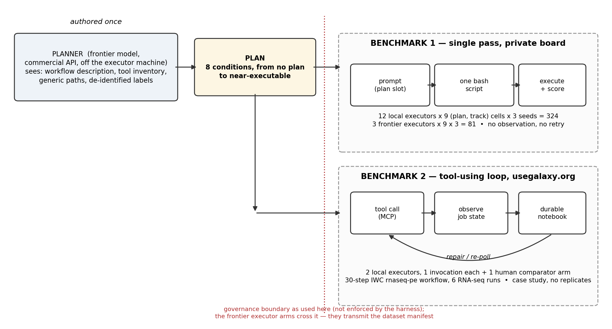
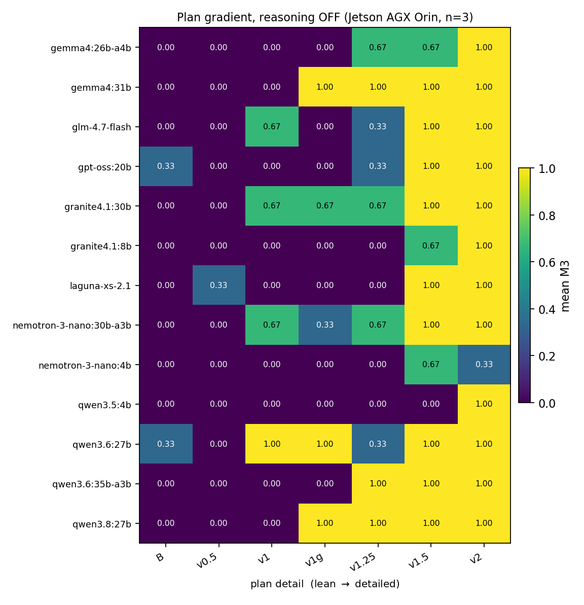
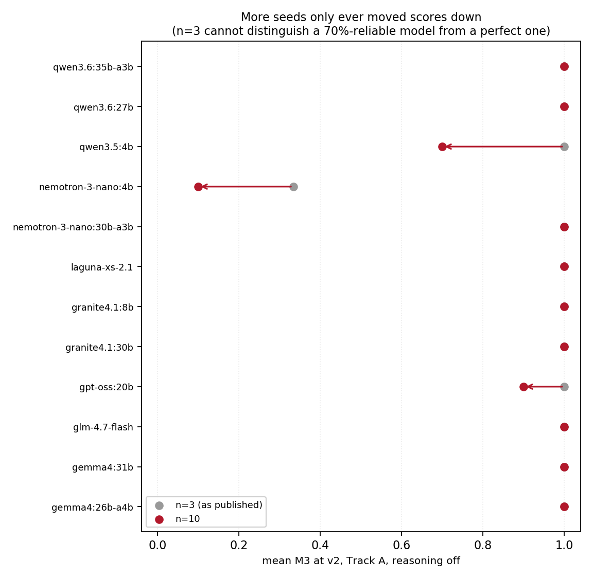
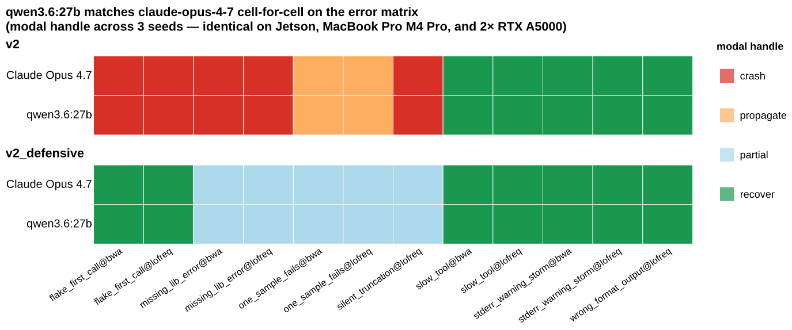
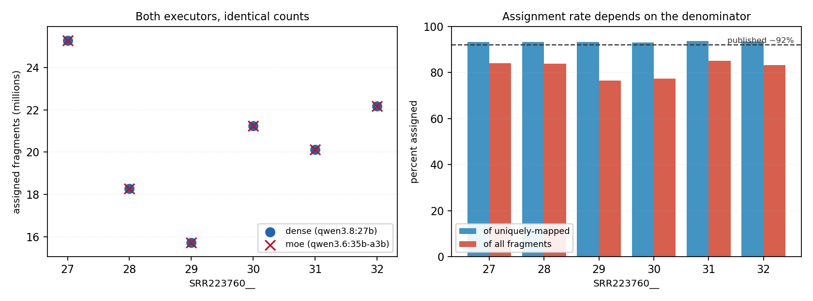

# In a single pass, most local 4-bit models copy a detailed plan; two of thirteen connect it to the files on disk

## Abstract

Running an established genomic workflow on new input files is execution work: the analytical decisions are already made, and an operator connects the workflow to this batch's files, runs it, and handles whatever fails. Here we asked how much detail a separately written plan must supply before a language model can do that execution, using per-sample mitochondrial variant calling as the test. Twelve open-weight models — models whose weights can be downloaded and run locally, here compressed to 4-bit precision so that they run on one machine — and three commercial API models each received one prompt and returned one shell script, with no feedback loop. Without a plan, 6 of 108 local runs and 13 of 27 API runs produced the correct call set; the API models succeeded in 9 of 9 runs with a short plan containing no commands, whereas the local models reached 34 of 36 correct runs only when the plan supplied literal command lines. The two groups also differ in compression, in the software that runs them, in size and in vendor, so this contrast describes the groups rather than isolating a cause. Within the plans, a command the model could paste and run raised success, and removing the explanatory prose changed nothing we could detect. To ask whether a model binds a plan — connects its commands to the inputs actually on disk — or merely copies it, we moved the reference genome and stated its new path in the input listing: eleven of thirteen local models (the twelve above plus one added later) copied the plan's stale path and failed, and two used the stated path and succeeded. Given up to three attempts, with the failed script and its error shown after each, three of the eleven repaired the path in at least two of three repetitions and eight never did. An RNA-seq case study on a public Galaxy server produced counts matching the published benchmark, but a human prepared part of the input and no model completed the final reporting step. These results apply only to workflows whose plans can specify every analytical choice. <!-- addresses: R2.1, R2.11, R2.16, R2.17, R2.21, R2.24, R3.6, R3.7, R3.8, R3.10, R3.13, R3.15, R2.10, R2.18, R1.3, C1, C2, T3.1 -->

## Introduction

Routine sequencing analysis requires an operator to connect a fixed workflow to new files, execute it, detect failures, and repeat the steps that failed. However, that connecting and repeating is still a person's work. We asked whether a language model can take over it from a separately authored plan, and measured it on two benchmarks: per-sample mitochondrial variant calling from paired-end Illumina reads (benchmark 1) and per-sample RNA-seq quantification on a public Galaxy server (benchmark 2). We tested fixed sets of models in two settings: locally, on one NVIDIA Jetson AGX Orin, a compact computer with 64 GB of memory shared between its CPU and GPU, and remotely, through one commercial API. We did not test whether a model can design an analysis, and we did not measure the human time involved; in neither benchmark did the models run the workflow unsupervised. <!-- addresses: R2.1, R3.15, R3.2 -->

A stable pipeline does not need a language model. A validated shell script, a workflow rule set, a Common Workflow Language (CWL) description, or a saved Galaxy workflow is a better choice because it is deterministic, auditable, and runs without a GPU (Di Tommaso et al. 2017; Mölder et al. 2021). A language model can be useful in the situations a saved pipeline does not cover: a one-time analysis, a change in file layout or tool version, or a natural-language interface for a user who does not write code. It can also be useful for binding—connecting a fixed workflow to a specific set of local inputs. Benchmark 2 exercised binding only in part (Results, *Case study: a tool-using agent loop on a production server*), so we also tested it directly. We moved one reference file, told the model where it now was, and checked whether the script used the new location; two of thirteen local models did (Results, *Moving one path separates transcription from binding*). <!-- addresses: R3.2 -->

The separation we tested — a plan written once, and its execution done separately against each new set of inputs — is the one workflow systems already embody. A specification is written once, and an engine connects it to concrete inputs at run time (Di Tommaso et al. 2017; Mölder et al. 2021; Amstutz et al. 2016; Galaxy Community 2024). Language-model research has produced several methods built on the same split between deciding what to do and doing it, including plan-and-solve prompting, least-to-most decomposition, ReAct, HuggingGPT, graph dispatch, and Reflexion (Wang et al. 2023; Zhou et al. 2023; Yao et al. 2023; Shen et al. 2023; Kim et al. 2024; Shinn et al. 2023). Alam and Roy (2025) reviewed their application to bioinformatics workflows. Our goal was to measure how well this design works on genomic workflows, with plan detail as the independent variable in benchmark 1. <!-- addresses: R1.2, R3.1, R3.2, C5 -->

In practice, the execution side is supplied by an agent harness—software that feeds the model its instructions, runs what the model writes, and returns the output for another round. Several harnesses were in wide use by mid-2026. We compared none of them, so we cannot say whether any result here would survive a change of harness. For benchmark 2 we used `galaxyproject/loom`, a harness through which the model reaches a Galaxy server, chosen for the deployment reasons given in the Supplement. Benchmark 1 has no agent harness at all: the model receives one prompt and returns one script, which we execute externally, with no loop, no observation, and no repair. This design isolates plan detail as the only variable, but it means the benchmark 1 system should not be called agentic. We added benchmark 2 to supply the missing loop.

The closest bioinformatics work scores tool-using agents — models allowed to call software as they work — on suites of open-ended research tasks (Huang et al. 2025; Mitchener et al. 2025; Su et al. 2025; Mehandru et al. 2025). We ran none of those suites, so we obtained no external anchor and no number in this paper sits on a published scale. Benchmark 2 has two external points of comparison, and we state the protocol behind each. First, a human executed the same workflow manually on the same server. Second, eight frontier models, the most capable commercial models available at the time, each acted as both planner and executor — wrote the plan and then carried it out — on the same data at $2.82–$131.83 per run (Nekrutenko 2026). That source is a post by the present author, with plans that were never published and no replicate runs; it bounds what the API route costs and is not a controlled comparison against those models. <!-- addresses: R2.5, R2.9, R2.15, C1, C5, T3.8 -->

Whether an open-weight model — one whose weights can be downloaded and run locally — fits on a given machine depends on two properties that the parameter count alone does not capture. The first is how much of the model works on each token, the unit of text a model reads or writes one at a time. A dense model uses all of its parameters for every token. A mixture-of-experts (MoE) model is instead built from several sub-networks, its experts, and sends each token through only a few of them. Its compute per token is therefore governed primarily by the parameters in the experts that fire (the active parameters), whereas weight residency — the memory the loaded weights occupy — is governed by the total parameters. The second is the key–value cache, the working memory in which the model keeps a record of every token in its context, that is, the text it has been given plus the text it has produced so far. This cache grows linearly with the length of that context and also depends on the model's architecture: how many layers it has, how many key–value heads each layer carries, and how wide each head is. The grouped- and multi-query variants of attention share key–value heads across query heads and so keep the cache smaller than full multi-head attention does. These two quantities, rather than the headline parameter count, set which models fit in the Jetson's 64 GB of memory (Methods), and Table 1 lists the four local models on which we measured weight residency. <!-- addresses: R2.3, C1 -->

**Table 1.** The four local models on which we measured weight residency, plus the API models. The table is a selection, not a catalogue: fourteen local models appear in this study. The full list — with file digests (checksums that identify the exact model file), declared context lengths, and each model's default decoding settings — is Supplementary Table S8. Ollama, the program that served the local models, ran every one of them at 4-bit quantisation — each weight stored at 4 bits of precision, the compression that lets these models fit on one machine. The format was not uniform: `gpt-oss:20b` ships in MXFP4, and every other local model in `q4_K_M`. The table carries no residency column because our own residency figures for one of these models do not reconcile; every residency measurement we made, with the discrepancy stated inline, is in Supplementary Table S4. We measured residency for four of the fourteen models and not for the other ten, because each measurement costs roughly six minutes to load the model from disk into memory (a cold load). We neither ran those loads nor estimated a figure in their place. Declared parameter counts span 4.0 B (`nemotron-3-nano:4b`) to 36.0 B (`qwen3.6:35b-a3b`).

| Executor | Architecture | Total params | Active params/token | Quantisation | Role |
|---|---|---|---|---|---|
| `qwen3.6:27b` | dense | 27 B | 27 B | q4_K_M | benchmark 1 plan series; injected-failure runs |
| `qwen3.8:27b` | dense | 27 B | 27 B | q4_K_M | added after the main series; benchmark 2, dense model |
| `qwen3.6:35b-a3b` | sparse MoE | 36.0 B | 3 B | q4_K_M | benchmark 1 plan series; benchmark 2, mixture-of-experts model |
| `gemma4:12b` | dense | 12 B | 12 B | q4_K_M | speed measurement only |
| `claude-opus-5`, `claude-sonnet-5`, `claude-haiku-4-5` | commercial API | — | — | — | commercial reference set for benchmark 1 |
| `claude-opus-4-7`, `claude-sonnet-4-6`, `claude-haiku-4-5` | commercial API | — | — | — | injected-failure runs |

<!-- addresses: R2.2, R2.3, R3.10, R1.3, TEN1, Q7 -->

We ran two workflow classes: alignment and small-variant calling, whose plan has 7 steps, and RNA-seq quantification, whose Galaxy workflow has 30 steps. Four further classes — single-cell RNA-seq, de novo assembly, metagenomic profiling, and ChIP-seq or ATAC-seq peak calling — cover most of the remaining routine per-sample work, and we ran none of the four. Which two classes we ran is the single most important limitation in this paper. The two classes run here are the two in which the plan can state the answer; the four not run are ones in which it cannot. In each of the four, at least one parameter is a scientific judgement made against the data: filtering thresholds, clustering resolution, assembler parameterisation, database version, peak-calling thresholds. There is thus no canonical value for a plan to carry and no command line for an executor to copy. The finding that a sufficiently detailed plan lets the local models succeed is therefore conditional on tasks with no data-dependent parameter choices. It may be in part a restatement of the criterion by which we selected the tasks (Supplementary Table S19). <!-- addresses: R2.4, R1.3, C2 -->

Two limits apply to all results. First, the series of plans at increasing levels of detail (the plan gradient) is exploratory: we had the most detailed plan written after we had observed failures with the shorter plans, not before. Second, benchmark 2 is a case study, and we do not combine results from the two benchmarks.

The detailed plan also carries a confound of its own. A separate language model acting as planner wrote it from a prompt we supplied (the meta-prompt). That prompt asks for every flag with its exact value and tells the planner that the executor will copy the commands into a shell script. Success with this plan can therefore include direct transcription, that is, copying the plan's commands verbatim. We measured transcription in two ways. Indirectly, we counted the fraction of the plan's literal command tokens that reappear in each script, which we call the transcription index (Results, *How much of the plan the models copy*). Directly, we used the moved-path test described above (Results, *Moving one path separates transcription from binding*). Results below present the plan series for benchmark 1, then the copying and repair tests, then the Galaxy case study. <!-- addresses: R2.14, R3.5, R3.preamble, R1.4, R3.6, T3.2, T3.3, C2 -->

## Methods

Extended methods are in the Supplement.

<!-- Build note: figure and table numbers are assigned by document position (in this
   file Methods precedes Results), not carried over from the archived filenames.
   Figure-number-to-filename manifest for this ordering, because the archived
   filenames no longer match the in-text numbering and a typesetting pass must not
   infer one from the other:
    Figure 1 -> revision/figures/rev_fig0_design.png
    Figure 2 -> revision/figures/rev_fig1_gradient_thinkoff.png
    Figure 3 -> revision/figures/rev_fig4_n3_vs_n10.png
    Figure 4 -> figures/ms_fig3_qwen3p6_27b_error.png
    Figure 5 -> revision/galaxy_demo/galaxy_demo_counts.png
    Figure S1 -> figures/fig1_workflow_dag.png
    Figure S2 -> revision/figures/rev_fig2_gradient_thinkon.png
    Figure S3 -> revision/figures/rev_fig3_reasoning_delta.png
   addresses: R3.14 -->

### Study design

We ran the two benchmarks on different harnesses, models, scoring methods and infrastructure, but held one division of labour constant: a commercial API model authored the plan before execution, and a local 4-bit open-weight model executed it (Figure 1). Benchmark 1 gave the executor one prompt and collected one shell script, so the model could not observe execution and could not retry. Benchmark 2 gave the executor multiple tool calls; it read state from a public server and kept state between sessions.

**Figure 1.** Study design. A plan is authored once, off the executor machine, by a frontier model in the planner role. Benchmark 1 executes that plan in a single pass: one prompt in, one bash script out, executed and scored with no observation step. Benchmark 2 executes it in a tool-using loop against the public usegalaxy.org server, with observation, durable state and repair. The dotted line marks the data-governance boundary as it was used here. The harness does not enforce that boundary, and the frontier executor arms of benchmark 1 cross it because their prompts carry the dataset manifest. <!-- addresses: R2.12, R3.16, R1.4 -->

The initial benchmark-1 design comprised 324 local generations and 81 API generations: 12 local executors and 3 API executors, crossed with 9 combinations of plan file and track, at 3 seeds each. A seed is the random-number setting that makes repeated draws from the same model differ; a track is the prompt template the executor received. Under Track A the template carries the plan file, and under Track B it carries only the problem statement and the tool inventory, so a Track-B run is a no-plan run whichever plan file was named on the command line. Four of the nine combinations used a Track-B template. One of those, v0.5, used a variant of the template that adds a single line giving the tool order, and is its own condition. The other three differ only in the plan file nominally named on the command line and are the same no-plan run. The nine combinations therefore represent seven plan conditions: five plan files (v1, v1g, v1.25, v1.5 and v2) under Track A, v0.5, and one no-plan condition pooled from the three Track-B runs. Ten released logs contain 848 cells and 75.27 h of generation, a cell being one executor, one plan condition and one seed. The 848 comprise these 405 gradient cells together with the blocks itemised in Supplementary Table S1: the reasoning-on arm, the repeated-sampling pass, the out-of-sample model and the budget and effort sweeps. Reasoning is the model's option to emit a chain of thought before it writes its script, and every gradient cell ran with reasoning off. API calls account for 81 cells and 1.55 h (Supplementary Tables S1–S2). Three later passes sit outside the 848-cell ledger and add 351 local cells. The first is a 273-cell extension that raised selected conditions from three seeds to ten. The second is a 39-cell pass in which the detailed plan was left verbatim while the reference genome was moved — the moved-path condition, described below. Under that move, a model that copies the plan's paths fails, while a model that reads the prompt's paths succeeds. The third is a 39-cell pass that re-ran that moved-path condition allowing up to three attempts, with the failing script and its error returned to the model after each failed run — a nonzero exit code, the shell's signal that a script did not finish. The log of this three-attempt pass has one duplicate skipped row, which we did not count as a cell. We discarded 400 earlier runs because they were generated with the key–value cache quantised to 8 bits (`q8_0`) rather than the 16-bit cache used for every retained run, and a quantised cache alters model output. Supplementary Table S10 gives generation outcomes for each block. <!-- addresses: R2.13, R3.10, Q8, Q16, C1, C2, R1.1, T11-corpus -->

### Benchmark 1: task, plan conditions, and execution

The task was per-sample mitochondrial variant calling on four deeply downsized paired-end Illumina amplicon samples, drawn from blood and cheek tissue of a mother–child pair, with nine truth variants per run summed over the four samples (two, two, two and three). The reference workflow indexes the 16,569-bp chrM reference with `bwa index` and `samtools faidx`, aligns with `bwa mem` piped to `samtools sort`, and indexes the resulting BAM. It then calls variants with `lofreq call-parallel`, compresses and indexes the VCF with `bgzip` and `tabix`, and finishes with a `bcftools query` plus `awk` fan-in that collapses all four samples into one `collapsed.tsv`. Only this fan-in couples samples to one another (Supplementary Figure S1). <!-- addresses: R3.14 -->

We ran executors under eight conditions, spanning no plan at all to a near-executable recipe (Table 2). Six conditions are plan files; Track B and v0.5 are prompt-template variants that substitute no plan file. The plan files were produced by three planner meta-prompts. The meta-prompts are reproduced verbatim in the Supplement, together with the executor prompt template. Two pieces of content that the results depend on originated in the human meta-prompt, not with the planner model. The first is the literal read-group string, which `PLANNER_PROMPT.md` requires reproduced "EXACT[ly], character-for-character"; it is therefore present even in the lean v1 condition. The second is the naming of `lofreq call-parallel`, `bgzip` plus `tabix` and `bcftools query`. The gradient is therefore in part a gradient in how much literal syntax was demanded of the planner, not purely in model-authored detail. The exception to model authorship is v1g: its `lofreq` block was extracted mechanically from the Galaxy community's tool-wrapper registry, maintained by the Intergalactic Utilities Commission (IUC; tools-iuc commit `39e7456`), and we included it as a check on sensitivity to plan authorship, not as an arm of a planner comparison. <!-- addresses: R1.4, R3.6, Q5 -->

**Table 2.** Plan conditions. Sizes are bytes of the substituted plan text, or of the prompt-template variant for the two no-plan conditions.

| Condition | Size | Summary | Hypothesis tested |
|---|---:|---|---|
| Track B | 1.2 KB | Problem statement and tool inventory only | How much a model does unaided |
| v0.5 | 1.4 KB | Track B plus one line giving the tool order | Whether tool order alone helps |
| v1 (lean) | 3.1 KB | Numbered bullets naming tools and key flags; no code | Reference lean plan |
| v1.25 | 3.1 KB | v1 plus one literal `lofreq call-parallel` command line | Whether one full command bridges v1 to v2 |
| v1.5 | 1.3 KB | v2 with all prose stripped; code fences only | Whether the prose changes outcomes or is decoration |
| v1g | 4.2 KB | v1 plus a `lofreq` invocation extracted mechanically from the IUC tool registry | Whether a tool registry can substitute for a plan author |
| v2 (detailed) | 4.6 KB | Exact command line and a Gotchas block per step | Reference detailed plan |
| v2_defensive | 6.5 KB | v2 plus `try()` helper, per-step validation, retry-once, failure log | Whether error-handling prose changes runtime behaviour |

Pooling by plan file without honouring the Track-B rule yields the convincing but false conclusion that the most detailed plan performs worst; `revision/scripts/gradient.py` implements the correct mapping and asserts it. <!-- addresses: Q1 -->

All local generations ran on one NVIDIA Jetson AGX Orin developer kit: 64 GB of unified LPDDR5 at 204.8 GB/s, released 2022. This memory class is now ordinary desktop hardware: the Mac mini announced in August 2026 reaches the same 64 GB of unified memory, at 307 GB/s, in its M5 Pro configuration (Apple 2026). The comparison is of memory capacity, bandwidth and price class only; no Apple machine was run in this study. All local generations were served by Ollama 0.32.5 at `temperature = 0.2`, the setting that scales how far the sampler strays from the most probable next token. The context window and the maximum output were both set to 16,384 tokens (`num_ctx = num_predict = 16384`). <!-- AUTHOR: state the reason for choosing temperature = 0.2; no rationale is recorded in the manuscript, the Supplement or revision/PROGRESS.md. --> Neither the local seed nor the API run identifier gives bitwise determinism, so we make no claim that any run can be reproduced bit for bit. One serving decision is a confound, not merely a disclosure: the harness overrode only `temperature`, leaving `top_k` and `top_p` at each model's own defaults. Those two settings limit how many candidate tokens the sampler may draw from, and their defaults are not uniform across families, being absent altogether for `qwen3.8:27b` (Supplementary Table S8). Every cross-model comparison here therefore compares models decoded from different distributions. The gradient itself is a within-model comparison and is unaffected. <!-- addresses: C4, R2.6, R3.9, R3.16 -->

Generated scripts were executed on the model host, in a per-cell working directory, under a pinned conda environment, and killed at 600 s. Execution had no human review, and none of the isolation a production system would use — no container or virtual machine, and no restriction on system calls, process namespace, resource quota or outbound network: only the wall-clock kill, the tool inventory restricted through `PATH` and the working directory are enforced. The constraints on absolute paths, package managers and network fetches are prompt instructions a model is free to violate, so we measured the violation rate in the Results rather than asserting compliance. The local arm does not meet the sandboxing bar a production deployment needs and is not a deployment template. Text that an attacker or an accident could control reached the executor through at least five channels that nothing sanitised, listed in the Supplement. We ran no test of whether such text could steer the model — an indirect prompt injection. <!-- addresses: R1.1 -->

### Scoring, error injection, and interval estimates

We assessed success on a three-rung ladder whose names match the released scorer's field names. The first rung, M1 (`m1_executes`), asks whether `bash run.sh` returned 0 within 600 s; the second, M2 (`m2_schema`), whether every expected output exists and `bcftools` accepts every VCF; the third, M3 (`m3_jaccard`), whether the per-sample variant output matches the answer key. Two properties of M3 govern how the Results read. First, M3 depends on exit status: `score_run.py` sets it to 0.0 whenever the run exited non-zero, regardless of what is on disk. Second, M3 is the Jaccard overlap — variants shared by call set and answer key, divided by the variants in either — rather than a per-sample success fraction. It is computed per sample on (chrom, pos, ref, alt) against the answer key, with allele frequencies matched within ±0.02 (hence "tolerant Jaccard"), and averaged over the four samples. On the 324 local cells run with reasoning off, M3 takes only the values 0.0 and 1.0; on the frontier arm it does not. Conventional variant-calling metrics were computed alongside, not instead (Supplementary Table S12), and the departures from the nearest published conventions (Krusche et al. 2019) are enumerated in Supplementary Table S5. <!-- addresses: R3.4, R2.8, R2.11, Q6, C3, recall-equals-success -->

To test whether a generated script survives a tool failing beneath it, we injected failures with PATH shims. Before each cell the harness wrote a short wrapper named `bwa` or `lofreq` into a directory placed first on `PATH`, so the shell ran the wrapper instead of the real tool. The wrapper failed in a chosen pattern, and the script saw nothing but ordinary exit codes, stderr and output files. A pattern is the failure behaviour, and a target is the tool the wrapper replaces. Each executor–plan combination comprises 39 cells: 12 pattern–target combinations at 3 seeds each, of which 8 inject a true error and 4 do not, plus 3 uninjected controls. Two of the seven patterns do not inject an error at all — `slow_tool` sleeps 30 s and then succeeds, and `stderr_warning_storm` emits 200 warnings and then succeeds — so 4 of the 12 injected combinations (a third) test latency and log-noise tolerance, not recovery — whether the script notices the failure and still produces the correct call set. We therefore report results by class and never pool them (Supplementary Table S6). <!-- addresses: R3.7, R2.7, T3.5 -->

We ran the full gradient at three seeds per executor–condition pair, and raised the headline condition (plan v2, Track A, reasoning off) to ten seeds by adding seven and pooling. We later raised three further conditions — v1g, v1.25 and v1.5, Track A, reasoning off — to ten seeds per model across thirteen local executors, because those three carry the mechanism argument and three seeds could not separate them. The thirteen are the twelve gradient models plus `qwen3.8:27b`; that model's original three seeds sit in a separate log and are not pooled, so it contributes seven. One attempted v1g cell has no score record in the released log and could not be reconstructed, so we treated it as missing rather than as a failed generation. The denominators are 126 for v1g and 127 for v1.25 and v1.5 (Supplementary Table S16); treating the missing cell as a failure gives 31/127 rather than 31/126 for v1g and does not change the conclusions. This is repeated sampling from a single configuration, not replication: ten seeds on one machine, one engine build, one quantisation, one plan and one scorer vary the sampler and nothing else. Generation attempts ending in truncation, refusal or provider error are scored 0 and retained (the retention rule); no completed generation was dropped for producing a bad answer. All success proportions carry Clopper–Pearson exact 95% confidence intervals, and the intervals are wide here: 3/3 gives [0.29, 1.00], 10/10 gives [0.69, 1.00]. <!-- addresses: R2.6, R3.8, R3.10, Q10, Q12, T3.6 -->

### The moved-path condition

We added one further condition, after the gradient had been run, to separate transcription from binding directly. The plan is v2 verbatim, not one character changed. The working directory holds the same four read pairs, but the reference genome sits at `data/ref/GRCh38_chrM/rCRS.fa`, and the plan's literal path, `data/ref/chrM.fa`, does not exist. The prompt's DATASET section states the real path, so every fact needed to succeed is in the executor's context. A script that copies the plan's command lines fails at the first step; a script that binds them to the stated inputs succeeds. We validated the working directory before any model ran, with a hand-written script of each kind: the copying script fails at `bwa index`, and the binding script produces the correct call set. Thirteen local executors — the twelve gradient models plus `qwen3.8:27b` — ran at 3 seeds each, reasoning off, Track A, giving 39 cells (`matrix_jetson_perturbed.jsonl`; per-cell artifacts under `revision/runs_perturbed/`). The control is the unperturbed published v2 condition, 34 of 36 perfect across the twelve gradient models. No frontier executor was run on the moved-path condition, because no API spend was authorised for this pass. <!-- addresses: R2.1, R3.preamble, R3.6, T3.2 -->

### Benchmark 2 and the fabrication study

The second benchmark re-quantified *Candidozyma auris* RNA-seq from Santana et al. (2023), BioProject PRJNA904261, six paired-end runs SRR22376027–SRR22376032. We chose this target because it is a published benchmark with known expected values (~5,594 genes, ~92% assigned). Relative to benchmark 1 it varies four things at once: a second workflow class, a shared production server, a 30-step workflow, and an external cost comparator (Nekrutenko 2026). The executor-selection rule is invoked repeatedly in what follows, so we state it verbatim:

> *take every local model that scored 3/3 at plan v2 Track A with reasoning off in the benchmark-1 gradient, and from that set take the largest dense model and the largest mixture-of-experts model by total parameter count.*

The rule returns `qwen3.6:27b` (dense) and `qwen3.6:35b-a3b` (mixture-of-experts). The dense arm actually run was `qwen3.8:27b`, substituted at matched parameter count because it was released on 14 August 2026, after the rule was frozen and benchmark 1 was complete. That arm is therefore exploratory rather than confirmatory, and plan sufficiency was never confirmatory on either benchmark, because the Galaxy plan was corrected repeatedly while benchmark 2 ran. <!-- addresses: R3.5, R2.14, R2.15, R1.4 -->

Both executors ran on one Jetson AGX Orin 64 GB with reasoning off, under the `galaxyproject/loom` harness. The harness reached Galaxy through MCP — the Model Context Protocol, a standard interface through which a model calls external tools — and kept a `notebook.md` file as the executor's memory from one session to the next. The plan was a router — a 50-line index plus seven step files — so the executor loads only the step it is on. Its seven steps ran from importing the workflow by its identifier in the Tool Registry Service (TRS) of the Global Alliance for Genomics and Health (GA4GH) to reporting the per-sample counts. No number reported for this benchmark comes from an agent's own report: we read every state, parameter and count back from the Galaxy API or from dataset contents, because one executor produced a fully formed failure report for an event that never occurred. Scoring had four components: 1) invocation correctness, field by field; 2) biological outcome against the published benchmark, read from dataset contents; 3) end-to-end reporting, meaning whether the executor itself delivered the per-sample table with a dataset identifier beside every number; and 4) a defect ledger attributing every human intervention to the planner or the executor side.

We rewrote the step-7 verification file while benchmark 2 ran, because its original version stated its own expected values and so let an executor that never opens a dataset verify by recitation. The rewritten file states no expected values and sanctions `UNAVAILABLE`. The general rule follows: any agent evaluation that places the expected answer in the task description cannot distinguish execution from recitation. <!-- addresses: C1, C2, R2.10, R3.1, R3.3, R3.5, R1.3, Q2, T3.1, T3.3, T3.4 -->

That fabricated failure report was a single observation, so we ran a controlled follow-up to bound the rate. The design was 3 conditions × 2 models × 5 seeds, one fresh workspace per cell, a fixed prompt and known ground truth. The task was to fetch six featureCounts summary datasets from a real Galaxy history and report each `Assigned` value with the dataset identifier it was read from. The conditions were blind (nothing said about expected values), leaky (the expected range stated) and blocked (two identifiers replaced with same-shaped ones that do not exist, so `UNAVAILABLE` is the only correct answer). Answers were scored `CORRECT`, `WRONG` — the fabrication category — `ABSTAINED` or `ABSENT`. The design is 30 launches, of which 24 produced a scorable answer file, giving 144 sample-level judgements; six of 30 (20%) produced no answer to score. Three limitations govern the rate. First, judgements within a session are not independent, so the session is the unit of analysis. Second, unscorable launches are excluded, so the rate is fabrication conditional on an answer having been produced, and the excluded class — launches that produced no answer — is the very class the original incident belongs to. Third, every cell is single-shot with a working tool path, whereas the incident arose in a resumed session with no reachable path. <!-- addresses: R2.18, R3.7, R1.1 -->

### Cost model, data governance, and availability

We built a cost model comparing annualised local and API spending from eight inputs, of which two are measured. Frontier-API cost was $0.0662 per run over 81 API cells, and Jetson generation time, verified from the released log, is 80.3 s per run (26,010 s over 324 cells). The cost model uses 86.7 s per run, the 7.8 h recorded at run time for the 324-cell local block including model loading, execution and scoring. That block figure was not archived, so it is carried as a stated input, not a verifiable measurement. Substituting the verified 80.3 s changes the electricity term by 8% and no conclusion. The other six inputs are assumptions, exposed as parameters in `revision/scripts/cost_model.py` (Supplementary Table S9). The cost model reports a like-for-like annualised comparison, with an API-side labour term exposed rather than set to zero. Supervision labour is not priced at all, and benchmark 2 shows it is not zero; the cost model is therefore the zero-touch case, which benchmark 2 did not achieve. <!-- addresses: R2.17, R3.2, R3.13 -->

The plan-then-execute split also defines a data-governance boundary — the plan may leave the machine, the sample data and subject labels may not — and only the planner role respected it. The frontier executor arms — 315 API cells in all, 81 in the reference gradient and 234 in the error matrix — transmitted the executor prompt, which carries the dataset manifest with this study's own subject labels. `revision/scripts/payload_audit.py` reconstructs every outbound payload and scans it against a deny-list of local-identity tokens (Supplementary Table S3). Benchmark 2's MCP traffic is neither archived nor reconstructable, and it is outside the audit. <!-- addresses: R1.4 -->

The repository at https://github.com/nekrut/LLM-eval-paper is released under an MIT license. It contains the plan files and prompt templates, the planner meta-prompts, the harness and sweep drivers, the scoring code, every archived `run.sh` and per-cell artifact, the error-matrix logs, and the revision analysis scripts. Four items are not released: the Galaxy plan files, the fabrication study's code and per-cell outcomes, the eleven-item defect ledger with its diffs, and the `loom` session logs. Benchmark 2's per-sample counts and gene count are re-readable from public Galaxy histories, but its defect count and attribution, its tool-call and wall-clock figures, and the fabrication study's cell counts rest on `revision/galaxy_demo/FACTS.md`. That file is a hand-typed contemporaneous record of live API read-back — the same evidentiary class as an assertion in this manuscript — and those figures are marked as such wherever used. <!-- addresses: Q4, Q3, R3.16, R1.4, R1.3 -->

## Results

### The two executor classes diverge most where the plan is thinnest

To measure how much written guidance each executor class — the local open-weight models and the commercial API models — needs, we ran every executor against the plan gradient, from no plan at all to a plan spelling out every command (Figure 2, Table 3). Each condition was run at three seeds, so each 3/3 or 0/3 below is three independent scripts from the same prompt. With no plan, 6 of 108 local runs produced the correct call set (exact 95% CI [0.02, 0.12]), while the three commercial API models — the frontier arm — produced it in 13 of 27 runs ([0.29, 0.68]). Plan v1, the lean plan, contains no command lines, yet the frontier executors were correct in all 9 v1 runs and in all 36 runs with the four more detailed plans. Thus more plan detail did not increase their observed success proportion, although the interval on 9/9 is wide (exact 95% interval [0.66, 1.00]). The local executors reached 34 of 36 correct runs only with v2, the most detailed plan.

The tested executor classes therefore differed in how much specification they needed, with the largest contrast where the plan was thinnest — a contrast our design cannot attribute to any single variable. The local arm is 4-bit quantised, at most 36 billion parameters (36 B), open-weight and served by Ollama on our own hardware. The frontier arm is unquantised, of undisclosed size, from a single vendor, served over an API and run with different randomness settings during generation (Methods). These variables move together, and this design separates none of them. The 4-bit compression in particular could explain why a model cannot write the correct set of flags for `lofreq call-parallel`. The decisive control would run one model, `qwen3.6:27b`, at 8-bit (`q8_0`) or full 16-bit (fp16) precision against its own 4-bit (`q4_K_M`) version, and we did not run it. If precision closes a meaningful part of the gap, the finding is about quantisation rather than open weights. Three models from one vendor is also not a sample of frontier models. <!-- addresses: R2.1, R2.6, R3.15, Q1, R2.4, T9-frontier-no-ci -->

**Figure 2.** Plan gradient with reasoning off, Jetson AGX Orin, n = 3 seeds per cell. Rows are the twelve benchmark-1 local executors plus the out-of-sample addition `qwen3.8:27b`, thirteen rows in all. The twelve-model gradient totals given in the text exclude `qwen3.8:27b`, which was run separately and is shown here for comparison. Columns run left to right from no plan (Track B) to the most detailed plan (v2). Cell values are the mean tolerant Jaccard score (M3), which on this arm takes only the values 0 and 1 per run. <!-- addresses: R2.13, R3.10, Q6 -->

**Table 3.** Plan gradient, reasoning off, twelve local executors, three seeds per cell. Track B was run under three nominal plan files and we pool the three, hence n = 108 (12 models × 3 files × 3 seeds). Intervals are Clopper–Pearson exact 95% intervals. The local arm is reported as a count of runs producing the correct call set, not as a mean score: on all 324 local reasoning-off cells, M3 takes only the values 0.0 and 1.0, so a local "mean M3" column would be the perfect-run proportion written twice and would invite the reader to believe partial biological credit was measured, which on this arm it was not. The tolerant Jaccard is retained only for the frontier arm, where it carries information of its own: its cells there take the values 0.0, 0.833, 0.938 and 1.0, so a Track-B mean of 0.825 coexists with only 13 of 27 runs perfect. The frontier column pools the three API executors at n = 9 per column, 27 at Track B. Three local conditions — v1g, v1.25 and v1.5 — were later raised to ten seeds per model over thirteen executors (31/126, 63/127 and 109/127; Results, *Runnable command syntax, not explanatory prose, carries the plan's effect*; Supplementary Table S16). The n = 3 rows are retained here so that the survey is one design.

| Condition | Local runs with the correct call set | 95% CI | Frontier runs with the correct call set | 95% CI | Frontier mean M3 (Jaccard) |
|---|---:|---|---:|---|---:|
| Track B (no plan) | 6/108 | [0.02, 0.12] | 13/27 | [0.29, 0.68] | 0.825 |
| v0.5 (tool order only) | 1/36 | [0.00, 0.15] | 3/9 | [0.08, 0.70] | 0.801 |
| v1 (lean) | 9/36 | [0.12, 0.42] | 9/9 | [0.66, 1.00] | 1.000 |
| v1g (registry-authored) | 9/36 | [0.12, 0.42] | 9/9 | [0.66, 1.00] | 1.000 |
| v1.25 (v1 + one command line) | 15/36 | [0.26, 0.59] | 9/9 | [0.66, 1.00] | 1.000 |
| v1.5 (v2 with prose stripped) | 30/36 | [0.67, 0.94] | 9/9 | [0.66, 1.00] | 1.000 |
| v2 (detailed) | 34/36 | [0.81, 0.99] | 9/9 | [0.66, 1.00] | 1.000 |

<!-- addresses: Q6 -->

### Runnable command syntax, not explanatory prose, carries the plan's effect

The gradient bundles prose and command syntax together, so we next pulled the two apart. Plan v1.5 is v2 with all prose stripped, leaving only the fenced code blocks. It is the shortest plan in the set, at 159 words against v2's 660, and the second best at producing the correct call set: 30 of 36 local runs, against 34 of 36 for v2.

The two halves of the prose-versus-syntax contrast are not equally well resolved. Removing the literal command lines, which is what plan v1 is, reduced perfect runs from 34/36 to 9/36. Stripping every word of explanation from v2 reduced them from 34/36 to 30/36, a difference not resolved at these sample sizes. Comparing each model's v1.5 result with its own v2 result, 3 models did better without the prose, 1 did worse and 8 were unchanged (two-sided sign test, p = 0.63). Three seeds per cell leave that contrast underpowered, so we later re-ran three conditions — v1g, v1.25 and v1.5 — at ten seeds per model (the seed extension). That extension sharpens the syntax contrasts rather than the prose one, because v2 was not among the extended conditions. For comparison, v2's own ten-seed pooling at the headline condition gives 107 of 120 runs over the twelve gradient models (Supplementary Table S11), against 109 of 127 for v1.5 over thirteen. The pooled descriptive proportions were 31/126 for v1g (0.246, exact 95% CI [0.17, 0.33]), 63/127 for v1.25 (0.496, [0.41, 0.59]) and 109/127 for v1.5 (0.858, [0.79, 0.91]). Because the ten runs of one model are not independent of one another, we treat the 13 model-level success proportions as paired observations for the primary contrasts. The mean within-model difference was 0.253 for v1.25 minus v1g (p = 0.027 by an exact sign-flip test, a permutation test that flips the sign of each paired difference) and 0.354 for v1.5 minus v1.25 (p = 0.0039). We report the corresponding run-level paired counts in Supplementary Table S16 as a sensitivity analysis. The defensible claim has three parts: runnable command syntax improved outcomes across the tested models, removing prose produced no detectable change, and the size of any prose effect remains uncertain. <!-- addresses: R3.6, R3.8, R2.24 -->

The mechanism is more specific than a count of command lines. Plans v1.25 and v1g each add one literal `lofreq` invocation to v1 but present it differently. Plan v1.25 supplies one runnable line: `lofreq call-parallel --pp-threads 4 -f data/ref/chrM.fa -o results/{sample}.vcf results/{sample}.bam`. Plan v1g supplies its `lofreq` invocation as a five-line block, spelled the way the Galaxy tool registry writes it: long-form flags (`--ref`, `--out`) broken across several lines. Two of those flags (`--sig`, `--bonf`) stand on their own lines with no value, and the plan itself says they may be omitted. Their pooled success proportions were 0.496 and 0.246, respectively. The v1g plan also states that `results/{sample}.bam` is a positional argument at the end, so the contrast is not explained by omission of that information. Across the 13 paired model-level proportions, v1.25 exceeded v1g by a mean of 0.253 (exact sign-flip p = 0.027). The plan property that matters, on this evidence, is whether a command can be pasted and run without modification, not how much information the plan carries or how long it is. Plan v1.5 is the shortest and the second best, v2 is the longest and the best, and v1g is the second longest but the weakest of the plans containing command syntax (Table 4). We quote no rank correlation over five points with ties. <!-- addresses: Q5, R3.6, R2.8, R2.24, spearman -->

**Table 4.** Syntax density against outcome, Track A, reasoning off. "Literal command lines" counts non-blank lines inside fenced blocks that invoke a workflow tool or shell construct. That is an operational definition, and the count is sensitive to it. v1g's single `lofreq` invocation is written across five physical lines in the long-form flag spelling of the Galaxy tool registry; it is counted as one, because it is one invocation. v1g's author is the Galaxy IUC registry, extracted mechanically; every other plan was authored by a frontier model. The local counts include the one truncated v1g generation, scored 0 under the retention rule stated in Methods; `revision/galaxy_demo/SYNTAX_DENSITY.md` drops that generation and so differs in the third decimal. Every frontier cell here is 9/9. The ten-seed column pools the seed extension over thirteen local executors (Methods; Supplementary Table S16). v1 and v2 were not extended; v2's headline pooling to n = 10 is Table S11.

| Plan | Author | Words | Literal command lines | Local runs with the correct call set, Jetson (n = 3/model) | Local runs with the correct call set, Jetson (n = 10/model) | Frontier mean M3, API (n = 9) |
|---|---|---:|---:|---:|---:|---:|
| v1 | frontier planner | 422 | 0 | 9/36 (0.250) | — | 1.000 (9/9) |
| v1g | Galaxy IUC registry (mechanical) | 558 | 1 | 9/36 (0.250) | 31/126 (0.246) | 1.000 (9/9) |
| v1.25 | frontier planner | 413 | 1 | 15/36 (0.417) | 63/127 (0.496) | 1.000 (9/9) |
| v1.5 | frontier planner | 159 | 10 | 30/36 (0.833) | 109/127 (0.858) | 1.000 (9/9) |
| v2 | frontier planner | 660 | 8 | 34/36 (0.944) | — | 1.000 (9/9) |

Across the same five plans, the API executors were correct in 45 of 45 runs while the local success proportion increased from 0.250 to 0.944. Thus, greater plan detail reduced the observed difference between the two executor groups, although the API result is a point estimate from nine runs per plan. The v1g plan does not test whether a tool registry writes better plans than a model, because it differs from the model-written plans in how much command syntax it carries as well as in who wrote it: it is a mechanically extracted plan with a non-model author. Its result shows that authorship and plan length do not explain the observed pattern. The data support a narrower conclusion: local models produced working pipelines more often when the plan contained commands that could be copied without modification. Explanatory prose produced no detectable effect at the tested sample size. How much of a plan the models copy outright is what we measured next. <!-- addresses: R3.6, R2.1, R3.15, R3.preamble, Q5, v1g-joint-worst -->

### How much of the plan the models copy

To compute the transcription index, we split the command lines of plan v2 into their 90 literal tokens — tool names, flags, values and paths — and counted the fraction of them that reappear in each emitted script. Two normalisations precede the count: `{sample}`, `$sample` and `${sample}` are treated as one token, and a `$THREADS` variable as the same token as the plan's literal thread count of 4. The index is indirect, because it counts shared tokens and not whether they were used correctly. We computed the index over the 787 reasoning-off scripts (Table 5).

**Table 5.** Transcription index by plan condition, reasoning off, over the 787 archived reasoning-off scripts (the original corpus plus the seed-extension scripts at v1g, v1.25 and v1.5). Recall is of plan v2's 90 literal command tokens, so all conditions are measured against one fixed reference. Brackets are the interquartile range across scripts. The corresponding bootstrap 95% intervals on the mean have a half-width of at most 0.03 in every cell with n > 9, and are omitted to keep the table legible. The two values compared in the text are the frontier correct-run value at Track B and the local correct-run value at v2. The corpus includes the 48 `qwen3.8:27b` scripts that Table 3 excludes; they are 6% of it.

| Condition | Local, all scripts | n | Frontier, all scripts | n | Local, correct runs only | n | Frontier, correct runs only | n |
|---|---:|---:|---:|---:|---:|---:|---:|---:|
| Track B (no plan) | 0.446 [0.42–0.49] | 117 | 0.520 [0.47–0.56] | 27 | 0.428 | 6 | 0.505 [0.46–0.54] | 13 |
| v0.5 | 0.454 [0.42–0.49] | 39 | 0.501 | 9 | 0.467 | 1 | 0.444 | 3 |
| v1 | 0.515 [0.48–0.54] | 39 | 0.522 | 9 | 0.509 | 9 | 0.522 | 9 |
| v1g | 0.520 [0.48–0.56] | 129 | 0.517 | 9 | 0.505 | 34 | 0.517 | 9 |
| v1.25 | 0.516 [0.49–0.54] | 130 | 0.533 | 9 | 0.513 | 66 | 0.533 | 9 |
| v1.5 | 0.702 [0.68–0.74] | 130 | 0.658 | 9 | 0.705 | 112 | 0.658 | 9 |
| v2 | 0.746 [0.74–0.76] | 122 | 0.695 | 9 | 0.749 [0.74–0.76] | 110 | 0.695 | 9 |

The 13 correct API runs with no plan had a mean transcription index of 0.505, while correct local runs with v2 had a mean index of 0.749. Thus approximately half of the v2 command tokens occur in a correct pipeline written without any plan, and supplying the plan added approximately one quarter of the tokens. The index did not predict success within a plan condition. At v2 the means were 0.749 for successful scripts and 0.722 for failed scripts, and at v1 they were 0.509 and 0.517. Measured against plan v1.5's own command tokens rather than v2's, local scripts reproduced 0.942 of them (n = 130).

What the index cannot settle is what the remaining quarter is. A model that merely reflows the supplied tokens — call it a transcriber — and a model that reconciles those tokens against the actual inputs — a binder — both score near 0.75. No token count forces them apart. The condition that does force them apart is a perturbed plan, v2 verbatim with the reference moved, because a transcriber reproduces the defect and a binder repairs it. That condition is the next section. <!-- addresses: R3.6, R2.1, R2.11, R3.preamble, T3.2, T11-corpus, transcription-no-interval -->

### Moving one path separates transcription from binding

Briefly (the full design is in Methods), the plan is v2 verbatim, but the reference genome sits at `data/ref/GRCh38_chrM/rCRS.fa` instead of the plan's literal `data/ref/chrM.fa`, and the real path is stated in the prompt's DATASET section. Before any model ran, we validated the sandbox with two hand-written scripts: one copies the plan's path verbatim and must fail, the other binds to the stated path and must succeed. We then ran thirteen local executors at three seeds each, against a control of 34/36 perfect on the unperturbed v2.

The result is 6 of 39 perfect, and the outcome is bimodal by model: every model is 3/3 or 0/3 (Table 6). We verified this from the emitted scripts rather than inferring it from the scores. Both surviving models wrote `data/ref/GRCh38_chrM/rCRS.fa` throughout. All eleven failing models wrote the plan's `data/ref/chrM.fa` verbatim — several derived index names such as `chrM.fa.fa` from it — and every failing run died at the first step, with `bwa index` unable to open the file. <!-- addresses: R2.1, R3.preamble, R3.6, T3.2 -->

**Table 6.** Plan v2 verbatim with the reference moved to a path stated in the prompt, thirteen local executors × 3 seeds, reasoning off. Outcomes read from the emitted scripts and per-cell logs (`matrix_jetson_perturbed.jsonl`; artifacts under `revision/runs_perturbed/`). Control: unperturbed v2, 34/36 perfect.

| Outcome | Models | What every emitted script wrote |
|---|---|---|
| Bound (3/3 perfect) | `gemma4:31b`, `gpt-oss:20b` | the true path `data/ref/GRCh38_chrM/rCRS.fa`, carried into every derived path |
| Copied (0/3 perfect) | `qwen3.6:27b`, `qwen3.8:27b`, `qwen3.6:35b-a3b`, `gemma4:26b-a4b`, `glm-4.7-flash`, `granite4.1:30b`, `granite4.1:8b`, `laguna-xs-2.1`, `nemotron-3-nano:30b-a3b`, `nemotron-3-nano:4b`, `qwen3.5:4b` | the plan's stale `data/ref/chrM.fa` verbatim; every run failed at the first step (`bwa index`: fail to open file) |

Four things follow, and together they change what the gradient means. First, for eleven of thirteen local models, v2 success is transcription: they copy the plan's command lines without reconciling them against the stated inputs. One path mismatch, stated in the prompt they were reading, sent a condition that scores 34/36 to 0. The headline result therefore rewards pasting for eleven of the thirteen models, and we say so as a measurement rather than a concession. Second, binding exists in this model class but is rare. Two of thirteen models adjusted every path and produced the correct call set in all three seeds, so binding is demonstrable rather than hypothetical — a property of individual models, not of the class. Third, rank on the unperturbed gradient does not predict binding. `qwen3.6:27b`, at 10/10 on unperturbed v2, copied the stale path; `gpt-oss:20b` bound the stated one, although it was one of only three models below 10/10 on that same condition (9/10). Fourth, the claim that survives is narrower than plan sufficiency: a detailed plan makes most local models work only while its literal paths match the data. Reliable execution under a stale plan requires either a binding-capable model or a plan kept exactly current. Whether frontier executors bind under the same perturbation is unknown, because we ran no frontier arm. And at three seeds per model, a 3/3 is [0.29, 1.00], so the bimodality is sharp but each per-model rate is wide. <!-- addresses: R2.1, R3.preamble, R3.6, R3.8, T3.2, C2 -->

### Three attempts separate transcribers that repair from transcribers that do not

The moved-path test above gave each model one attempt: it wrote a script, the script ran, and that was the end of the trial. We therefore repeated the test with the same moved reference, allowing up to three attempts. After each failed run the model was shown the script it had just written, the exit code and the last 40 lines of the execution log, and could submit a replacement. Failure meant a nonzero exit code and nothing more: we computed the score afterward and never showed it to the model. We ran thirteen local executors at three seeds each (`matrix_jetson_repair.jsonl`; per-attempt scripts under `revision/runs_repair/`). <!-- addresses: T3.1, C1, R2.10 -->

Feedback split the eleven models that had copied into models that repair and models that do not (Table 7; per-seed attempts and scores are Supplementary Table S18). Three of the eleven repaired. Eight did not, although the error named the missing file and the correct path was in their prompt. Repair rescued 8 of the 33 seeds from the copying models, so with repair the class reached 14 of 39 perfect runs, against 6 of 39 one-shot and 34 of 36 unperturbed. The one-attempt constraint therefore accounts for part of the transcription finding, not all of it. The taxonomy is three tiers: bind (2 models), repair (3), neither (8). One retry converted `qwen3.6:27b` and `qwen3.8:27b` from total failure to perfect: for those two models, an execute-and-retry round was worth more than any amount of plan prose. <!-- addresses: T3.1, C1, R2.10 -->

**Table 7.** The moved-reference condition re-run with up to three attempts, the error fed back after each nonzero exit. Thirteen local executors × 3 seeds, reasoning off. Per-model attempts and per-seed scores are Supplementary Table S18.

| Tier | Models | Outcome |
|---|---|---|
| Bind on attempt 1 | `gemma4:31b`, `gpt-oss:20b` | one attempt, perfect, all seeds (the controls; unchanged) |
| Repair on attempt 2 | `qwen3.6:27b`, `qwen3.8:27b` | perfect on attempt 2 in all three seeds |
| Partial repair | `laguna-xs-2.1` | perfect on attempt 2 in two of three seeds |
| No repair | the remaining eight models | 0 of 24 seeds recovered in three attempts |

We verified three behaviours from the per-attempt scripts rather than inferring them from the scores. First, the fix by `qwen3.6:27b` is a genuine repair: its second attempt tests for the old path, falls back to the path stated in the prompt, and proceeds. It used the prompt's information once the error pointed at the file. Second, `qwen3.6:35b-a3b` resubmitted the identical dead path in all three attempts, with the error naming that path in front of it. Third, `granite4.1:30b` and `gemma4:26b-a4b` guessed `data/ref/rCRS.fa` on attempt 3 — the correct filename from the prompt, in the wrong directory — so they used part of the prompt's information and did not check the rest. Failure to repair is not failure to act: the non-repairing models changed other things — flags, loops, index names — while keeping the dead path. Four caveats bound this arm: three seeds per model, one perturbation type, a retry only on a nonzero exit, and no frontier arm. <!-- addresses: T3.1, C1, R2.10 -->

### The n = 3 headline does not survive repeated sampling

Because three seeds per cell leave wide intervals, we added seven seeds to the original three at v2 Track A (Figure 3, Supplementary Table S11). The headline moved. Nine of 12 executors are 10/10 (exact 95% CI [0.69, 1.00]); `gpt-oss:20b` is 9/10; `qwen3.5:4b`, which scored 3/3 at n = 3, is 7/10; and `nemotron-3-nano:4b` is 1/10 ([0.00, 0.45]). Every model that moved, moved down: eleven of the twelve were already at 3/3 and could only fall or hold, and the one model below that ceiling, `nemotron-3-nano:4b` at 1/3, fell as well. We therefore report n = 10 as the headline and read every n = 3 cell as its wide interval rather than as a rate. We had also asked whether `qwen3.8:27b`, the newer release of the same family, outperforms `qwen3.6:27b`. It does not on this evidence, and the evidence is thin rather than null: of 27 cells (plan condition × seed) run with both models, 19 gave the same outcome and 8 differed, and the older model won 6 of those 8 (p = 0.29). We therefore make no claim about model generation. <!-- addresses: R3.8, R2.16, R2.20, R2.4, R3.10, Q12, T3.6 -->

**Figure 3.** Repeated sampling with plan v2 (plan v2, Track A, reasoning off). Grey points are the n = 3 means from the full n = 3 gradient; red points are the pooled n = 10 means. Every model that moved, moved down; no model rose. This is repeated sampling from one configuration, not independent replication. <!-- addresses: R2.6 -->

### Per-variant recall exceeds the proportion of successful runs, because some failed runs called variants correctly

The conventional variant-calling metrics are worth reporting, but only with their construction stated. Over all 324 reasoning-off runs, of 2,916 truth variants (324 runs × 9) TP = 1,042 and FN = 1,874, with FP = 0; precision is 1.000 by construction, because the truth set is the canonical output of the same deterministic caller. Recall, however, does not equal the run-level success rate in any condition except v2. It is 0.086 against a success rate of 0.056 (6/108) at Track B, 0.306 against 0.250 (9/36) at v1, 0.485 against 0.417 (15/36) at v1.25, and 0.886 against 0.833 (30/36) at v1.5 (Supplementary Table S12). Pooled, recall is 0.357 against a success rate of 0.321. We report no pooled F1: it averages over conditions that share no denominator of interest, and with precision fixed at 1.000 it is a monotone function of recall, 2R/(1 + R), and adds nothing. <!-- addresses: R2.11, R3.4, recall-equals-success, C3 -->

When we count variants from the VCFs a run left on disk, ignoring the rule that a run exiting non-zero scores 0, recall at every thin-plan condition exceeds the proportion of runs scored as successes, and the excess is real biology: variants correctly called by runs the run-level metric scores 0. Two mechanisms produce it. Of the 324 runs, 26 (8%) produced exactly 2 of the 9 truth variants, concentrated at the lean end, so output is near-bimodal but not strictly so. In addition, 8 of the 324 (2.5%) wrote all four VCFs and then exited non-zero, of which 6 had called all nine truth variants. That is why 110 runs called the complete truth set while only 104 scored a perfect run. Scoring such a run 0 is defensible — a pipeline that exits non-zero has not finished — but it is a choice. That choice, not the biology, is what confines the run-level metric to the values 0 and 1. So the conventional metrics quantify how often a model gets the biology right and the plumbing wrong: 8% of runs (26 of 324) by partial call sets, plus 2.5% (8 of 324) by exit status. What they cannot do is separate a good caller from a bad one, because the truth set is the same caller's own output and we ran no perturbation series that would vary accuracy continuously. <!-- addresses: R2.11, R3.4, R3.2, R3.3, C3, no-output-at-all -->

### Enabling reasoning does not substitute for plan detail

We next asked whether enabling reasoning substitutes for plan detail. It does not. Over 324 reasoning-off and 270 reasoning-on cells, restricted to the 10 models runnable in both arms, reasoning helps where the plan is thin and costs accuracy where it is sufficient. The per-plan differences in mean M3, reasoning on minus reasoning off, are +0.17 at v1, +0.23 at v1.25 and −0.20 at v2, and at v2 Track A, 4 of 10 models regress while none improve. Enabling reasoning on `qwen3.8:27b` at plan v1g also needs an output-token budget two to three times larger merely to emit a script. Even then the model falls from 3/3 correct in ~130 s to 1/3 correct in 7,395–12,974 s. Thus chain of thought is not a substitute for a sufficient plan, and at the sufficient plan it is a liability. The reasoning-on arm also ends at the harness's own limit — the 16,384-token output budget, which cuts a generation off before it has finished — in 6.7% of runs (18 of 270) against 0.3% (1 of 324) with reasoning off. It therefore measures model-plus-budget rather than model capability (Supplementary Results, Figures S2–S3). <!-- addresses: Q9, Q10, Q11, R2.6, R3.16, R3.8, R2.21 -->

### Injected failures: the plan and the injected pattern, not the model, set the outcome

The injected-failure matrix asks what a model does when a tool breaks mid-pipeline. For `qwen3.6:27b` with plan v2, we sorted the 24 cells containing a true tool failure by what the script did when the tool failed (Figure 4). In 15 it crashed, stopping with no valid per-sample output. In 6 it propagated the error: it ran on past the broken step, so that some samples were called and others were not, and exited non-zero without reporting what had failed. In 3 it recovered, producing valid output for all four samples. The recovery rate was 12.5% (exact 95% CI [0.03, 0.32]), the crash rate 62.5% ([0.41, 0.81]), and the mean M3 0.000. The 12 cells that injected no error, and the 3 uninjected controls, contain no tool failure, so results that pool the classes are not recovery rates. These runs gave the model one attempt and could not retry; we tested retries separately, under the moved-path condition (*Three attempts separate transcribers that repair from transcribers that do not*). <!-- addresses: R3.7, R2.7, C1, R2.10 -->

The frontier executor produced exactly the same split, and that identity shows that the injected fault, not the executor, fixed the outcome; it does not show that the two executors are equally capable. Across the 39 v2 cells, `qwen3.6:27b` and `claude-opus-4-7` agree in every cell on both M3 and the handle category — crash, propagate, partial or recover. The same holds under v2_defensive, and five of the six executors in the matrix — `qwen3.6:27b`, `qwen3.6:35b-a3b`, `claude-opus-4-7`, `claude-sonnet-4-6` and `claude-haiku-4-5`; the sixth is `granite4` — produce exactly crash 15 / propagate 6 / recover 3 on the 24 true-error v2 cells. Two architecturally unrelated families do not converge cell-for-cell by shared competence, so the handle category at the baseline plan is determined by the injected pattern. Two things bound that reading. The per-cell artifacts for the error matrix were not archived, so the script diff that would confirm it cannot be run. The frontier comparator here is also a different model generation from the arm that produces the paper's main result. The executor does matter under some plans. Under v2_defensive, `qwen3.6:27b` and `claude-opus-4-7` resolve the 24 true-error cells to recover 9 and partial 15, a partial being a script that detected the failure and reported it, in a failures log or a summary line, while producing valid output for fewer than four samples. `qwen3.6:35b-a3b` resolves them to recover 3 and partial 21, with its mean M3 over those 24 true-error cells at 0.146, below the 0.438 for `qwen3.6:27b` under the same plan, and `granite4` — a Granite release distinct from the two Granite 4.1 models of the gradient — produces 24 crashes in 24 cells. So a defensive plan changes error handling, and how much it helps is model-dependent. <!-- addresses: R2.7, R3.7 -->

**Figure 4.** Injected-failure matrix: modal handle category across three seeds, for the local executor `qwen3.6:27b` and the frontier executor `claude-opus-4-7`. Cells are coloured by category: red for crash, orange for propagate, light blue for partial and green for recover. The top block is the baseline plan v2 and the bottom block is plan v2_defensive; the two executors match in all 39 cells of each block. Five of the six executors in the matrix match on the v2 block. That is evidence that the outcome is pattern-determined, not evidence of model parity (see text). Columns 8–11 (`slow_tool@bwa`, `slow_tool@lofreq`, `stderr_warning_storm@bwa`, `stderr_warning_storm@lofreq`) inject no error; they are latency and log-noise tolerance checks, not recovery tests (Supplementary Table S6). The columns are alphabetical, so the twelfth and rightmost, `wrong_format_output@lofreq`, is a true-error pattern, and a green cell there is a genuine recovery.

### No script installed software, fetched from the network or invoked `sudo`, but two deleted files under `/tmp`

We audited the 1,039 archived `run.sh` files word by word for destructive or sandbox-escaping actions, so that what follows is a count rather than an assurance. None invokes a package manager, network fetch tool or `sudo`, and none directs output to an absolute path outside `/dev/` and `/tmp/`, although 19 (1.8%) write under `/tmp/`. Two scripts perform a genuinely out-of-sandbox action. One, `rm -f /tmp/*.txt /tmp/temp_*.vcf.gz`, came from a no-plan run. The other, `rm -rf /tmp/tmp*`, is an unbounded recursive wildcard delete against a shared directory, and it came from a plan-conditioned run (v1g). The `/tmp/` write rate is higher without a plan — 11 of 303 no-plan scripts against 8 of 736 with a plan — but the strongest single action occurred with one. A plan lowers the rate of this behaviour and does not eliminate the class. <!-- addresses: R1.1, R2.1 -->

### Case study: a tool-using agent loop on a production server

This is a case study, not an experiment: one invocation per arm, no replicates, no frontier control, and a plan repeatedly corrected while it ran, so nothing in it carries a confidence interval. Tool-call and wall-clock figures are transcribed from `FACTS.md`, and the counts are re-readable from the public histories.

Given the plan and a live MCP connection to usegalaxy.org, both local executors imported the 30-step `rnaseq-pe` workflow maintained by the Intergalactic Workflow Commission (IWC), fetching it by its TRS identifier, and both verified the six paired-end inputs and the annotation. A human had pre-built both of those after the harness's connection to the server failed (a transport fault), so those two plan steps were verification and not construction. Both executors then submitted a parameter-correct invocation: 2 of 2 inputs and 8 of 8 parameters. The dense arm (`qwen3.8:27b`) did this in 38 tool calls over 44 min, the mixture-of-experts arm (`qwen3.6:35b-a3b`; the MoE arm below) in 19 over 22 min. The 8/8 figure measures transcription, not derivation, because the plan's invocation step supplied the parameter block verbatim, as JSON, for the model to submit. The invocations reproduced the published quantification: both arms yielded 5,594 genes, which we verified by downloading and counting the counts table rather than by accepting a reported figure. Assigned fragments were 15.7–25.3 M per sample, at 93.1–93.6% of uniquely mapped fragments, against a published ~92% on that denominator (Supplementary Table S14, Figure 5). The two arms produced byte-identical values from twelve distinct dataset identifiers, which is expected from a deterministic server-side workflow on identical inputs and is not independent replication of model behaviour. <!-- addresses: C1, C2, R2.10, R3.1, R3.3, R3.5 -->

**Figure 5.** Per-sample featureCounts results for the benchmark-2 case study. Left: assigned fragments per run; the dense (`qwen3.8:27b`) and mixture-of-experts (`qwen3.6:35b-a3b`) arms are exactly superimposed. Right: assignment rate against two denominators — uniquely mapped fragments and all fragments — with the published ~92% benchmark marked. The gap between the two denominators is multi-mapping, a property of the data rather than of the executor.

Six caveats must accompany this result wherever it is claimed. Both executors submitted a parameter-correct invocation, and the workflow produced benchmark-matching counts. But, first, the plan supplied the invocation body literally; second, a human pre-built the inputs of two of the seven plan steps after the transport fault; and third, neither executor completed the final reporting step. Neither reported a single per-sample value in the two runs of step 7, and a human read the six values out of the server (*Framing, not capability, decides whether the reporting step happens*). "Both executors submitted a correct invocation" is true; "both executors succeeded" is not. In addition, supervised human time was substantially larger than the agent wall time and was not logged, reasoning was off in both models, and we do not report job-level outcome counts because the jobs-summary JSON was not archived. <!-- addresses: C1, C2, R2.10, R1.3, R3.2, R3.13, Q2, Q3, R3.3 -->

Repeated human correction of the plan, and not any change of model, is what produced a clean run. `FACTS.md` records eleven plan defects, all authored on the planner side, against two executor errors and one harness error. The ledger and the diffs that fixed each entry are not released, so the attribution cannot be checked and must be taken on the author's contemporaneous record. We therefore give the count only here; elsewhere we say "repeated human correction". The ledger, and the five defect classes worth naming for plan authors, are Supplementary Table S15 and its accompanying text. The most expensive defect is the clearest instance: a GFF3 annotation staged where featureCounts requires a GTF carrying `gene_id`. It aborted all six counting jobs two hours in, because the IWC workflow hard-codes the `exon`/`gene_id` pair and exposes neither as an input. Plan sufficiency was established during this exercise rather than tested by it: the case study contains no plan gradient, so nothing in it discriminates a sufficient plan from an insufficient one. <!-- addresses: R3.5, R3.2, R1.4, R3.16, C2, T3.3 -->

### Failure modes visible only in the agentic setting

Three failure modes appeared in this setting that a benchmark giving the model one attempt cannot produce. First, neither executor completed the final reporting step, so a scorer reading only the invocation would record two clean successes. Second, a stale note a model had written itself could not be escaped: `loom` keeps a notes file (`notebook.md`) between sessions, and one arm re-read from it the annotation identifier recorded before the GFF3 was replaced, then re-invoked the doomed workflow, losing about 2 h of correct upstream compute. Durable memory amplifies a stale fact as readily as a correct one. Third, the empty turn that makes no tool calls is a recurring mode: 6 of 30 launches (20%) in the controlled study described below produced no answer file. The observed mode was a session that made zero tool calls, ran about a minute and stopped normally — invisible to any scorer that reads only the answers produced. None of the three can occur in benchmark 1. As findings they are weak: the first two are properties of the `loom` harness as much as of the executors, and the empty-turn rate is the difference between launches and answer files (30 − 24 = 6), not a count of empty turns read from logs. <!-- addresses: C1, R2.5, R2.7, R2.10, R3.1, R3.8, R1.3, Q3 -->

### Framing, not capability, decides whether the reporting step happens

We then put the same reporting job to the same two executors, against the same finished workflow, in two framings. The first framing was step 7 of the seven-step plan, behind a monitoring step with no bound on its duration. There neither executor produced a single per-sample number, although both fetched the datasets that contain them; the MoE arm used 22 tool calls over 54 min, the dense arm 26 over 24 min. The second framing was a standalone task — the controlled study reported in the next subsection — with six dataset identifiers: report `Assigned` for each and cite the identifier beside every number. Both models did that correctly and repeatedly: of 144 sample-level judgements, 118 were correct, 14 were correct abstentions, 12 were absent, and none was fabricated.

The models demonstrably read and reported these datasets in the standalone framing. The contrast is consistent with the reporting step's position and budget limiting completion rather than with an inability to read the datasets. An unbounded monitoring step preceded reporting in the original plan, and nothing required the report to be emitted first. A practical implication is to give reporting its own task and budget rather than place it after an open-ended wait. This is the weakest finding of the case study. <!-- AUTHOR: the earlier text said "the weakest of the three lines of evidence" without naming the three; name them here if the enumeration is wanted. --> With one invocation per arm and no second harness, we cannot tell apart three explanations: how the task was framed, the surrounding code that packaged the task for the model, and `loom` itself. The standalone framing also changed the task shape, not only the step's position. <!-- addresses: C1, R2.10, R1.3, R2.5, R3.1 -->

### One fabrication occurred, and a controlled study bounds its rate

One fabrication incident occurred. In a resumed session, an executor emitted a fluent, specific failure report: a named trimming tool failing on a named sample at a named error rate, with a retry and a decision to stop. It had made zero tool calls, and its own invocation was healthy, with 48 jobs `ok`. Every element was false, and the tool name was taken from the instructions the harness itself places in the model's prompt. <!-- addresses: R1.1, R3.7 -->

We then measured the rate in a controlled study: three conditions, two models and five seeds against known ground truth. Of the 30 launches, 6 (20%) produced no answer to score. Among the 24 that did, we found 0 fabrications in 144 sample-level judgements, of which 118 were correct, 14 were correct abstentions and 12 were `ABSENT` (the answer file gave no value for that sample). In the blocked condition, both models wrote `UNAVAILABLE` for exactly the two unreadable identifiers every time and reported the other four correctly, with identifiers cited. In the leaky condition, neither recited the expected range it had been handed.

The bound must be stated at the session level and conditionally. The six judgements within a session are not independent: a session that opens the right datasets gets all six right, and one that does not gets none right. The effective sample size is therefore 24, not 144. The Clopper–Pearson exact 95% interval for 0 fabrications in 24 scorable sessions is [0, 0.142], conditional on an answer having been produced, which happened in 24 of 30 launches. The model either answered correctly or did not answer at all, and it did not answer one launch in five. The per-judgement figure of 0/144 has a much narrower interval but uses an independence assumption the sessions do not support. The two further limitations stated in Methods weaken even the session-level bound. The scored denominator excludes the 6 launches that produced no answer file, which is the same zero-tool-call class to which the original incident belongs, so the study excludes, at a 20% rate, the regime whose rate it is trying to bound. Every cell was also a single attempt with the datasets it needed reachable through its tools, whereas the incident arose in a resumed session with no reachable path. <!-- addresses: R2.18, R3.8, R1.1, R3.7 -->

### A local executor does not pay for itself on a task this small

On the Jetson, median generation time on plan v2 is 105 s (IQR [98–107], full range [97–227], n = 36; Supplementary Table S13). That median is for plan v2 alone; the cost model below uses the 86.7 s mean over all 324 runs. All local-model performance results in this paper come from this one machine and one inference configuration, while the frontier results come from a remote commercial API, so we make no cross-platform claim about local hardware. <!-- addresses: R2.19, R3.11, R2.3, T15-fullrange, R3.12, R2.22 -->

The cost model does not support local execution on economic grounds for a task this small. Measured API cost was $0.0662 per run over 81 runs, while the local run time carried by the cost model is 86.7 s per run — recorded at run time but not archived (Methods; the verified 80.3 s changes the electricity term by 8%) — corresponding to $0.00016 of marginal electricity. Against a three-year cost of ownership of $5,045, recovering the full cost would require 76,424 runs, or 15.3 years at 5,000 runs per year. In the annualised comparison, fixed local cost is $1,682 per year, and the crossover — the number of runs per year at which local becomes cheaper than the API — is approximately 25,475 runs/year with no API-side labour, 17,900 with 4 h/year and 10,325 with 8 h/year. At 16 h/year the assumed API-side fixed labour cost already exceeds the annualised local fixed cost, so no positive crossover exists. Six of the model's eight inputs are assumptions, and supervision labour is excluded. Holding the three-year total fixed, the number of runs needed for cost recovery falls to 5,046 at $1.00 per API run and 1,009 at $5.00. Thus larger multi-step workloads could change the economic comparison, but the task measured here — one script, one run — does not justify the local hardware on cost alone (Supplementary Table S9). <!-- addresses: R2.17, R3.13, R3.15, R3.2, R1.4 -->

## Discussion

### What was demonstrated and what was not

Two things were demonstrated. First, this class of executor requires near-executable detail and the frontier class does not. Free 4-bit open-weight models on a single sub-$2,000 board produced a working per-sample variant-calling pipeline in a single pass when the plan supplied the literal invocations. Nine of twelve were perfect on all ten seeds at the most detailed plan condition. Where the plan was thin the same models produced almost nothing, 6 of 108 no-plan runs correct. The frontier models, in contrast, produced a correct call set in 13 of 27 no-plan runs and were 9 of 9 from the leanest plan file onwards. The contrast concerns a class of executor rather than model identity, because quantisation, size, vendor, serving stack and decoder all move together between the arms. Second, that detail works by transcription for most of the class. We moved the reference file on disk, left the detailed plan's path stale and stated the true path in the prompt. Eleven of thirteen local models, the transcribers, copied the stale path and failed at the first step in every seed, while the two binders re-bound every path to the data's new location and stayed perfect. Binding therefore exists in this class, but as a property of two individual models rather than of the class, and for the transcribers a detailed plan works only while its paths match the disk. <!-- addresses: R2.1, R2.6, R3.15, R3.preamble -->

Five things were not demonstrated. First, autonomous analysis: in both benchmarks the specification was authored elsewhere, and in the case study repeated human correction preceded any clean run. Second, binding as a property of the class. The perturbation resolves the transcription question for this model set, in the direction of transcription for eleven of thirteen, but it does so under one perturbation type at three seeds. The two binders license no claim about local models generally, still less about the frontier executors, which we did not run on the perturbed plan. Third, that local executors match the frontier ones on the second workflow class, because we ran no frontier executor on it. Fourth, that iteration can substitute for plan detail, which is the constraint the title's "single pass" names. Every trial above was single-pass: the model wrote its commands once, they ran, and the trial ended. The requirement for near-executable plans therefore holds only under that constraint, which is a property of the harness and not of the models. We probed that constraint only against the stale path, with a repair arm: we re-ran the perturbed condition, feeding each failure's error back to the model and allowing up to three attempts. Three of the eleven transcribers fixed the path when shown the error, and eight did not. The test that would settle the fourth point — the same feedback loop at the lean plans v1 and v1.25, feedback in place of specification — was not run. Fifth, an external anchor: none of the numbers here sits on a published scale. <!-- addresses: R3.preamble, C1, C2, R3.6, R2.9, R2.10, R2.15, Q17, T3.1, T3.2 -->

### The plan, not the model, is the thing to engineer

The specification, not the model, separates success from failure among models of this class; the frontier executors did not need it. Plan detail therefore substitutes for model capability — it is not that model identity is irrelevant. What makes a plan sufficient can be read off the three failure records. The gradient shows that a sufficient plan carries at least one invocation the executor can copy verbatim. Stating the same invocation in prose, or in a form that cannot be run as written, does not help. The perturbation shows what sufficiency means for a transcriber, and eleven of thirteen local models here are transcribers: the plan must be literal and current. The plan's paths must match the data on disk at run time, because a transcriber reproduces them without reconciling them against the stated inputs. A stale detailed plan is therefore worse than a lean one for a transcriber, since it fails at the first path while looking like the condition that scores 34/36. For these models the plan is not a specification; it is the program. The repair arm qualifies that for some models. For `qwen3.6:27b` and `qwen3.8:27b`, one execute-and-retry round replaced the need for a current path: shown the error once, both were perfect on the second attempt in every seed, and `laguna-xs-2.1` was in two of three. For eight of the eleven transcribers feedback did not help, and they kept the dead path through three attempts. The case-study defect ledger supplies the rest: a sufficient plan names the identity of every value carried between steps rather than saying "record the output id" where three ids exist. It states gotchas where a plausible action fails, specifies a validation and retry policy wherever a late failure is expensive, and states no expected answers in its verification step. A plan must also be tested with the executor that will run it: the defensive plan improved results for two executors, reduced results for one, and caused all runs from another executor to fail. The fabrication result adds a measured corollary: a plan must make the reporting step sufficient, not only the execution steps. The same job, models and datasets produced 118 correct sample-level judgements out of 144 as a standalone task, and not one per-sample number as step 7 behind a monitoring step with no bound on its duration. A sufficient plan therefore gives reporting its own step and its own budget. <!-- addresses: R3.15, R3.2, R1.4, R3.6, T3.1, C1, R2.7 -->

Plan v1.5 contains 159 words and ten command lines, and local scripts reproduced 0.942 of its tokens: this plan is close to a shell script. We did not compare the models with a deterministic template — a fixed script of about 20 lines that substitutes the sample names and paths into those same commands without a model. The two models that re-bound the moved path show path binding under one perturbation, not an advantage over such a template. Until that comparison is run the template remains the right default for a stable pipeline, with a model justified only where inputs move and the model has been shown to bind. <!-- addresses: R2.1, R2.7 -->

### Local execution buys data governance, not savings

The measured API cost was $0.0662 per run, and the annualised crossover sat above 25,000 runs per year even with API-side labour priced at zero. Cost is therefore not the argument for running locally at these task sizes. What local execution can buy is custody of the data: it can keep data from an API vendor, although in our study that boundary — the line between what stays on the board and what leaves it — was incomplete. The API executor prompts included the dataset manifest and subject labels, all executor prompts included the operator's home directory, and the planner prompts included sample identifiers. No payload included a host name, conda prefix, or credential. A controlled-access data use agreement could prohibit these transfers. Supplementary Table S20 lists four untested production concerns: a production system should restrict tool calls and their inputs, verify state changes, expire saved notes that no longer match the server, and include a dataset or job identifier with each reported value. <!-- addresses: R1.4, R3.13, R1.3, R1.1, C2 -->

### Scope

Benchmark 1 measured one workflow class with one dataset. The case study does not extend the plan-sufficiency result, because it contains no plan gradient: what benchmark 2 contributes is three failure modes a single-pass design cannot produce, two of which are confounded with `loom`. A two-point gradient inside that loop would make it test plan sufficiency instead of illustrating it, and we did not run that gradient. The boundary of every claim here is the task type: the plan-sufficiency result is conditional on tasks with no data-dependent parameter choices, and we expect it not to carry over to tasks that have them without a test. It may be in part a restatement of the criterion by which we selected the two tasks. The results support the use of local executors for running pipelines whose plans are literal and current; for the two models shown to bind, they also support attaching such a plan to inputs that have moved. They say nothing about local executors making analytical decisions. <!-- addresses: R2.14, R2.1, R2.5, R2.4, C2, R3.3, R3.preamble -->

### Limitations

The evidentiary base is one controlled benchmark on one workflow class with one dataset, plus one uncontrolled case study. We ran no *data*-perturbation series: no variation in depth or allele frequency, no swap of the reference sequence itself, no tool-version change. Such a series is what would let the accuracy metrics separate a good caller from a bad one, rather than a pipeline whose steps are connected correctly from one whose steps are not. The pass in which we perturbed the *plan* moved a path, not the biology, and its result carries its own limits. Three seeds per model means every per-model 3/3 or 0/3 is an interval, not a rate. A single perturbation type — one moved reference path — means nothing here says how these models respond to renamed samples, an added sample, permuted steps or a wrong output path. And we ran no frontier arm, so whether frontier executors bind under the same perturbation is unknown. The repair arm shares those limits — three seeds per model, one perturbation type, no frontier arm — and adds one of its own: it retried only on a nonzero exit. Five experiments would each resolve a claim this paper states conditionally, and we ran none of them (Table 8).

**Table 8.** Experiments that would each resolve a claim this paper states conditionally. None was run.

| Missing experiment | What it would settle | Approximate cost |
|---|---|---|
| The remaining perturbed-plan variants (renamed samples, extra sample, permuted order, wrong output path), and a frontier arm on the path variant | Whether the transcription/binding split holds beyond a single moved path, and whether frontier executors bind | 13 models × 3 seeds per variant, ~1 h of Jetson generation each |
| Bounded repair at v1 and v1.25, up to 3 rounds with stderr fed back | Whether feedback also substitutes for plan detail at the lean plans; the repair arm that was run tested feedback against a stale path only | 72 base cells, ≤216 generations |
| `top_p` and `top_k` pinned at the headline and discriminating cells | Whether any cross-model ordering survives a common decoder | 156 cells, ~4 GPU-hours |
| A deterministic ~20-line template scored beside the models on the same inputs and on perturbed inputs | Whether the model beats the baseline the paper concedes usually wins | no GPU |
| `qwen3.6:27b` at `q8_0` or fp16 against its `q4_K_M` self at v1 and v1.25 | Whether the finding is about quantisation rather than open weights | 12 cells |

Three design gaps have no cheap resolution. First, we never compared plan authors at a matched number of literal command lines: v1g, the registry-extracted plan, carries its one `lofreq` invocation in a six-line form that v1.25 states in one runnable line. We also wrote no plan by a human expert and ran no second frontier model as planner. What v1g does show is that a longer plan from a non-model author did no better than the lean plan v1, so length and authorship do not explain the gradient. Second, we did not expand the injected-failure matrix beyond its seven patterns and two plans. A designed matrix would add a malformed FASTQ, a missing input, a permission denial, a full disk, an incompatible tool version, stale intermediates, and an output that is syntactically valid but biologically implausible. Third, benchmark 2 carries no plan gradient, and a two-point gradient inside that loop is what would turn its illustration of plan sufficiency into a test.

Three gaps concern the released artifacts, and they are reproducibility failures rather than limitations of the evidence. First, four items are not in the repository: the Galaxy plan files, the fabrication study's code and per-cell outcomes, the eleven-item defect ledger with its diffs, and the `loom` session logs. Second, four sets of claims therefore rest on `FACTS.md` and are marked as such at every point of use: 1) the eleven plan defects and their attribution, 2) the two executor errors and the one harness error, 3) the tool-call and wall-clock figures, and 4) the fabrication study's cell counts. The per-sample count table and the gene count can be verified independently. Third, per-cell records carry a plan file path but no plan revision, so one cannot check by script which revision of the plan produced a given command.

Individual results carry their own limits; those that would change a conclusion if resolved are these. Decoding parameters other than temperature sat at per-model defaults that differ across families, so every cross-model ordering is provisional. The two primary model-level syntax contrasts — v1.25 against v1g, and v1.5 against v1.25 — have exact p-values of 0.027 and 0.0039 from a sign-flip test. The effect of stripping prose from v2 remains unresolved, so the size of any prose effect is unknown. The residency figures do not agree with one another for one model (two measurements of `qwen3.8:27b` differ by 11 GB), so no residency number here should be used to size a machine. No fabricated value appeared in the 24 sessions that produced an answer, which yields an exact 95% upper confidence limit for fabrication of 14.2% at the session level. That bound is conditional on an answer being produced in 24 of 30 launches. The economic case fails at these task sizes on the study's own numbers. And the claim that the injected pattern, not the model, set the outcome in the injected-failure matrix rests on per-cell artifacts that were not archived, so it cannot be checked.

Two limitations concern how the study itself changed while it ran. The model set was not stable: the frontier reference moved from Opus 4.7 to Opus 5, which reasons by default and is therefore not a like-for-like substitution. A new Qwen generation was also substituted into the benchmark-2 dense arm, in place of the model that the executor-selection rule, fixed in advance, had returned. In addition, the plan author is a closed-API model in both benchmarks, so a laboratory that cannot use one has no evidence here about an open-weight planner. The models named here will be superseded within months; we release the artifacts so the evaluation can be re-run. <!-- addresses: R3.preamble, R3.15, C2, R3.3, R3.5, R3.6, R3.7, R2.9, R2.6, R3.13, R3.14, T3.1, T3.2, T3.5, T3.7 -->

### Conclusion

Twelve free 4-bit open-weight models on a single sub-$2,000 board produced a working pipeline reliably only when the plan supplied the literal invocations, on a 7-step per-sample variant-calling task with no data-dependent parameter choices. Three frontier models needed only a lean plan with no command lines in it, and produced a correct call set about half the time from a problem statement alone. That contrast establishes executor class, not model identity. The requirement holds under a single-pass constraint, and we then measured directly what those literal invocations are doing. We moved one path in the detailed plan and stated the true path in the prompt. Eleven of thirteen local models, the original headline model among them, copied the plan's stale path verbatim and failed at the first step in every seed, while two re-bound every path and stayed perfect. For most of this model class a detailed plan works by transcription, and only while its literal paths match the data. Binding exists, in two models of thirteen, and rank on the unperturbed gradient does not predict it. Two transcribers became perfect on the second attempt in every seed once the repair arm fed the error back and allowed up to three attempts. A third was perfect in two of three, and eight never recovered. We exercised a second workflow class as a case study on a public production server, where repeated human correction of the plan produced a clean run. Both executors submitted a parameter-correct invocation from a plan that stated the invocation body literally, but a human pre-built two of the seven steps' inputs. Neither executor delivered the final report, and a human read the per-sample counts out of the server. The practical reading for a laboratory is that the plan decides whether an executor of this class works, and that the plan must be kept exactly current, because a stale path defeats a transcriber outright. The exceptions are models shown to bind, or to repair when given the error, by a perturbation test like this one. The leanest plan that works here is short and literal enough to be a shell script, and this study did not compare the models with one. At the task sizes measured here, the reason to run an executor locally is data governance, not cost. <!-- addresses: R2.1, R2.6, R2.10, R3.6, R3.15, R3.13, R3.preamble, T3.1, C1 -->

## Acknowledgements

This work used the public Galaxy server at usegalaxy.org, maintained by the Galaxy Project, and the community-curated tool wrappers and workflows of the Galaxy Project Intergalactic Utilities Commission and the Intergalactic Workflow Commission. The *Candidozyma auris* RNA-seq data re-quantified in the benchmark-2 case study were generated by Santana et al. (2023) and released under BioProject PRJNA904261. We thank the reviewers of the first version of this manuscript.

An LLM-based coding agent was used for harness construction, analysis scripting and manuscript drafting. The author is responsible for all content. <!-- addresses: R2.21 -->

## References

Alam K, Roy B. From prompt to pipeline: large language models for scientific workflow development in bioinformatics. *arXiv*:2507.20122; 2025. https://arxiv.org/abs/2507.20122

Amstutz P, Crusoe MR, Tijanić N, et al. Common Workflow Language, v1.0. *figshare*; 2016. doi:10.6084/m9.figshare.3115156.v2

Apple. Mac mini — technical specifications. https://www.apple.com/mac-mini/specs/ (2026), accessed 27 August 2026.

Di Tommaso P, Chatzou M, Floden EW, Barja PP, Palumbo E, Notredame C. Nextflow enables reproducible computational workflows. *Nat Biotechnol.* 2017;35(4):316–319. doi:10.1038/nbt.3820

Galaxy Community. The Galaxy platform for accessible, reproducible, and collaborative data analyses: 2024 update. *Nucleic Acids Res.* 2024;52(W1):W83–W94. doi:10.1093/nar/gkae410

Galaxy Project Intergalactic Utilities Commission (IUC). tools-iuc: community-curated Galaxy tool wrappers, commit `39e7456`. GitHub. https://github.com/galaxyproject/tools-iuc Accessed 2026.

Huang K, Zhang S, Wang H, Qu Y, Lu Y, Roohani Y, Li R, Qiu L, Li G, Zhang J, Yin D, Marwaha S, Carter JN, Zhou X, Wheeler M, Bernstein JA, Wang M, He P, Zhou J, Snyder M, Cong L, Regev A, Leskovec J. Biomni: a general-purpose biomedical AI agent. *bioRxiv*; 2025. doi:10.1101/2025.05.30.656746

Kim S, Moon S, Tabrizi R, Lee N, Mahoney MW, Keutzer K, Gholami A. An LLM compiler for parallel function calling. In: *Proceedings of the 41st International Conference on Machine Learning (ICML)*; 2024. arXiv:2312.04511.

Krusche P, Trigg L, Boutros PC, Mason CE, De La Vega FM, Moore BL, Gonzalez-Porta M, Eberle MA, Tezak Z, Lababidi S, Truty R, Asimenos G, Funke B, Fleharty M, Chapman BA, Salit M, Zook JM; Global Alliance for Genomics and Health Benchmarking Team. Best practices for benchmarking germline small-variant calls in human genomes. *Nat Biotechnol.* 2019;37(5):555–560. doi:10.1038/s41587-019-0054-x

Mehandru N, Hall AK, Melnichenko O, Dubinina Y, Tsirulnikov D, Bamman D, Alaa A, Saponas S, Malladi VS. BioAgents: bridging the gap in bioinformatics analysis with multi-agent systems. *Sci Rep.* 2025;15:39036. doi:10.1038/s41598-025-25919-z

Mitchener L, Laurent JM, Andonian A, Tenmann B, Narayanan S, Wellawatte GP, White A, Sani L, Rodriques SG. BixBench: a comprehensive benchmark for LLM-based agents in computational biology. *arXiv*:2503.00096; 2025. https://arxiv.org/abs/2503.00096

Mölder F, Jablonski KP, Letcher B, Hall MB, Tomkins-Tinch CH, Sochat V, Forster J, Lee S, Twardziok SO, Kanitz A, Wilm A, Holtgrewe M, Rahmann S, Nahnsen S, Köster J. Sustainable data analysis with Snakemake. *F1000Research.* 2021;10:33. doi:10.12688/f1000research.29032.2

Nekrutenko A. Eight LLMs, one RNA-seq dataset: what we learned controlling Galaxy from Orbit. Galaxy Hub news post, 9 June 2026. https://galaxyproject.org/news/2026-06-09-llm-agents-reanalyze-rnaseq/

Santana DJ, Anku JAE, Zhao G, Zarnowski R, Johnson CJ, Hautau H, Visser ND, Ibrahim AS, Andes DR, Nett JE, Singh S, O'Meara TR. A *Candida auris*-specific adhesin, Scf1, governs surface association, colonization, and virulence. *Science.* 2023;381(6665):1461–1467. doi:10.1126/science.adf8972

Shen Y, Song K, Tan X, Li D, Lu W, Zhuang Y. HuggingGPT: solving AI tasks with ChatGPT and its friends in Hugging Face. In: *Advances in Neural Information Processing Systems (NeurIPS) 36*; 2023. arXiv:2303.17580.

Shinn N, Cassano F, Berman E, Gopinath A, Narasimhan K, Yao S. Reflexion: language agents with verbal reinforcement learning. In: *Advances in Neural Information Processing Systems (NeurIPS) 36*; 2023. arXiv:2303.11366.

Su H, Long W, Zhang Y. BioMaster: multi-agent system for automated bioinformatics analysis workflow. *bioRxiv*; 2025. doi:10.1101/2025.01.23.634608

Wang L, Xu W, Lan Y, Hu Z, Lan Y, Lee RK-W, Lim E-P. Plan-and-Solve prompting: improving zero-shot chain-of-thought reasoning by large language models. In: *Proceedings of the 61st Annual Meeting of the Association for Computational Linguistics (ACL)*; 2023:2609–2634. arXiv:2305.04091.

Yao S, Zhao J, Yu D, Du N, Shafran I, Narasimhan K, Cao Y. ReAct: synergizing reasoning and acting in language models. In: *International Conference on Learning Representations (ICLR)*; 2023. arXiv:2210.03629.

Zhou D, Schärli N, Hou L, Wei J, Scales N, Wang X, Schuurmans D, Cui C, Bousquet O, Le Q, Chi E. Least-to-most prompting enables complex reasoning in large language models. In: *International Conference on Learning Representations (ICLR)*; 2023. arXiv:2205.10625.

## Supplementary material

Supplementary Methods, Supplementary Results, Supplementary Tables S1–S20 and Supplementary Figures S1–S3 are in `supplement_R2.md`.

<!-- AUTHOR NOTES (each also kept in place at the line cited)
  1. [line 90; Benchmark 1: task, plan conditions, and execution] state the reason for choosing temperature = 0.2; no rationale is recorded in the manuscript, the Supplement or revision/PROGRESS.md.
  5. [line 280; Framing, not capability, decides whether the reporting step happens] the earlier text said "the weakest of the three lines of evidence" without naming the three; name them here if the enumeration is wanted.
-->
